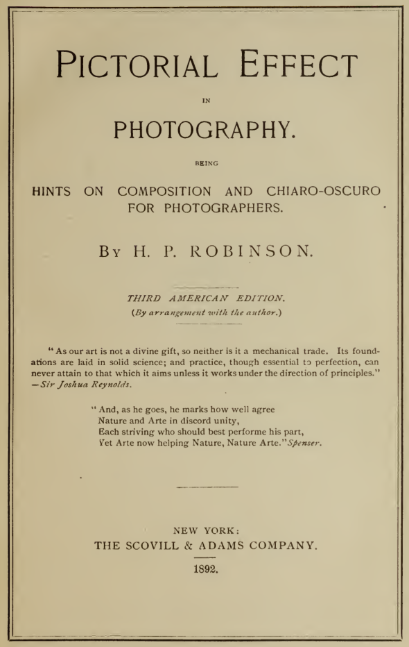
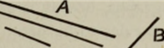
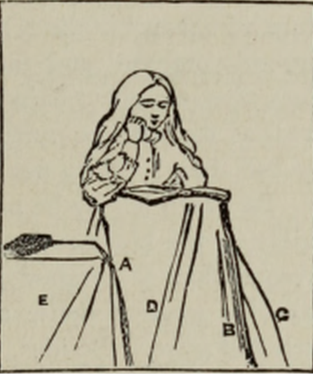
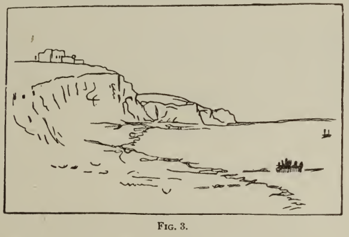
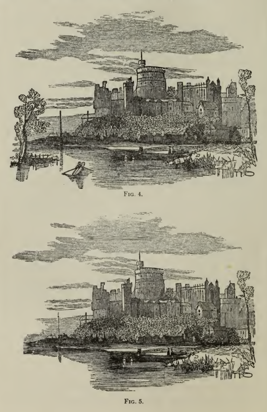
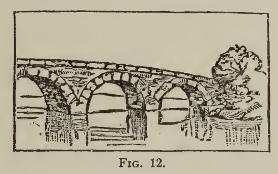
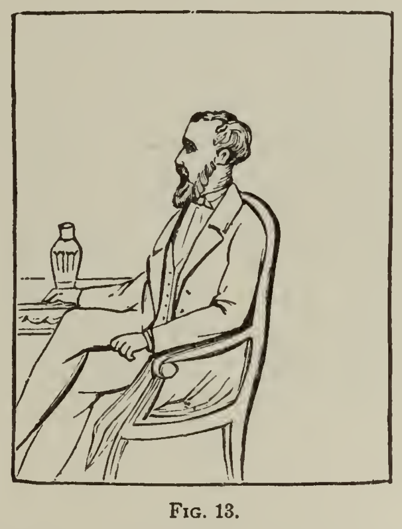
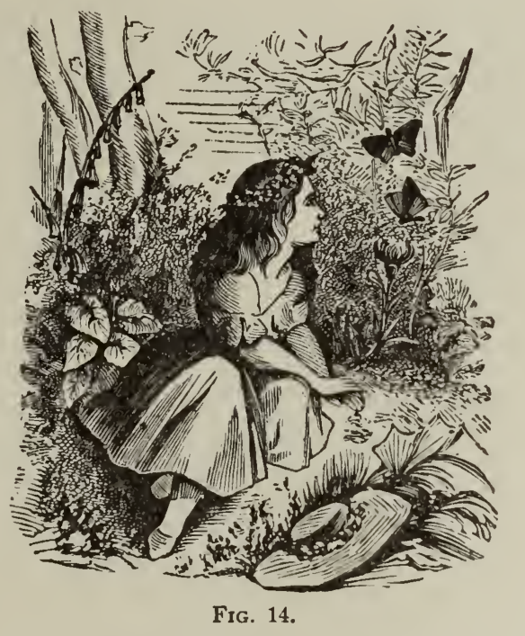
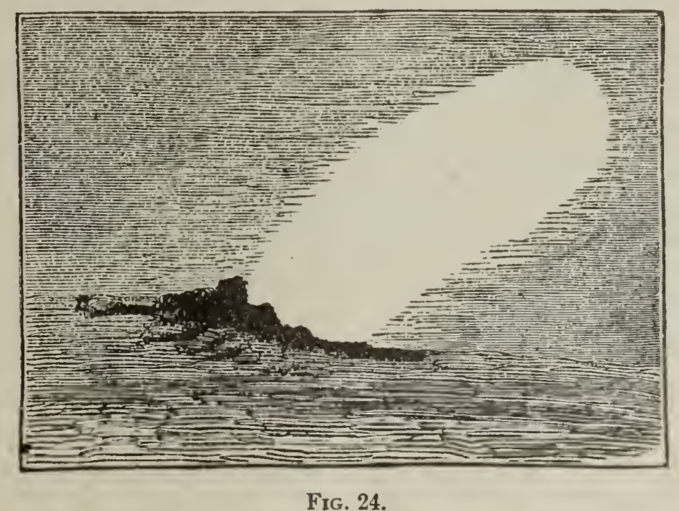
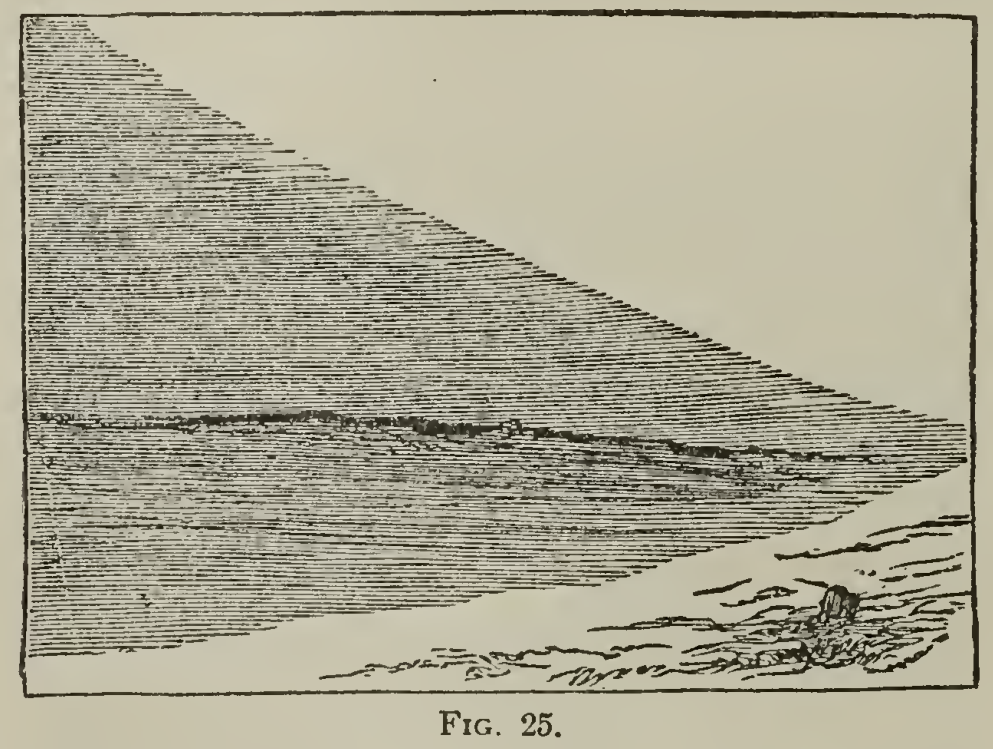

#### ИЗДАТЕЛЬСКОЕ ПРЕДИСЛОВИЕ

Первая и, по мнению многих, лучшая книга Робинсона о фотографическом искусстве уже давно ставшая эталоном. Первоначально опубликовано в Америке Эдвардом Л. Уилсона, он много лет пользовался большой популярностью. В последнее время безошибочно проявился растущий спрос на «Изобразительный эффект», и поэтому казалось, что требуется новое издание. С этими краткими вступительными замечаниями мы выпускаем это новое американское издание «Pictorial Effect in Photography», содержащее все оригинальные иллюстрации, для фотографов в этой стране, будучи уверенными, что оно встретит широкий и благодарный прием.

Нью-Йорк, январь 1892 года.

#### АВТОРСКОЕ ПРЕДИСЛОВИЕ

Одна из самых больших трудностей при написании книги для новичков в любом искусстве состоит в том, чтобы сделать ее достаточно простой. К сожалению, девять из десяти фотографов совершенно не разбираются в искусстве; одни считают манипулирование самодостаточным, другие слишком поглощены научными принципами, чтобы думать о создании картинок; в то время как сравнительно немногие рассматривали науку как средство изобразительного воплощения своих идей. Именно для первого упомянутого я так долго останавливался в главах III, IV и V на том, что можно назвать исходной идеей композиции — балансе и контрасте. Некоторые отрицают, что искусство и фотография могут быть объединены, и это высмеивает идею о том, что знание принципов искусства может быть полезным для фотографа. Именно для противодействия этим ошибочным представлениям я так сильно настаивал на законности и необходимости понимания тех руководящих законов композиции и светотени, которые во всех формах искусства должны быть основой живописного эффекта.

При выборе иллюстраций я выбрал, главным образом копии знакомых картинок, те, по которым я мог бы лучше объяснить принцип или помочь в описании процесса, чем те, которые можно рассматривать как просто красивые картинки.

В остальном я стремился сделать полезную, а не претенциозную книгу. я считаю, что это будет помощь фотографам, и в этом случае я уверен, что это должно помочь в возвышении искусства, в которое я глубоко верю.

Генри Робинсон.

# ГЛАВА 1. 

## Введение.

Часто утверждалось, что художник, как и поэт, рождается, а не становится; и в известных пределах это утверждение, несомненно, верно: без природной способности к изобразительному восприятию никакая учеба и никакое трудолюбие не создали бы художника. "Терпение и наждачная бумага, — замечает Рескин, — статуи не сделают.'' Но, как бы ни были велики природные способности или как несомненна гениальность, уверенность в превосходстве и постоянный успех не могут быть достигнуты без знания правил и изучения принципов, от которых зависит живописный эффект. Нет ошибки более фатальной, чем упование на гений вместо усилий, на «врожденный вкус» вместо культуры и применения общепризнанных и надежных законов.

В этой книге я ни слова не скажу о поэзии искусства; это вопрос, по которому трудно написать так, чтобы его действительно поняли, кроме тех, кто получил длительное образование в области искусства. я ограничусь тем, что можно назвать построением картины: на самом деле я предлагаю иметь дело с телом или, может быть, со скелетом, а не с душой, с осязаемым, а не с неосязаемым; с тем, чему можно научить, а не с тем, что нужно почувствовать. И я не буду пытаться пойти в крайние тонкости науки о композиции, которые могут быть полезны только живописцам, владеющим каждой линией, появляющейся в их работах. Фотографы, хотя перед ними открывается широкий простор для художественного воздействия, не обладают теми способностями, которыми обладают другие художники, для внесения материальных изменений в пейзажи и пейзажи, охватывающие широкие пространства, и не имеют они столько возможностей для усовершенствования фигурных предметов, хотя и многое другое. может быть сделано с помощью умения и суждения; но у них есть возможность видоизменять, и, будучи свободными агентами, они имеют право отказываться от очерчивания предметов, которые без их усилий никогда не создадут эффективных картин. Фотографы слишком часто упускают из виду неприспособленность сцены к художественной обработке только потому, что они думают, что она поддается легкости, которой обладает их искусство, для передачи с поразительной правдой мелочей и несущественных деталей. Для многих эта передача деталей и получение четких изображений — это все, что считается необходимым для достижения совершенства; и причина этого в том, что они ничего не знают и, следовательно, не могут интересоваться изображением природы, как она предстает перед глазами хорошо обученного художника или того, кто изучал ее с благоговением, уважением и любовью.

Следует признать и четко понять, что у фотографии есть свои пределы. Хотя будет необходимо объяснить основные законы композиции во всей их полноте, применимость этих законов в фотографии ограничена сравнительно малой пластичностью инструментов фотографа — света, поскольку он может быть искажен линзами и химическими веществами. Поэтому, поскольку я продолжаю изучать правила композиции, поскольку они сведены к системе или, скорее, к квазисистеме, моей целью будет попытаться указать, что и как можно сделать с помощью фотографии; при условии, однако, что учащийся знаком с фотографией и способностями имеющихся в его распоряжении приспособлений, прося его помнить, что большие технические познания — это лишь средство проявления художественной силы, а не цель и совершенство фотографического искусства. При этом я буду помнить итальянскую пословицу: «Глупец тот, кто не извлекает выгоду из чужого опыта», и без колебаний воспользуюсь советами любого автора, у которого есть идеи, заслуживающие внимания моего читателя. иллюстрируя свои замечания гравюрами с работ известных художников, а также случайными зарисовками фотографий, на которых принципы, определяемые искусством композиции, помогли фотографу в выборе объекта, в расположении натурщика или в управлении им. света и тени.

Часто утверждалось, что искусство не может иметь ничего общего с фотографией, за исключением своих низших фаз и наиболее ограниченной степени, поскольку последняя должна иметь дело с природой, будь то пейзаж или портрет, только в ее самых буквальных формах; в то время как основная сфера искусства состоит в том, чтобы иметь дело с природой в идеале, передавая то, что она предлагает, так же, как и то, что она представляет, очищая то, что вульгарно, избегая того, что обыденно, или преображая и прославляя ее поэтической обработкой. . Говорят, что фотография может воспроизвести аспекты природы такими, какие они есть; и «Природа не сочиняет: ее прекрасные аранжировки — всего лишь случайные комбинации."Но можно возразить, что только образованный глаз того, кто знаком с законами, от которых зависит живописная работа, может обнаружить в природе эти случайные красоты и установить, в чем они состоят. Бёрнет замечает: «Природа открывается только тому, кто может проникнуть и оценить ее священные места». Тот же автор, говоря о ранних работах Тернера, описывает их как что-то вроде весьма заурядных фотографий; это были акварельные пейзажи, «претендующие только на топографическую правильность, на безукоризненное изображение отдельных сцен». Только последующее изучение и более высокое знание средств искусства дало ему намек на то, что подбор ситуации и облечение ее эффектным светом и тенью облагораживают картину и ставят ее более в ранг композиция, чем обычная стенограмма. То же самое относится и к портретной живописи. Хотя сходство является первостепенным качеством, художественная организация едва ли стоит на втором месте после него. Действительно, в некоторых случаях художественное совершенство обладает более широкой и постоянной ценностью, чем простое правдоподобие. Портреты Тициана, Веласкеса или Рейнольдса живут скорее как картины, чем как подобия, а знаменитый Герварциус из Ван Дейка в Национальной галерее вызывает восхищение тысяч людей, которые едва ли задумываются о подлинности оригинала. Художественная культура, однако, существенно помогает обеспечить сходство, обучая глаз быстро схватывать характерные черты, определять наиболее подходящий вид и распределять свет так, чтобы выявить характерный эффект; в то же время придавая силу и значение естественным преимуществам и скрывая или подавляя естественные недостатки.

Признать, что фотографы не контролировали свои объекты, означало бы отрицать, что работы одного фотографа лучше, чем работы другого, что было бы неверно. Самый решительный противник фотографии как изобразительного искусства должен признать, что один и тот же объект, представленный разными фотографами, будет давать разные изобразительные результаты, и это неизменно не только потому, что один человек использует разные линзы и химикаты, чем другой, но потому что в каждом есть что-то свое — разум человека, который каким-то образом передается кончикам его пальцев, а оттуда — его картинам. Если принять это во внимание, то легко следует, что оригинальная интерпретация природы возможна для фотографов — ограниченная, я признаю, но достаточная для того, чтобы запечатлеть авторский отпечаток на определенных работах, чтобы их могли так же легко выбрать и назвать те, кто знаком с фотографией, как картины приписываются их различным авторам теми, кто глубоко знаком с картинами.

Прежде всего важно доказать, что превосходные результаты достигаются благодаря превосходному знанию не только использования материалов, применяемых в фотографии, но и знакомству с искусством, иначе вся цель настоящего трактата сводится к земля.

Дан определенный объект, например, разрушенный замок, для фотографирования несколькими разными операторами; не должна быть указана точная точка зрения, но точка зрения должна быть ограничена определенной областью. Каков будет результат? Скажем, есть десять отпечатков. Один будет настолько превосходить другие, что вам покажется, что у продюсера было все — ветер, свет и т. д.- в его пользу; в то время как другие, по-видимому, пострадали от многих недостатков. Выяснится, что лучшая фотография была сделана тем из десяти, кто изучал искусство. Выбором точки зрения, размещением фигуры, выбором времени суток, либо передержкой, либо недоразвитостью, либо наоборот, производя мягкие, нежные, атмосферные эффекты или блестящие контрасты, если это может потребоваться, фотограф может передать свою интерпретацию сцены либо как сухую прозаическую карту вида, либо как перевод пейзажа, столь превосходно подходящего для объекта, как он увиден в его лучшем виде. аспекты, чтобы дать очевидные указания на то, что называется чувством в искусстве и что почти поднимается до поэзии; результат, часто разительно отличающийся от ужасов, совершаемых посредством нашего прекрасного искусства в руках тех, чьи знание фотографии распространяется на то, и только на то, что если кусок стекла подготовить и обработать определенным образом, это приведет к получению изображения предмета, который был спроецирован на экран камеры с помощью Объектива.

Не только образованный и критический взгляд требует хорошей композиции в произведениях искусства, но и невежественные и необразованные люди испытывают удовольствие, причину которого они не знают, в чувстве приспособленности и симметрии, баланса и поддержки.

# ГЛАВА II. 

## Изучение художественного зрения.

Это старый канон искусства: каждая сцена, которую стоит нарисовать, должна иметь что-то возвышенное, прекрасное или живописное. По своей природе фотография не может претендовать на то, чтобы представлять первую; но красота может быть представлена ​​с помощью ее средств, а живописность никогда не имела столь совершенного истолкователя. Самым очевидным способом знакомства с живописными и красивыми предметами было бы обладание знанием того, что живописно и красиво; а этого можно достичь только тщательным изучением причин, порождающих эти желательные качества. Тот, кто изучает различные эффекты и характеры формы, света и тени (для фотографа добавление цвета было бы только усложнением), исследует и сравнивает эти характеры и эффекты, а также то, как они сочетаются и располагаются, как в картинах, так и в природе, будет лучше подготовлен к открытию и наслаждению пейзажем, чем тот, кому это изучение никогда не казалось необходимым, или кто смотрит только на природу, не усвоив каких-либо правильных принципов отбора. Как бы человек ни любил красивые пейзажи, его любовь к ним значительно усилилась бы, если бы он смотрел на них глазами художника, и знал, почему это было красиво. Новый мир открыт для того, кто научился различать и чувствовать действие прекрасных и тонких гармоний, которые представляет Природа во всех ее разнообразных аспектах.

Люди обычно мало что видят из того, что находится перед их глазами, если только они не обучены пользоваться этим особым образом. В «Современных художниках» г-н. Раскин дал прекрасную главу, в которой он показывает, что истина природы не может быть различена необразованными чувствами. Он говорит: «Первая большая ошибка, которую люди совершают в этом вопросе, — это предположение, что они должны видеть вещь, если она находится перед их глазами. Они забывают великую истину, сказанную им Локком: «Несомненно, что какие бы изменения ни происходили в теле, если они не достигают ума, какие бы впечатления ни производились на внешние части, если их не замечают внутри, восприятия нет. Огонь может сжечь наши тела с тем же эффектом, что и заготовку, если только движение не будет продолжено в мозг, где в уме возникнет ощущение жара или представление о боли, в чем и заключается фактическое восприятие. Как часто человек может замечать в себе, что в то время как его ум сосредоточенно занят созерцанием некоторых предметов и любопытным обозрением некоторых существующих там идей, он не замечает отпечатков звучащих тел, производимых на орган слуха, с такое же внимание, которое используется для создания звуковых идей. В органе может быть достаточно импульса, но, поскольку он не достигает наблюдения ума, за ним не следует восприятие; и хотя движение, которое используется для производства идеи звука, совершается в ухе, тем не менее звук не слышен. И то, что здесь сказано, что все должны чувствовать на собственном опыте, чтобы быть правдой, более замечательно и необходимо относится к зрению, чем к любому другому чувству, по той причине, что ухо не привыкло постоянно упражняться. его функции слуха; он привык к тишине, и возникновение звука любого рода может пробудить внимание и сопровождаться восприятием пропорционально степени звука; но глаз во время нашего бодрствования постоянно осуществляет свою зрительную функцию; это его постоянная привычка; мы всегда, что касается телесного органа, что-то видим, и всегда видим в одной и той же степени; так что возникновение зрения как такового для глаза есть только продолжение его необходимого состояния действия и не пробуждает никакого внимания, кроме особой природы и качества зрения. И таким образом, если умы людей не направлены специально на зрительные впечатления, предметы постоянно проходят перед глазами, не производя вообще никакого впечатления в мозгу, и, таким образом, остаются фактически невидимыми; не просто незаметно, а в полном, ясном смысле этого слова, невидимо. И множество людей, занятых какими-либо делами или заботами, совершенно не связанными со зрительными впечатлениями, так и происходит с ними; они получают от природы лишь неизбежные ощущения синевы, красноты, темноты, света и т. д., и, за исключением особых и редких моментов, больше ничего».

Не только художнику, но и всем, изучающим науки, относящиеся к внешним сторонам природы, доставляет более яркое наслаждение, чем тому, кто, не умея направить свое внимание, смотрит, но не видит. Ботаник находит красоту в сорняках, невидимых и вытоптанных другими; энтомолог находит неожиданные чудеса в каждой ползающей личинке и в каждой летающей бабочке; геолог обнаруживает, как были созданы миры в камнях, о которые он спотыкается во время прогулки.

Возьмем пример того, насколько больше должен наслаждаться проницательный наблюдатель природы, чем тупой человек, который бредет по миру с открытыми глазами, но слепым разумом. Можно ли сомневаться в том, что Шекспир получал больше удовольствия от изучения характеров, чем обычные наблюдатели?

Комбинации событий и характеров должны были поразить его гораздо сильнее и доставить ему большее удовольствие, чем тем, кто не был способен видеть и оценивать юмор того времени, в котором они жили. Его работы указывают нам на многие сцены, которые ускользнули бы от нас в реальной жизни. Так и образованный художник откроет и раскроет красоту, которую другие не замечают, в наших прогулках за границей и в нашем повседневном существовании. Как часто бывает, что фотограф берет с собой фотоаппарат и дюжину сухих тарелок в район, который ему рекомендовали посетить, потому что в нем так много живописных предметов и художественных штучек, и возвращается он ночью, неудовлетворенный и угрюмый, «без игры». в своем мешке», объявив это место скучным и неинтересным, без единого предмета, достойного его внимания? Опять же, другой фотограф, который, как и Беатрис, «может увидеть церковь при дневном свете», но мало что еще, будет ходить по земле, фотографируя каждый объект, так что это объект, с которым он встречается. Но тогда то, что он подразумевает под объектом, есть нечто вполне определенное; это должен быть замок или аббатство, каменный крест или особняк — что-то, чему можно «дать имя»."Для этого собирателя негативов не имеет значения, есть ли в его объекте что-либо, поддающееся художественной обработке, улучшат ли эффект несколько ярдов вправо или влево, увеличится ли немного больше неба или немного больше переднего плана или уменьшить видимый размер объекта, который он собирается захватить; его единственная забота состоит в том, чтобы дом или замок, которые он фотографирует, попал в середину его фотопластинки и чтобы ничто не помешало ему получить хороший план его возвышения. Это не причудливая картина, которую я набрасываю, но у меня в воображении так много оригиналов для нее, что ее едва ли можно назвать портретом человека. Еще одного фотографа вряд ли волнует, куда он идет; он научился выбирать и везде находит картинки. Он делает это не по инстинкту или какой-либо врожденной способности: он должен был приобрести его знания; он научился знать, чего хочет, и схватывает это в тот момент, когда оно оказывается перед ним, — он научился видеть. Из того, что я только что сказал, не следует делать вывод, что, поскольку искусству нужно учиться, я считаю возможным для всех учиться в равной степени: способность приобретать знания не всем дается в равной степени. Невозможно одному из тысячи достичь совершенного знания искусства; но несомненно, что все, особенно те, чьи инстинкты обратили их к родственному занятию, такому как фотография, могут научиться достаточно, чтобы уберечь себя от каких-либо очень серьезных ошибок в своих работах. Все мужчины должны учиться."Искусство, — как сказал сэр Джошуа Рейнольдс, — это не божественный дар." Способность приобретать его совершенно несомненно есть.

Эти наблюдения могут показаться скучными изучающему, стремящемуся добраться до практических деталей композиции, но они являются ключевым моментом всего, что я должен сказать в следующих главах. я хочу показать, что дело фотографа — видеть; делать то, что он должен научиться видеть, чтобы, видя, он мог оценить, и чтобы сила художественного зрения могла быть как бы искусственно взращена изучением тех правил и аксиом, которыми руководствовались величайшие художники, скульпторы и архитекторы в создании своих лучших работ.

Но прежде чем я продолжу, я должен предостеречь вас от слишком пристального изучения искусства с исключением природы и подавлением оригинальной мысли. Кто изучает только искусство, тот будет иметь узкую, педантическую манеру рассматривать все предметы и относить их к тому или иному стилю композиции, к тому или иному порядку изображения. Этот класс школьников смотрит на природу только через призму картин известных художников: спокойный закат — это всегда Клод; все дикое или запутанное — это Тюрнер в его последний период (это показывает знание, когда говорят о «периодах» мастера)."Какой восхитительный Уилсон или Рейсдал!" скажет один, глядя на водопад "Настоящий Ландсир!". Другие будут восклицать при виде овчарки или гончей; и так далее. Природа может лишь напомнить им о каком-то классе картин. Это извращение обучения, и оно имеет тенденцию низводить Природу до уровня ее подражателей, вместо того, чтобы помочь возвысить ее учеников до уровня скромной дистанции от ее совершенства, до которой могут достичь художники. Здесь я хочу подчеркнуть, что искусство должно быть только руководством к изучению природы, а не набором оков, сковывающих идеи или подавляющих способность оригинальной интерпретации у художника, будь то живописец или фотограф. ; и знание технических тонкостей искусства окажется лучшим проводником.

Среди молодых художников есть тенденция пренебрегать правилами и доверять инстинкту и чувству искусства; но не только хорошо поступать правильно, даже если бы это было возможно, по одному лишь инстинкту, но и приятно знать, что ты поступаешь правильно; и хотя нехорошо обуздывать восходящий гений, знание принципов, которые в силу их всеобщего принятия на протяжении веков должны быть здравыми, должно быть дополнением к силам, которые художник в любом материале должен привнести в свой предмет. Сэр Джошуа Рейнольдс в своем шестом выступлении высказал несколько превосходных замечаний по этому поводу, гораздо более убедительных, чем все, что я мог бы сказать сам.

С необходимостью должно быть так, что даже гениальные произведения, как и всякое другое действие, поскольку они должны иметь свою причину, должны также иметь свои правила; не может быть случайным, чтобы превосходство производилось с каким-либо постоянством или какой-либо уверенностью, ибо это не случайная природа; но правила, по которым работают люди с выдающимися способностями и те, кого называют гениальными, либо таковы, как они обнаруживают в своих собственных наблюдениях, либо имеют такую ​​утонченную структуру, что их нелегко выразить словами, особенно поскольку художники не очень часто владеют таким способом передачи идей. Однако, какими бы неосновательными ни казались эти правила, и как бы трудно их ни было передать их в письменной форме, они все еще видятся и ощущаются в уме художника; и он работает с ними с такой уверенностью, как если бы они были воплощены, как Можно сказать, на бумаге. Правда, эти утонченные принципы не всегда можно сделать осязаемыми, но из этого не следует, что ум можно настроить так, чтобы он воспринимал, своего рода научным чувством, правильность слов, особенно слов неопытных писателей. такие, как мы, могут, но очень слабо предположить.

Пытаясь показать, что способность к художественному зрению не исходит от природы, а является развитым чувством, я постараюсь в последующих главах стать более конкретно практическими и постараюсь дать вам некоторое представление об этих формах линий и массы света и тени, составляющие композицию в искусстве. Эти формы, создающие баланс, единство и гармонию, часто могут казаться неосязаемыми, и у учащегося может возникнуть соблазн спросить: "Если бы форму можно было назвать, то в этой форме не было ни одного различимого члена, сустава или члена, Или можно было бы назвать субстанцией то, что казалось тенью, Ибо каждый казался тоже?"

Но для опытного глаза каждая неуловимая линия, свет и тень играют свою определенную роль в создании совершенной композиции.

# ГЛАВА III. 

## Баланс линий и контраст.

Можно сказать, что композиция в искусстве состоит из выбора, расположения и сочетания на картине объектов, которые должны быть обрисованы, чтобы произвести приятное представление форм и тонов, чтобы рассказать историю, которая должна быть разъяснена, и воплощать дух того, что изображение должно представлять или предлагать. Главные цели, которых следует добиваться, — это гармония и единство, изложенные таким образом, чтобы можно было доставить удовольствие глазу без какого-либо жертвоприношения истины природы. Сохраняя гармоничный баланс линий, света и тени, достигается несколько целей. Первый и самый простой результат — это создание живописного эффекта, который удовлетворяет глаз независимо от значения или намерения изображения. Но также служит и более высокая цель. Сохранение гармонии обязательно включает в себя идею подчинения или рассмотрение относительной важности всех частей картины, при этом главные объекты выделяются, а второстепенные объекты становятся вспомогательными благодаря расположению линий и массивов изображений. свет и тень. При правильном их распределении и равновесии основные объекты на картине будут выдвинуты на видное место, а менее важные будут удалены от глаз и будут поддерживать или действовать как фон для основных объектов, представляющих интерес. Как рекомендует старый чудаковатый писатель по искусству Лересс: «Пусть на первом месте будет король или принц, а затем его свита или другие надлежащие лица; к композиции, без лишних слов поместите их в тень».Короче говоря, великие фундаментальные законы композиции можно суммировать очень кратко. Это единство, уравновешенность и приспособляемость целого к широте светотени, благодаря которым главный предмет в картине, как, например, голова на портрете, выдвигается на первый план, но вместе с тем соединяется с другие части, чтобы глаз мог сначала увидеть главный интерес, а затем постепенно и приятно провести его по картине. Помимо перечисленных выше первичных требований в композиции, есть много подразделений, принадлежащих к гармонии, как-то: покой, единство, субординация, повторение, разнообразие и т. д.— которые будут рассмотрены вместо них после того, как будут ясно поняты общие принципы.

Любопытно, что картины всех художников, живших в течение последних трех столетий, или, по крайней мере, все те картины, которые дошли до нас, кажутся созданными по какому-то твердому принципу; и при рассмотрении лучших произведений великих мастеров было обнаружено, что самые приятные и приятные композиции формируются более или менее на ведущей идее треугольника или пирамиды, диагональной линии и ее контрастах (что является вариант одного и того же), и круг с его различными модификациями. Изучив эти факты, Бернет и другие авторы по этому вопросу разделили искусство композиции на угловатое и круглое, в то время как многие из лучших примеров представляют собой комбинацию обеих форм.

Поскольку это имеет первостепенное значение и фактически представляет собой скелет, на котором висят все остальные части этого предмета, будет хорошо сначала обратить внимание учащегося на рассмотрение баланса линий.

Все линии должны быть сбалансированы или компенсированы. Без должного внимания к этому важному качеству картина будет казаться готовой развалиться на части. Пример. Линии, идущие в одном направлении, независимо от того, параллельны они или нет, будут выглядеть слабыми и неуклюжими.   Ощущение падения передается сознанию повторяющимися линиями таким образом: ///. Когда встречаются строки этого символа, он будет всегда можно найти компенсирующие линии в других частях изображения, таким образом: // \ или, если линии идут по диагонали  A вниз по картинке, таким образом, что линия A компенсируется линией В. 

Есть много других способов, которыми можно компенсировать косые линии, в значительной степени зависящих от изобретательности и мастерства художника. Вот пример на портрете/ 

Девушка, стоящая на коленях в кресле, читает книгу, положенную на спинку, лицом к зрителю. Линии головы и плеч над стулом прекрасно компенсируются линией руки, идущей в противоположном направлении; но линии стула А и B и платья C, идущие почти в том же наклонном направлении, придавали бы фигуре эффект неуверенности, и это было бы болезненно чувствовал, что девушка и стул опрокинутся, что не будет иметь приятного эффекта. Чтобы противодействовать этому чувству опасности, линии A, B и C были уравновешены линией драпировки D; и, поскольку этого недостаточно, была введена таблица e, в то время как темное пятно, вызванное книгой, также помогает поддерживать композицию, как будет объяснено в этой главе. Этот пример взят из реальной фотографии и показывает, как я надеюсь показать с помощью других набросков, также сделанных с фотографий, как фотограф может применять эти правила к своему искусству.

Иногда полезно повторение линий без баланса. Хорошую иллюстрацию этого можно найти в изображении Фроста, на котором Сабрина и сопровождающие ее нимфы спускаются в чертоги Нерея, выгравированные и опубликованные Художественным союзом несколько лет назад и уже знакомые или легко доступные ученику. В этой картине всякое равновесие линий и равновесие основания намеренно опущены, и кажется, что фигуры спускаются по воде — эффект, необходимый для истории.

Можно сказать, что если диагональные или пирамидальные линии требуют компенсации, то зачем их использовать? Почему бы не использовать горизонтальные и вертикальные линии? На что можно ответить, что в последних упомянутых строках нет достаточного разнообразия; квадрат гораздо менее живописен, чем пирамидальная форма, в чем можно убедиться, сравнив современный квадратный дом с готической церковью и шпилем. Кроме того, Природа никогда не строит квадраты; даже горизонтальная линия моря прерывается линиями облаков и волн, а линия равнины — деревьями, возвышенностями и горами. Опять же, ряд стоящих фигур, все одинакового роста, хотя и часто встречающийся на фотографиях, в высшей степени однообразен и неприятен, и сам факт то, что группы фигур так часто фотографируются таким образом, показывает необходимость в этой работе. Диагональная линия (рис. 2) очень подходит в композиции ландшафта. scape; он так превосходно поддается отступлению линий перспективы. Рис 2. 

С балансом линий почти связан контраст, который можно описать как противопоставление различных аспектов друг другу, чтобы выявить самый полный и лучший эффект каждого; такие как положение и разнообразие головы, молодость и возраст, свет и тень и т. д. Действительно, контраст иногда заменяет баланс, как на эскизе (рис. 3), где показаны главные черты фотографии, где самое темное пятно — лодка — противопоставляется самому яркому и, будучи ближайшим объектом, противопоставляется самому дальнему, воздействуя таким образом друг на друга и, также в основании угла, поддерживает целое и действует как своего рода ключевая нота для всего каркаса композиции. Эта форма композиции с бесконечными вариациями, на которые она способна, наиболее ценна для фотографа-пейзажиста.

Заканчивая эту главу, я должен напомнить изучающему, что, следуя приведенным выше намекам в своих картинах, он не должен допускать, чтобы искусство стало слишком очевидным, эффект от которого был бы болезненным. Как разговор очень ученого человека бывает иногда скучным, так и его работа была бы скучной, если бы ученик приложил слишком много усилий, чтобы показать свои знания. Он не должен давать критику возможности сказать:

"Природа в нем была почти потеряна в искусстве."

Аксиома о том, что те, кто больше всего пользуется искусством, меньше всего предают, до известной степени достаточно верна; но, с другой стороны, слишком большое усилие скрыть искусство может привести к слабости и разрушить простоту и характер. То, что попадает в золотую середину, будет самым большим успехом.

# ГЛАВА IV. 

## Баланс.—"Пример."

"Поскольку видимое сильнее того, что слышно», — цитирует Теннисона, и поскольку реальный пример, видимый глазу, лучше, чем страницы написанных слов, я предлагаю в этой главе дать небольшую иллюстрацию того, как художник, даже в такой тривиальной набросок как предмет, выгравированный на следующей странице, соответствует обычаям искусства и той ценности, которую его произведение приобретает благодаря такому обращению. я берусь за эту тему, потому что она следует и иллюстрирует правило баланса, данное в предыдущей главе.

Две гравюры изображают один и тот же предмет — Виндзорский замок — и идентичны, за исключением того, что острые черные пятна — лодка в реке, кусок берега и дерева — которые появляются на одной, удалены на другой. Можно заметить, что диагональная линия, начинающаяся в нижнем левом углу, следует по вершинам высокой трубы и отдаленным башням и идет к флагштоку, откуда взгляд переносится по картине маленьким белым облачком над часовню, таким образом завершая диагональную линию, данную в последней главе (стр. 17). Сравнив их, вы сразу же почувствуете значение маленьких точек крайней темноты в нижней точке угла, образованного перспективными линиями замка и реки. На рис.5, с которого убрано равновесие, обеспечиваемое лодкой и берегом с деревом, кажется, что у замка нет ничего, на чем можно было бы стоять, нет прочного основания. Линии, идущие к какой-то точке вдалеке, как будто хотят собраться воедино и урегулироваться; Расстояние

само выдвигается на передний план, и части не принимают должного отношения друг к другу. На рис.4, где появляются черные пятна или ключевая нота, все становится на свои места, и возникает ощущение завершенности, которое Инжир.5 недостатков. Эту форму композиции перенимали самые выдающиеся художники-пейзажисты. Кейп, который обычно рисовал восходы или закаты, почти всегда использовал эту композицию; и в его картинах точка тьмы, расположенная рядом с точкой наибольшего освещения и противопоставленная ей, придает исключительную ценность его высочайшему свету. Тот же прием почти всегда встречается в пейзажах голландской школы. В великолепных картинах моря и неба Тернера удивительная яркость в значительной степени обусловлена ​​тем, что самый темный черный цвет противостоит самому высокому свету.

Нет необходимости, чтобы точка тьмы состояла только из одного объекта; иногда удобно представить группу фигур или каменную массу; но всегда нужно помнить, что разумно размещенная темная масса на переднем плане не только уравновешивает композицию, но и усиливает действие градаций средних и крайних расстояний.

Из того, что я говорил о темной точке на переднем плане, не следует думать, что это единственная возможная форма, в которой должен быть составлен пейзаж. Этот принцип можно применить прямо противоположным образом: свет может занять место тени и выполнять ту же функцию. Картина может быть в целом темной, с массой света на переднем плане для баланса. Например, изображение темного, мрачного замка может быть облегчено потоком света на переднем плане, разбивающим и оживляющим монотонную тень. Нет абсолютной необходимости и в том, чтобы пейзаж строго следовал диагональной линии; есть бесконечные вариации этого принципа; но я даю

это самое простое и очевидное из всех правил композиции, во-первых, потому, что это ключ, который, однажды овладев им, позволит ученику открыть секреты самых сложных рисунков и облегчит его будущие занятия.

По мере того, как я буду продолжать свой предмет, я предвижу, что может возникнуть небольшая трудность. Главная опасность, которой я, по-видимому, подвергаюсь при написании определенно, заключается в том, что я ошибаюсь, когда описываю все изображения как составленные в правильной форме, такой как диагональная, пирамидальная, круглая и тому подобные формы; но только таким образом я могу представить что-либо осязаемое учащемуся, который, когда он достаточно знаком с формулами и знает, как их классифицировать и комбинировать, может экспериментировать с оригинальностью композиции на свой страх и риск. Как я сказал в начале, правила не предназначены для того, чтобы калечить тех, кто их использует, и не предполагается, что учащийся должен безоговорочно им следовать. Цель состоит в том, чтобы тренировать его ум так, чтобы он мог легко выбирать и, когда он делает выбор, знать, почему один аспект предмета лучше другого. Некоторым читателям может показаться излишним смотреть на природу как на вещь, которую нужно привести в порядок, прежде чем можно будет получить какое-либо удовлетворение от ее созерцания или от ее представления; но когда учащийся начинает анализировать причину красивого и приятного эффекта некоторых картинок, и неприятный эффект других, столь же совершенных в том, что касается отделки и манипуляции, он обнаружит, что может приписать причину некоторому согласию или несогласию с правилами искусства, сколь бы отдаленными они ни были.

Внимание к правилам поможет художнику сохранить картину в тонусе. Небольшая масса темного или светлого, чем бы она ни была, в ближних частях пейзажа действует как своего рода ключевая нота, как я уже сказал, и удовольствие, доставляемое образованному глазу хорошей композицией, мало чем отличается от что слух происходит от совершенных гармоний в музыке; а если договориться\*

достоинства картины не очевидны с первого взгляда, если то, что эквивалентно мелодии, не бросается сразу в глаза, полагайтесь на это, что если картина приятна, то композиция есть, хотя она может быть и в миноре .Как музыка есть только звук, подчиняющийся определенным законам, так и живописный эффект есть лишь сочетание определенных форм и света и тени, подобным образом гармонично соединенных вместе.

Мораль для фотографа-пейзажиста состоит в том, что во многих случаях он должен стараться получить на переднем плане какой-нибудь объект или массу объектов, которые будут служить ключевой нотой для сохранения гармонии в целом; и если природа не дает такого предмета, требование живописи часто может быть обеспечено искусством, не нарушая материальной истины. Об этом подробнее в другой главе.

# ГЛАВА V. 

## Баланс.—"Примеры"—"продолжение."

Нет необходимости, чтобы правящая точка находилась абсолютно сбоку от изображения и на крайнем расстоянии. При исследовании лучших ландшафтов будет обнаружено, что она очень сильно различается; но, если это важный объект, он никогда не будет найден точно в центре, или под, или на одной линии с любой другой важной или заметной формой того же размера или характера.

Я беру для иллюстрации сцену, построение которой учащийся сможет воспринять сам. Он заметит, что она имеет диагональную форму и что баланс сохраняется за деревьями. Он также заметит, что массы, произведенные главными объектами, повторяются другими, а зданиям вторят далекие горы.

При обучении любому искусству всегда полезно указать не только \| что делать, но и чего не делать, и здесь есть небольшой пример того, чего следует избегать. Видно, что облака повторяют форму верхних холмов, а последние частично повторяют строения. Итак, повторение является ценным качеством в искусстве, как мы увидим дальше, и помогает придать одной части картины I-отношение к другим частям; но повторение должно состоять из слабого эха, а не из точного подражания линиям, формам или тонам; это было бы слишком похоже на выдумку, даже если согласиться.способным для глаза, чего на самом деле не было бы, и искусство, как бы оно ни регулировало изображение природы, никогда не должно делать природу искусственной.

Увлекшись, я надеюсь, изучающим со мной так далеко, я должен был бы посоветовать ему изучить хорошие картины и гравюры и, проанализировав их для себя, увидеть, как далеко следует простое правило, дальше которого мы еще не продвинулись. - маленькое темное пятно или

наблюдается противоположная линия, действующая как уравновешивание целого, особенно в изображениях пейзажа. Осмелюсь утверждать, что если он впервые сделает это с оценкой, то он будет поражен регулярностью и частотой, с которой соблюдается этот принцип. Изучение картин на современном этапе окажет на учащегося большее влияние, чем изучение природы, которое без руководства могло бы вызвать у него лишь смутный и неустойчивый вкус. Изучение картин познакомит его с методами, с помощью которых они были созданы, и направит его с помощью общих принципов композиции в поисках бесчисленных и до сих пор не замеченных красот природы. Возьмем самую известную коллекцию пейзажей, которая приходит мне на ум в данный момент, и в то же время самую совершенную, и потому что они принадлежат человеку, гениальность которого была достаточна для того, чтобы поднять его выше и выше всех правил. Если бы он счел правильным отказаться от правил, я бы порекомендовал студенту отправиться в Национальную галерею и тщательно изучить коллекцию Тернера; или, если он не в состоянии увидеть оригинальные картины, пусть просмотрит тома Художественного журнала, в котором превосходно выгравированы многие из этих замечательных картин. Пусть он забудет, если сможет, великолепный колорит, поэзию и воображение, которые в столь выдающейся степени проявляются в работах Тернера, и прозаически исследует построение картин; или, скорее, в настоящее время пусть он ограничится одним пунктом, который я предложил, и, когда он хорошо укоренится в этом, он может сделать еще один шаг, не опасаясь, что ему придется повернуть назад.

Взяв наугад несколько примеров, позвольте мне сначала обратить внимание на прекрасный девонширский пейзаж «Пересечение ручья», где собака в ручье образует точку баланса композиции; затем повернитесь к «Temeraire» и обратите внимание, как ту же функцию выполняет буй. В

"Цепной пирс Брайтона», «Солнце, восходящее в тумане», «Древний Рим», «Спитхед», «Св. Гора Михаила», «Севшие на мель у Ярмута суда», «Рыбацкие лодки» и другие морские виды, буй, бочка, якорь, лодка или обломок крушения всегда будут выполнять одну и ту же функцию. В «Полифеме» темные носы галер, рассекающие небо, придают чудесную силу этому славному восходу солнца. То же и с собственно пейзажами. Посмотрите на «Петворт-парк» и обратите внимание, как темная фигура лани, стоящая на фоне света на переднем плане, кажется последней вещью, но без нее гармония не была бы полной. На любопытной картине, изображающей сцену из Боккаччо, под названием «Птичья клетка», можно обнаружить, что белое пятно — нотная книга на земле — использовалось для завершения баланса. Обратите внимание, как почти неизменно он ставит свою самую темную тьму в непосредственное сопоставление со своим высшим светом, хорошим примером которого является его «Голландские лодки в шторм». Обратите также внимание и вспомните, как в своих самых смелых фантазиях, когда некоторые люди думали, что его гений покинул его или почти дошел до безумия, Тернер строго соблюдал простые правила композиции; например, в «Китобоях» и в том странном и чудесном изображении такой прозаической вещи, как железнодорожный поезд, которому он дал имя «Дождь! Пар! Скорость!» И если величайший из когда-либо живших пейзажистов мог одобрить эти правила и склонить к ним свой великий гений, то не новичку в искусстве и даже не продвинутому ученику говорить: «Искусство выше правил, которые только действуют как препятствие для изобретательности и как ограничение воображения."

Достигнув этого места, приобретя некоторые знания об элементарной живописной конструкции и наблюдая на картинах, как эту конструкцию наблюдали художники, ученик может теперь обратиться к природе, посмотреть на окружающие предметы.

предметы в помещении и на улице, тщательно проанализируйте любой объект или группу объектов, которые, по-видимому, производят приятное впечатление, и он обнаружит, что до некоторой степени причина удовольствия, которое он испытывает, глядя на них, начинает доходить до его ума. .Пусть он спросит себя, смотрит ли он даже на этой ранней стадии своего познания на природу с тем же безразличием, с каким прежде смотрел, и открыл ли он посредством искусства новые источники удовольствия, с которыми он до сих пор не был знаком. , и о котором он никогда не заботился. Если он открыл для себя новые ощущения и новые наслаждения, то он применил эти уроки к цели, для которой они были написаны, и может продолжать с теми, которые придут; в противном случае ему лучше отказаться от этого дела или «попробовать вернуться»."Я задаю этот вопрос так рано, потому что, если предмет последних трех глав не будет полностью освоен, все, что я должен сказать дальше, покажется очень запутанным.

# ГЛАВА VI.

## Единство.

В одной из предыдущих глав я говорил о единстве как об одной из важнейших составляющих удачной картины. В некоторых отношениях было бы лучше рассмотреть, что имелось в виду под единством в этом месте, но это задержало бы меня в представлении вам закона баланса и контраста, которым я стремился заинтересовать вас с самого начала.

Говоря о единстве как об одном из существенных элементов композиции, я делал это из твердого убеждения, что какие бы красоты ни содержала картина, сколь бы точным ни было подражание природе, правильное расположение линий, прекрасный цвет, крайняя отделка или большая ловкость обращения с мани

празднично, не будет передано глазу совершенного чувства удовлетворения, если свет будет рассеян, если не будет сохранена широта светотени или если на одном и том же полотне появятся два или более эпизода, не связанных друг с другом.

Единство было хорошо определено как «краеугольный камень природы и выражает гармонию Божественного разума, выраженную в творении.''Единство может быть достигнуто только изучением первых принципов. Закон природы гласит, что принцип должен предшествовать деталям; в рассказе о сотворении мира общий замысел описывается как изложенный первым, а детали — как следующие. Единство так просто, что его часто упускают из виду: но никакие успехи в каких-либо других качествах, желательных в картине, как я уже сказал, не компенсируют его отсутствие. На фотографиях, где нет цвета, отвлекающего внимание от дизайна, это особенно необходимо. Именно отсутствие единства в расположении фигур на фотографическом пейзаже так часто портит красоту в остальном эффектного изображения. Слишком часто принято разбрасывать фигуры, одетые негармонично со сценой, по переднему плану пейзажа без какой-либо связи друг с другом или уместности их присутствия там вообще, и поэтому единство игнорируется и теряется.

Подобно большинству элементов, составляющих хорошую картину, единство легче почувствовать, чем описать; но я думаю, что не ошибусь, если определю это как правильное соединение всех частей в совершенное целое. Сфера или функция единства состоит в том, чтобы объединить и сфокусировать второстепенные качества, такие как разнообразие, контраст, симметрия и т. д. Он в равной степени противоположен разбросанным идеям, разбросанным линиям или разбросанным огням на картине. В природе свет, преломляемый на своем пути, хотя и в уменьшенном количестве, становится более раздражающим для глаз. Мы можем выносить полное, непрерывное великолепие заходящего солнца, но когда его лучи разрезаются и разделяются, проходя через

экран листьев и ветвей, раздражение влияет на наименее образованный глаз. Это чувство раздражения, вызванное пятнистым светом, более правильно относится к теме света и тени, и о нем будет сказано в надлежащем месте; но необходимо учитывать единство линий и единство действия, особенно в композиции фигур; но единство цели так же необходимо в выражении пейзажа, как единство действия в фигуре-предмете. Все предметы должны уподобляться в одной точке, как бы несходны они ни были сами по себе. Должно быть некоторое соответствие тона и соотношения линий, как бы велико ни было разнообразие основных характеристик вида.

При фотографировании любого предмета, будь то пейзаж, портрет или группа фигур, должна сохраняться одна ведущая идея. Факт, который должен быть констатирован, не должен быть омрачен путаницей. Работа должна составлять одно целое; оно должно полностью произносить свое собственное значение. Для словесного объяснения не должно оставаться ничего. Картина не должна требовать шоумена; картина, не рассказывающая своей собственной истории, так же утомительна, как том, изо всех частей снабженный примечаниями и примечаниями, поясняющими то, что не нуждается в объяснении. В пейзаже всегда найдется какой-нибудь объект более важный, чем остальные, которому подчинены все остальные части и к которому ведут все другие объекты. Обязанностью фотографа будет выбрать такое положение для своей камеры, которое усилит этот эффект, чтобы максимально использовать главный объект или предмет изображения и не позволять никакому сопернику быть рядом, чтобы отвлечь внимание. от полного эффекта. Очень распространенный случай потери единства в фотографических пейзажах — это положение и действие фигур. У меня в портфолио есть пример, описание которого покажет, сколько вреда может принести такое пренебрежение единством.

Сцена представляет собой сельский переулок, пересекаемый ручьем и окруженный деревьями. На полпути вниз по переулку, растущий на цветке

крытый берег, видны ствол и корявые корни большого дуба, которые получают основной свет; этот свет повторяется в воде и постепенно рассеивается по картине. Слева тянутся темные и изящные ветви платана, которые, простираясь частично над стволом дуба, противопоставляются их темным листьям в тени, усиливая яркость основной массы света и помогая приведение взгляда к главному объекту. Нет массы света такой большой или такой высокой по тону, как на стволе дерева и вокруг него — ни одной неуместной линии; и вообще это одна из тех сцен, на которых глаз любит задерживаться и которые вполне можно выразить фотографией. И все же это одна из самых раздражающих картинок, которые я когда-либо видел. Причина раздражения обеспечивается сравнительно очень небольшой частью целого; но оно так ощутимо, что я храню картину только как предупреждение и никогда не смотрю на нее ради удовольствия. В центре картины, резко вырезанной против света, смотрящей прямо в камеру, не причастной и, по-видимому, совершенно не заботящейся о прекрасном окружающем пейзаже, стоит фигура. Таким образом, одна из самых прекрасных фотографий, которые я знаю, испорчена нелепым несоответствием, разрушающим всякое единство. Если бы были введены двое или трое деревенских детей, естественно занятых сбором цветов с берега или занятыми каким-либо другим сельским занятием, они выглядели бы как богатая гроздь драгоценностей в соответствующей оправе.

Те же самые замечания в равной степени относятся к портретам или группам, о которых больше в надлежащем месте, так как предмет будет более полно рассмотрен в разделе, посвященном свету и тени.

В этой главе я обращаю внимание на принцип, а не на простые правила, которые можно выразить столь многими словами. Но я должен так рано внушить вам эту господствующую мысль, что если картина должна быть успешной, она должна иметь единство цели или намерения, единство истории, единство мысли,

единство линий, единство света и тени. Все должно иметь смысл, и смысл должен быть объектом изображения; не должно быть ничего, что можно было бы отпустить."

Я больше желаю, чтобы вы «почувствовали», что такое единство, потому что единство и равновесие вместе составляют главные механические элементы живописного эффекта и могут существовать совершенно независимо от какой-либо истории, которую нужно рассказать, или намерения, которые нужно выразить, в картине, хотя правильное повествование является частью единства, что кажется парадоксальным. Эти два аспекта — равновесие и единство — следует, следовательно, сначала тщательно понять; другие элементы гармонии, такие как намерение, подчинение, сохранение и т. д., не менее важны, но будут тем лучше поняты и выражены после того, как учащийся основательно обосновается в более механических элементах; как бы ни был плодовит человек в идеях, он не может ясно выразить эти идеи, пока не выучит язык и его грамматику или законы построения. Равновесие и единство — принципы построения, на которых должно основываться каждое намерение, выражаемое в картине. я придаю большее значение этой первоначальной идее, потому что слишком часто случалось, что художественное обучение, которое давали фотографам, имело дело скорее с мыслями, которые должны быть выражены, чем со способами их выражения; и бесполезно пытаться научить человека писать стихи до тех пор, пока он не научится писать по буквам.

# ГЛАВА VII.

## Примеры.—"Выразительность."

Начав эту книгу с решимости связать все, что я должен сказать о живописном эффекте, с фотографией и продемонстрировать применение различных форм композиции в нашем искусстве, представляется подходящим поводом дать набросок с фотографии, показывающий в каким образом правила искусства — насколько уже было сказано — руководили фотографом при выборе предмета. Эскиз на следующей странице дает главные черты восхитительной маленькой фотографии сцены в озерном крае — «Деруэнтуотер, Кошачий колокольчик вдалеке», — сделанной г-ном Блэком. Мадд. И я могу указать, как исключительный пример возможности фотографа формировать свои материалы по своему желанию, тот факт, что пейзаж г. Mudd редко можно встретить с составом, который далеко не идеален. Из большой коллекции его работ, находящихся сейчас передо мной, я не могу выбрать больше двух или трех, в которых чувствуется нехватка баланса, единства и гармонии; и это небольшое меньшинство состоит из местных видов или портретов мест, интересных своей ассоциацией, но которые, по-видимому, не поддаются обработке в руках художника. Хотя это искусство должным образом скрыто, тренированный глаз может обнаружить и восхититься многими изобретательными приемами, которые он применяет, чтобы скрыть недостаток, обнаружить красоту или более заметно выдвинуть главную мысль своего предмета. Все восхищались г. Очаровательные картины Мадда, но немногие интересовались, чем главным образом обязано их превосходство, и довольствовались тем, что приписывали это его совершенному манипулированию.

о процессе коллодио-альбумина, методе работы, который он сделал своим собственным, но который, несмотря на его превосходство, не объясняет искусного расположения его предметов. Те же самые замечания относятся и к картинам г. Бедфорд. В работах этих господ ничего не делается бесцельно. Если вводится фигура, она выполняет какую-то важную функцию в композиции: либо направлять взгляд, подчеркивать точку, отбрасывать расстояние, либо собирать воедино несколько рассеянных светлых или темных участков, благодаря чему приобретается широта и избегается путаница. . Если точка зрения допускает живописный передний план, благодаря которому неживописный главный объект может быть превращен в интересную картину, она обеспечена; Кажется, ничего не забыто, что могло бы усилить эффект или помочь порадовать глаз..А так как это происходит при большем количестве взглядов, сделанных обоими джентльменами, то это не может быть приписано случаю, а должно быть результатом знания.

Эскиз дает очень слабое представление об исходной фотографии. Печатается с блока фототипии. Рельеф был взят с грубого наброска, сделанного экспериментально для проверки этого процесса, и не было уделено достаточного внимания созданию законченного рисунка, поскольку рисовальщик был под впечатлением, что необходим довольно грубый набросок, а не рисунок, полный деталей. дал бы гораздо лучший результат. Однако фотография находится в руках или ее видели так много моих читателей, что этого легкого и несовершенного наброска будет достаточно, чтобы вызвать в их памяти оригинал; Mudd за то, что представил такой плохой перевод своей прекрасной картины.

Первое, что бросается в глаза читателю этих уроков, когда он смотрит на оригинал, — это восхитительный баланс, которым достигаются валуны на переднем плане на следующем, огромное расстояние, которое ощущается между передним планом и

дальние горы. Этот эффект почти полностью создается расположением и противопоставлением темных камней впереди. Если бы точка зрения камеры была смещена на несколько футов вправо или влево, то получился бы совсем другой и гораздо менее ценный снимок. Камни в одном случае были бы исключены из картины, и расстояние выглядело бы плоским; в другом случае камни были бы либо в центре, либо в самом слабом месте, либо в правой части картины, под темными деревьями на среднем расстоянии, таким образом, вся темнота находилась бы на одной стороне картины, а все свет на другом.

Пока я пишу, молодой друг, который только начал изучать искусство, прочитав «Руководство по наброскам» Говарда, сказал мне, что если переместить камни на другую сторону, получится «клиновидная» форма композиции, которая, как ему сказали, широко используется художниками-пейзажистами. Это совершенно верно и согласуется со всем, что я уже сказал, потому что всякая угловатая композиция должна более или менее принимать форму клина, которая является основой многих прекраснейших композиций. Пусть, однако, учащийся запомнит как аксиому, располагая свои массы в такой форме, что острие клина должно опираться. Без такой поддержки картина создаст неприятное впечатление, что часть основных масс соскользнет вниз. И здесь я хотел бы предостеречь своих читателей от ошибки моего юного друга — от поспешных и несовершенных выводов, к которым приводит поверхностное знакомство с техническими названиями, которыми обозначаются различные формы композиции, без понимания принципов, на которых основываются все формы. живописный эффект должен быть основан. я настоятельно рекомендую слушателям этих уроков совмещать чтение с практикой, стараясь создавать фотографии, в которых воплощаются и иллюстрируются художественные правила. Прежде всего, избегайте бойких, попугайских парадов художественной терминологии, которые,

наша художественная практика - такая презренная вещь для всех серьезных людей.

Одно из самых ценных качеств фотографии, наводившей на мысль эти замечания, — ее совершенная выразительность. Это не столько покой, сколько совершенная безмятежность. Он наводит на мысль об одном из тех прекрасных дней, которых бывает не больше дюжины за двенадцать месяцев, когда солнце сияет белым светом, а ветерок стихает так, что слышно жужжание пчелы и прыгает форель. озеро — один из тех дней, когда фотографу удача помогает искусству, но также и один из тех дней, когда с таким фотографом, как г. Мадд, который не довольствуется простой невыбранной зазеркальной правдой, искусство помогает фортуне.

Я говорил о выражении этой картины. Некоторые могут усомниться в том, что такое возможно в пейзажной фотографии; но это так, в очень большой степени. Некоторые сцены требуют яркой и живой передачи; другие, такие как портреты мест, со всей сухой прозаичностью механического искусства; другие, опять же, лучше выражены под мраком приближающихся сумерек. Передо мной две фотографии. Тот настолько точно передает эффект раннего утра, что чувствуешь холодок, бодрящий воздух, когда смотришь на него. Трудно объяснить, как это получается. Сцена представляет собой окраину далекого города, вокруг которого протекает река. Расстояние состоит из холмов. Солнце, блестя на шиферных крышах дальних домов, вызывает столько сверкающих пятен света, которые, однако, хорошо сгруппированы. Река тоже переливается на солнце, образуя широкую изогнутую линию света, протянувшуюся поперек и вглубь картины; передний план состоит из крутого берега. Фотография в таком состоянии выглядела бы разбросанной и лишенной единства; а на берегу помещена фигура девушки с корзиной, собирающей папоротник. Фигура самая черная

пятно на картине, но обладает штрихами высочайшего света, вызванного сильным солнечным светом, который собирает воедино и повторяет огни вдали и на реке. Эта фигура имеет эффект приведения целого к гармонии. Вывод таков, что сверкающие огоньки, как сверкающая роса, создают впечатление раннего утра; но эти огни, если их не исправить, будут иметь рассеянный и неприятный эффект. Это вполне компенсируется фигурой, выводящей их в фокус.

Другая картина представляет собой вид на бассейн в Бернем-Бичес, на котором прекрасно передан эффект наступления сумерек. Солнце тонет за ширмой деревьев, очерчивая ветки и стволы тонкой гранью света. Самая темная масса теней находится в центре картины, ее разбавляют несколько белых уток на берегу пруда, которые служат для оживления единственной части картины, которой грозила тусклость. Никакой фигуры не введено, и все выражение — выражение одиночества и мрака.

Просматривая свое портфолио, я натыкаюсь на еще одну фотографию, которая также иллюстрирует мои достижения. На этой картине — авторства г. Дюррант из Торки — ветреный день прекрасно описан. Он не имеет того вида застывшего движения, который иногда является недостатком мгновенных фотографий моря, но вы чувствуете, что ветер шевелит деревья, хотя очевидно, что ничего не двигалось, пока снимался снимок, и экспозиция должна была был значительным. Облака с отдельного негатива, кажется, скользят по небу очень живым движением. Эти примеры, я надеюсь, покажут, что фотография, даже пейзажная, не обязательно должна быть безжизненной вещью, которую мы находим в обычных постановках.

# ГЛАВА VIII.

## Практика.—"Выбор темы."

Композиция, основанная на диагональной линии — форма расположения, которой в основном были посвящены предыдущие главы — после ее рассмотрения кажется подходящим временем сказать кое-что о композиции пейзажа в целом; тем более, что я уже призывал ученика сопровождать изучение этих уроков практическими попытками выполнять указания, время от времени доводимые до его сведения. Поэтому здесь могут пригодиться несколько намеков на его общий способ работы над пейзажем.

Изящество в пейзажной композиции, в пейзажах, где ни один необычный объект сам по себе не привлекает внимание, кажется, требует свободного движения линий, контрастирующих друг с другом; красивый, энергичный передний план, который, особенно в фотографии, следует использовать для управления и исправления тех частей изображения, которые не подвластны художнику; средняя даль, плавно переходящая в далекие горы и в небо. Линии, свет и тень должны быть расположены так, чтобы взгляд попадал в картину и на чем-то останавливался; что-то должно быть темой, на которой построена картина. Если в поле зрения есть какие-нибудь уродливые линии, от которых нельзя избавиться изменением положения, или встречными линиями, или массами света или тени на переднем плане, то фон пейзажа — небо — должен быть использован. , а благодаря расположению облаков можно исправить многие плохие композиции.

Есть несколько вещей, заслуживающих тщательного рассмотрения фотографом-пейзажистом, прежде чем он соберет свои ловушки и отправится в поле. Первый – метеорологический.

Без благоприятного состояния погоды самые совершенные манипуляции и искусная организация были бы хуже, чем бесполезны; они были бы отброшены на предметы, которые могли бы быть лучше рассмотрены при более благоприятных обстоятельствах. Ничто так не раздражает добросовестного фотографа, как знать, что можно было бы достичь большей степени совершенства, чем то, что он сделал, за исключением, быть может, обладания негативом, который слишком хорош для уничтожения, но недостаточно хорош для печати — отрицательно настолько далеко от совершенства, что вызывает сожаление, что это когда-либо было сделано.

Самый идеальный день для чистых ландшафтных работ тот, когда ветер тихий; и когда я говорю о чистом пейзаже, я не имею в виду виды на море, которые, возможно, более грандиозны, если не красивее, под влиянием ветра, чем в спокойном состоянии. Сказано, что природа пресна, когда\* находится в состоянии покоя; и что лучше пожертвовать остротой, чем терпеть прирученность; но, помимо всех фотографических соображений, что может быть прекраснее величественного спокойствия неподвижного пейзажа? Великое очарование хороших сумерек состоит больше в безмятежности и тишине, царящих в то время дня, когда

«Весь воздух торжественная тишина держит,»

чем в угасающем свете и в умирающем дне. Кстати, в связи с сумерками здесь можно упомянуть прекрасный эффект контраста. Кто, совершая вечернюю прогулку за городом, не чувствовал, как эффект сумеречной тишины усиливался и усиливался внезапным звуком хлопнувшей далекой калитки или лаем собаки на соседнем хуторском дворе?

Из всех недостатков фотографии как изображения, ошибка, вызванная движением фотографируемого объекта, является одной из худших. Особенно это касается листвы; и если в какой-либо степени обнаруживается, что негатив имеет этот дефект, его следует немедленно стереть. Стоячие воды, как правило, лучше всего подходят для тихих дней. Порывы ветра, частично скользящие над озером, добавляют поверхности воде и живости и жизни картине, это правда, но есть великая красота в величественных отражениях в неподвижной воде, которые так изысканно переданы нашим искусством.

Свет, обычно рассматриваемый в фотографии на первом месте, здесь поставлен на второе место, потому что, если объект не находится в подходящем состоянии для фотографирования, было бы бесполезно хорошо его освещать. Следует принять за аксиому, что большинство предметов пейзажа должно быть освещено солнечным светом. Природа, безусловно, выглядит красивее на солнце, чем в тени (есть, конечно, и исключения). Пейзаж без солнечного света, особенно если это обширный вид, обычно плоский и низкий по тону, и эта безвкусность, конечно, не будет уменьшена в фоторепортаже, потому что, если объект не имеет достаточной широты света и тени, чтобы создать рельеф, Возможности фотографа-пейзажиста добиться желаемого качества очень ограничены, и попытки сделать это обычно приводят к жесткости; кроме того, кто предпочтет холодный, скучный, прозаический эффект дневного света теплому, бодрящему сиянию «улыбки природы»?

При выборе солнечного дня не обязательно выбирать безоблачное небо; наоборот, темно-синее небо до известной степени неактинично, и день, когда белые облака лениво плывут по небу, изредка заслоняя солнце, день, часто наступающий после дождя, когда природа выглядит свежо и веселый, это лучшее, что можно было выбрать для пейзажной съемки.

Выбор предмета - следующее, на что следует претендовать

внимание фотографа; и теперь наступит время, когда ученик проявит свои способности в художественной обработке. Здесь позвольте мне искренне умолять вас последовать моему совету в одном; примите решение сначала довольствоваться одним предметом, работать над ним со всем сердцем и душой, пока не получите наилучшее возможное представление о нем. Даже если это займет лето, примите решение создать шедевр. Полная победа над одним предметом ценнее и как этюда, и как картины, чем беспорядочное подхватывание любого количества скучных и жалких общих мест. Если требуется много простых фотографий, лучше послать человека для их изготовления; найдется и намного дешевле; но исследование, необходимое для создания идеального фотографического пейзажа, достойно внимания высшего интеллекта.

Теперь возникает вопрос, как произвести этот шедевр.

Бесполезно брать с собой камеру в первый раз, когда вы посещаете неизвестную землю в поисках предметов. Когда вы выбрали объект и удовлетворены тем, что из него получится хороший снимок, позвольте ему полностью завладеть вашим вниманием. Рассмотрите его так, как сделал бы художник, если бы он собирался сделать большую и важную картину сцены, определите лучшее время дня, посетите его несколько раз в течение дня, чтобы заметить, как изменение положения солнца меняет свет и тень. и форму масс. Слишком часто фотографы работают с солнцем за камерой, чтобы получить максимально возможное освещение объекта, забывая, что им нужен не только свет, но и свет и тень. Очарование солнечного света во многом зависит от аспекта. Это должно быть тщательно продумано учеником. Одни объекты получаются лучше, когда солнце идет сбоку, а другие, когда солнце находится больше позади поля зрения, скользя по краям объектов только своими лучами. Выбрав предмет, затем зафиксируйте точное место для вашей точки зрения; это заставит вас меньше думать

когда вы принесете свою камеру на следующий день. Удалите все навязчивые дуги, которые могут мешать обзору; и, наконец, подумайте, можете ли вы что-нибудь сделать, чтобы улучшить уже хорошо продуманную композицию. Решите, нужно ли темное или светлое пятно на переднем плане для придания баланса, и подойдет ли фигура для этой цели, и какая фигура, имея в виду, что сукно и черные шляпы не улучшают деревенский пейзаж. , и что гармония между живой и неживой природой должна быть обязательно сохранена.

Когда вы будете полностью удовлетворены тем, что ваш взгляд представляет собой наилучший возможный аспект, что у вас есть свои фигуры и все остальное, вы можете начать думать о своих химических веществах, которые я бы предпочел рассматривать как инструменты, которыми вы в совершенстве владеете. а не как ряд научных проблем, над которыми вы собираетесь ставить эксперименты.

# ГЛАВА IX.

## Простые правила.

Делая живописное изображение сцены с натуры, нужно иметь в виду много деталей, некоторые из которых самоочевидны, но которые для порядка и для сведения тех, кто не дошел даже до элементарная стадия искусства, также может быть упомянута здесь.

Параллельные линии нежелательны. Если горизонт ограничен прямой линией, средний план или передний план должны быть волнистыми. Часто с этим легко справиться, изменив положение, чтобы получить перспективный вид на передний план.

Перемещение на несколько ярдов часто полностью меняет линии изображения.

Вид объекта спереди редко бывает таким живописным, как тот же объект, видимый в перспективе, как проиллюстрирует следующий пример. Инжир.8 — со стереоскопического слайда, слегка

преувеличены для того, чтобы сделать дефект композиции более ощутимым для ученика. Параллельные линии башен находятся под прямым углом к ​​параллельным линиям реки, а куст ольхи занимает видное место в центре.расположение, чем ничего не может быть хуже. Позиция, занятая в сорока или пятидесяти ярдах вдоль берега реки, представляла бы вид, показанный на рис.9, что полностью согласуется с правилами композиции, изложенными в предыдущих главах. Некоторые писатели утверждают, что, поскольку художник не более велик, чем Божественный Творец природы, он не должен пытаться улучшать или выбирать природу. Теперь фотографии, сделанные с любой из точек зрения, указанных на этих набросках, будут в равной степени верными; но Рис.8, вероятно, это то, как эти писатели представляли замок, а Инжир.9 — это то, как тот же объект будет представлен художником. я оставляю вас, чтобы выбрать, что вы предпочитаете.

Однако могут появиться неприятные прямые линии, когда многие из них идут параллельно друг другу, несколько прямых

линии чрезвычайно ценны в пейзаже, внося разнообразие, противопоставляя себя более изящным изгибам, и создавая ощущение стабильности в картине. Иногда несколько параллельных линий вдали и на небе создают приятный контраст с волнообразными линиями пейзажа. Небольшой участок прямых линий часто имеет огромное значение на изображении, содержащем множество кривых. Линии здания на возвышенности или сквозь деревья всегда добавляют живописности. В интерьере собора или церкви многократно повторяющиеся прямые линии колонн дают представление о стабильности и торжественности, не достигаемой никаким другим способом.

Если изображение было разделено посередине, одна половина никогда не должна быть факсимиле другой. Например, если сфотографировать неф церкви из центра прохода, получится такой эффект. Повторение удаляющихся столбов создает величие, но точное повторение тех же столбов на противоположной стороне произвело бы монотонность. Одни и те же наблюдения будут справедливы в самых разных случаях. Изображение вида, простирающегося вниз по аллее деревьев, вниз по реке или по улице, никогда не должно, если возможно избежать этого, браться из

центр. При сравнении рис.10 и рис.11 разница в результате будет видна с первого взгляда. Неловкий эффект размещения главных объектов, таких как человеческая фигура, телега и церковь в рис.10 на одной линии будет очевидным.

Изображение также должно всегда, когда это возможно, быть правильно закрытым. Центр арки никогда не должен оставаться без какой-либо другой опоры, кроме одной стороны изображения, как на рис.12; но картина должна заканчиваться у одной из опор моста. Без сомнения, воображение зрителя добавит недостающую опору, но гораздо лучше показать это на картине. Это же замечание касается и арок в интерьерах.

Выбор положения горизонта часто является предметом серьезного рассмотрения, но можно принять за правило, что он никогда не должен быть равноудален от верха и низа картины; то есть плоскость не должна быть поровну разделена между землей и небом. Точное положение — находится ли горизонт выше или ниже центра — должно определяться субъектом; но я заметил, что большинство фотографий, по-видимому, требуют, чтобы наибольшее место было отведено земле; в то время как, с другой стороны, у большинства картин и рисунков горизонт низкий. Разница, вероятно, может быть объяснена тем фактом, что до сих пор небо было проблемой для фотографов; во-первых, потому что их усилия заключались в том, чтобы производить фотографии настолько дешево, что они не могли позволить себе печатать в небе с высоты птичьего полета. 

второй отрицательный; и, во-вторых, потому, что, хотя механическая или химическая трудность в производстве естественных облаков очень мала, когда они существуют, очень редко можно найти прекрасное и подходящее небо за пейзажем.

# ГЛАВА Х.

## Фигуры в пейзаже. "Правдивость"

Прежде чем размещать фигуры в пейзаже, художник должен сначала решить, требует ли композиция введения какого-либо предмета для придания ей законченности. Если это так, не позволяйте ничему побудить его принять вид без фигуры, потому что он будет делать то, что, как он видит, можно было бы сделать лучше, если бы ему пришлось немного потрудиться; прежде всего, он должен избегать несоответствия и никогда, ради того, чтобы доставить удовольствие другу, поместив его в образ, не вносить элемент диссонанса, как это было показано в главе о единстве. Фигуры должны выглядеть так точно там, где они расположены, чтобы у нас не возникло предположения, что их можно разместить где-либо еще.

Если ожидается совершенный живописный успех, следует вводить не больше фигур, чем это абсолютно необходимо. Лишняя фигура была бы бесполезной кляксой и испортила бы эффект. Необходимо позаботиться о том, чтобы фигуры хорошо сочетались друг с другом, а также с пейзажем. На слишком многих фотографиях можно увидеть фигуры, слоняющиеся по переднему плану, совершенно незнакомые друг другу, по всей видимости, объединенные никакой целью, кроме той, что их портреты были сделаны в крайне невыгодном положении. Конечно, может случиться так, что в некоторых сценах природы фигуры могут быть найдены разбросанными.

над землей так, как это изображено на многих фотографиях, и изображение их может быть вполне правдивым и, следовательно, удовлетворило бы желания школы фактической правды любой ценой, которая насмехается над представление о том, что художественные знания могут быть полезны фотографам; но цель художника состоит в том, чтобы изобразить приятную истину или, по крайней мере, истины, которые не раздражают глаз, как ложные числа раздражают слух в стихах. я вполне осознаю и согласен со всеми, что истинное наслаждение искусством пропорционально его истинности. я держу, с госпожой. Элизабет Барретт Браунинг,

«Самая истинная истина, самая прекрасная красота»,

но приятные ощущения, производимые живописными изображениями, в очень большой степени зависят от духа и знания, с которыми эта истина передается. Одна только форма этого не даст, ни свет и тень одних не дадут; но союз обоих, хотя цвет может и отсутствовать (но он необходим для совершенства красоты), внушает разуму ту истину, которая является одной из великих функций искусства. Лучшее качество фотографии — это совершенная правда, эта абсолютная передача света, тени и формы; и знание того, что он лишен очарования цвета, должно заставить фотографа быть более осторожным, чтобы максимально использовать качества, которыми обладает его искусство и которые находятся за пределами досягаемости художника и скульптора. Фотограф не может производить свои эффекты, отступая от фактов природы, как это веками практиковали художники; но он может использовать все законные средства, чтобы представить историю, которую он должен рассказать, в наиболее приятной форме, и его настоятельная обязанность - избегать среднего, подлого и безобразного; и стремиться поднять свой предмет, избежать неуклюжих форм и исправить неживописность. Отвлекшись так далеко в поисках «что есть истина», вернемся со дна колодца к нашим цифрам.

Фигуры и пейзаж никогда не должны быть совершенно одинаковыми по интересу или живописной ценности. Одно должно быть подчинено другому. Картина должна состоять из фигур на фоне пейзажа (если они изображены на открытом воздухе) или из пейзажа, в котором фигуры введены только для того, чтобы произвести впечатление или оживить более важную сцену. Действительно, иногда с хорошим эффектом создаются картины, обратные этому, и фигуры соперничают со сценой по интересу; но сюжеты должны быть прекрасными, а мастерство художника — великим, иначе успех будет рискованным.

Трудно дать общие указания для того, чтобы делать то, что должно, в конце концов, иметь особое значение в каждом конкретном случае; поэтому для меня было бы почти невозможно дать более определенные указания по введению фигур в пейзажи, чем уже изложено в этой и предыдущих главах; но я могу резюмировать предмет, сказав, что фигура должна быть как субъекта, так и в нем, чтобы единство могло быть сохранено; что его нужно использовать с определенной целью, чтобы оживить сцену или создать важное пятно света или тьмы; чтобы уравновесить или привести в подчинение другие части, будучи либо чернее, либо белее этих частей; и чего следует избегать, так это беспорядочного втягивания фигур в сцены, в которых они не имеют никакого отношения и где они не делают ничего, кроме вреда. Возможно, лучший урок по этому вопросу можно извлечь из наблюдения за фотографиями, на которых успешно введены фигуры, — если с помощью компетентного учителя, тем лучше.

За исключением главы о небе и, кстати, когда я перехожу к рассмотрению светотени, я покончил с композицией пейзажа. Как часто фотографы путешествуют по стране, не находя ничего, что они считают достойным своего внимания, хотя, возможно,

изысканные предметы могут встречаться на каждом повороте дороги. Искусство фотографии по-своему достигло достаточного уровня совершенства, чтобы мы не боялись признать, что оно не обладает безграничной силой; что возвышенное не может быть достигнуто ею; и что его сила наибольшая, когда он пытается делать самые простые вещи. Но если это не гора, которую оно может изобразить лучше всего, то какое искусство может сравниться с ним в изображении кротовины? Корзина, корзина, камень, бревно, бочка — все или что-то из этого — могут стать ценными, если передний план сам по себе не представляет ничего особенно интересного. Своим присутствием они сразу придают нежность дали и простор картине.

# ГЛАВА XI.

## Небо.

Важность неба как средства создания эффекта в пейзаже невозможно переоценить. В письме к другу этот замечательный художник Констебл, который был восторженным поклонником и последователем природы в своих работах и ​​который проводил все лето, рисуя небо, пишет так, и его наблюдения должны быть приняты к сердцу всеми фотографами-пейзажистами. : «Тот художник-пейзажист, который не делает небо существенной частью своей композиции, пренебрегает одним из своих величайших помощников. Мне часто советовали рассматривать свое небо как «белую простыню, брошенную за предметы!» «Конечно, если небо такое навязчивое, как у меня, то это плохо; но если от него уклоняются, как у меня нет, это еще хуже; он должен и всегда будет со мной составлять действенную часть композиции. Трудно будет назвать класс пейзажа, в котором небо не является ключевым

примечание, эталон масштаба и главный орган чувства. Вы можете себе представить, что «белая простыня» могла бы сделать для меня, как бы я ни был впечатлен этими понятиями; и они не могут быть ошибочными. Небо является источником света в природе и управляет всем; даже наши обычные наблюдения за погодой каждого дня полностью основаны на нем. Трудность неба в живописи очень велика как в композиции, так и в исполнении, потому что при всем своем великолепии они не должны выдвигаться на первый план, или, более того, о них едва ли следует думать, как и о крайних расстояниях; но это не относится к явлениям или случайным воздействиям неба, потому что они всегда особенно привлекают."

Хотя я не считаю целесообразным слишком обильно пользоваться цитатами, я не могу не добавить к ценности неба свидетельство Лесли, в котором заключена очень красивая мысль: «Скалы, деревья, горы, равнины и воды — черты пейзажа, но его выражение исходит сверху, и едва ли будет метафорически сказать, что Природа улыбается или плачет, бывает спокойной, печальной или взволнованной яростью в зависимости от того, как на нее влияет атмосфера. Отсюда первостепенное значение неба в пейзаже — значение, не уменьшающееся даже тогда, когда оно составляет лишь небольшую часть композиции."

Часто случается, что нужно снять сцену, которая плохо скомпонована и на которую из-за случайностей фона невозможно выбрать другую точку зрения. Теперь художественный фотограф имеет свое лекарство в небе, и если он поймет, как его использовать для создания живописного эффекта, он может искупить уродство сцены, которую не стоит фотографировать самой по себе, но которая может быть интересна своими ассоциациями.

Это правда, что попытка добавить подходящее небо к пейзажу, как обнаружил Констебл, сопряжена с трудностями, которых многие фотографы были бы рады избежать; но они должны помнить, что чем больше трудность, если она будет успешно преодолена

51

установлен, тем больше будет триумф. В причудливых, но прекрасных строках старого Джорджа Фуллера:

"Кто целится в небо, тот стреляет выше далеко, Чем тот, кто имеет в виду дерево."

Небо является естественным фоном пейзажа и должно быть столь же полезным для пейзажиста, как фон для фотографа-портретиста, и не должно рассматриваться как макулатура, как это слишком часто делается, но должно быть сделано выбрасывать и облегчать основной предмет, направляя линии облаков, противоположные линиям пейзажа, путем противопоставления света и тени, либо для создания рельефа, либо для создания широты, и в целом для создания живописного эффекта; если, конечно, как это иногда случается — например, прекрасный закат — небо не будет главным изображаемым объектом; тогда пейзаж должен быть подчиненным.

Оставляя в стороне последний случай, посмотрим, насколько правомерно его использование в качестве средства воздействия, особенно когда оно печатается с отдельного негатива пейзажа, к которому он примыкает на готовом оттиске; единственный способ, на мой взгляд, с помощью которого можно получить наибольшую ценность и добиться максимального изобразительного эффекта; и не по слепой случайности, от которой Рескин говорит нам быть независимыми, как это было бы в случае с пейзажем, а с той уверенностью, которую знание искусства придает его поклонникам. Нет необходимости давать какие-либо определенные инструкции по использованию неба, так как читатели этих статей должны к этому времени или после того, как они прочитают главы о светотени, которые будут следовать, быть в состоянии художественно применить объект, который бесконечно разнообразен и, постоянно меняясь в своем свете, тени и форме, подходит для всех условий композиции.

Было придумано много оригинальных механизмов для

цель закрепить небо на той же пластине, что и пейзаж, и я полагаю, что в настоящее время во многих случаях нет химических или механических трудностей, связанных с сохранением обоих за одну операцию, с которыми не смог бы успешно справиться ловкий фотограф, но прежде чем приготовить зайца, вы должны сначала его поймать. Итак, каким бы естественным ни было небо, которое может быть на небе во время фотографирования, лишь изредка случается, что оно является лучшим или почти лучшим для живописного эффекта. В этом случае оператор должен выбрать небо, которое лучше всего подходит для его изображения, и при этом он должен иметь достаточно критическое знание Природа и различные фазы, которые она принимает, чтобы помешать ему отступить от истины природы. Он должен строго придерживаться правды природы — это абсолютно необходимо, — но он может выбрать наилучшую и самую живописную природу, какую сможет достать. Разумный учащийся всегда будет искать прекрасное, и когда он увидит прекрасное следствие, он всегда будет исследовать причины, которыми оно произведено, и отметит их в своем бумажнике, хотя у него может и не быть камера с ним в то время.

Что фотограф должен сделать, так это выбрать и использовать вероятное небо, чтобы увеличить красоту своей работы; но небо должно быть таким, чтобы не только придирчивому критику, но и настоящему человеку науки было бы невозможно сказать, что это неправда. Это действительно должно быть настолько верно, чтобы не поддаваться враждебной критике самого ученого метеоролога. Конечно, для наблюдательного студента нет невыполнимой задачи!

В то время как передний план картины должен содержать лейтмотив композиции, небо всегда должно сохранять гармоничную связь со всей картиной. Различные эффекты облаков и неба, которые могут быть использованы в пейзажной фотографии, открывают широкие возможности для проявления художественных способностей оператора. Он может хорошо выбранным эффектом принести

в противном случае неважное и несколько прирученное расстояние лучше сочетается с остальной частью картины; он может с его помощью восполнить недостаток в некоторых наиболее важных линиях композиции; или он может, особенно в картинах с фигурами на переднем плане, использовать эффект облака или атмосферы, чтобы не только придать рельеф главному объекту, но и скорректировать передний план и расстояние; ибо, хотя небо действительно находится за картиной, тем не менее оно может образовывать связующее звено между любыми двумя градациями цвета или массами света и тени.

# ГЛАВА XII.

## Оформление неба на фотографиях.

Доктрина, некогда выдвинутая прозаической школой критиков — теперь, к счастью, почти исчезнувшая, — которые пытались, но безуспешно, учить, что все, кроме механического копирования или скучного картографирования, является ересью в фотографии, относительно неуместности использования любое другое небо на фотографии — или, как это естественно должно следовать, на любом другом снимке, — чем то, которое действительно было представлено в момент создания остальной части снимка, хотя и столь незначительное, что вряд ли заслуживает внимания. заметьте, но все же требует нескольких слов, так как это может оказать пагубное воздействие на не думающих или тех, чья вера не вполне подтверждается фотографией как искусством.

То, что это учение совершенно неверно, можно легко доказать. Это действительно настолько абсурдно, что удивительно, как он вообще нашел свой путь к свету. Было бы совершенно не в моей нынешней цели или за рамками этой работы вступать в какое-либо подробное обсуждение по этому вопросу; но это

будет достаточно напомнить учащемуся, что если идея осуществляется в соответствии с тем способом, который отстаивает вышеупомянутая школа, то он приходит к этому; любой пейзаж одинаково прекрасен во все времена, и, несмотря на то, что его можно увидеть с разных сторон, его фотография, если она будет абсолютно точной, в силу своей точности будет произведением высочайшего искусства, так что искусство становится не чем иным, как искусством. нечто большее, чем простое рабское копирование природы, без малейшего указания на то, под каким видом видится природа. Эта доктрина свела бы все фотографии и всех фотографов к одному мертвому уровню; но ум отказывается принять унылое, плоское воспроизведение обыденной натуры с таким же удовлетворением и удовольствием, как блестящий, стройный, хорошо подобранный и хорошо освещенный пассаж, на который художник израсходовал все средства своего искусства. А цель, которой должно достичь искусство, — это удовольствие."Удовольствие», — говорит г. Даллас в своей замечательной книге «Веселая наука» писал: «Удовольствие — это конец всякого искусства."Здесь было бы слишком много места, чтобы вдаваться в аргументацию, почему это так. Это, текст его книги, подтверждается двумя томами блестящего письма и глубокой мысли, и мы можем принять эту аксиому. Высшая цель искусства, следовательно, состоит в том, чтобы передать природу не только с величайшей правдой, но и в ее! самый приятный аспект; показать бурю во всем ее величии или порадовать глаз улыбкой света природы. Истину можно получить без искусства. Точное представление неизбранной природы есть истина; то же самое в хорошо выбранной природе есть истина и красота. Первое не искусство, второе есть.

У критики фактов стало модным цитировать отрывки из сочинений г. Рескин, и искажают их значение для собственного использования. В своих уроках для начинающих этот красноречивый писатель рекомендует им на этом раннем этапе точно копировать природу, камешек за камешком и листок за листком; ни скрывать, ни изменять даже в самых мельчайших подробностях. Этот

он поступает очень мудро, потому что ученик еще не научился выбирать; но когда он пишет для художников, он пишет в совсем другом стиле. В «Современных художниках» он называет удовольствие от подражания самым презренным из всех, что можно получить от искусства.''Идеи подражания, — говорит он, — действуют, производя простое удовольствие от удивления, и не от удивления в его высшем смысле и функции, а от подлого и ничтожного удивления, которое ощущается при жонглировании. Эти идеи и удовольствия — самое презренное, что можно получить от искусства; во-первых, потому что для их удовольствия необходимо, чтобы ум отвергал впечатление и адрес представляемой вещи и сосредоточивался только на размышлении о том, что она не то, чем кажется. Таким образом, все высокие или благородные эмоции или мысли становятся физически невозможными, в то время как ум ликует в том, что очень похоже на чисто чувственное удовольствие."Это только один из многих аргументов (слишком длинных, чтобы цитировать), которые он приводит против простого буквального, фотографического изображения природы без добавления той души или чувства, которые разум человека может вложить в свою работу, будь то живопись или фотография.

Утешением для художника-фотографа является также то, что Тернер, который, по мнению Рёскина и многих других писателей, не мог сделать ничего художественно неправильного или как-либо отойти от природы, не только улучшил природу, извратив свои взгляды. из-за всего сходства с местностью, которую они должны были изображать, но на самом деле изучил многие из своих лучших небес с конца Маргейт-Джетти, а затем подогнал их к любой картине, которую, по его мнению, они подошли.

Здесь я могу процитировать анекдот, рассказанный Бернетом из Тернера, который применим к этому вопросу: «По дороге к его дому (Вудберну) в Гендоне разразился прекрасный закат. Тернер попросил остановить карету и долго оставался в молчаливом созерцании. Несколько недель спустя, когда Вудберн зашел к нему на улицу Королевы Анны, он увидел это

такое же небо в своей галерее и хотел добавить к нему пейзаж. Тернер отказался от комиссии; он не расстанется с ним. Уилки называл эти исследования своим «внутренним ремеслом».'Его небеса выглядят как стенограммы природы, но они являются результатом и воспоминаниями его созерцания. Они составлены из множества комбинаций и изменений в небесах, взятых из сохраняющихся запасов его памяти; они приспособлены к изображению в руке благодаря различным требуемым качествам. Если субъект безразличен, он доверяет богатству и составу неба, чтобы придать ему интерес; а если сцена сложная и состоит из многих частей, он использует небо как место отдыха."

Следует помнить, что природа не одинакова и одинаково прекрасна, но задача художника — изобразить ее как можно красивее; так что вместо того, чтобы быть смертью для художника создавать картины, которыми будут восхищаться все, кто их увидит, самая жизнь и весь долг художника состоит в том, чтобы подавлять то низкое в своей работе, поддерживать ее слабые части. , а в тех частях, которые подвержены постоянным изменениям вида, выбирать те особые моменты для изображения предмета, когда он будет виден с наибольшей возможной выгодой.

В этой работе я не защищал использование искусственного неба или рисование на небе на негативе, хотя я верю в правомерность любого метода, и это постоянная практика наших лучших фотографов-пейзажистов — Бедфорд, Англия, Мадд; нужно ли упоминать больше? - чтобы улучшить их негативы в небе и других частях с помощью кисти. я этого не сделал, потому что считаю, что естественное небо, добавленное с отдельного негатива, дает наиболее полные результаты; но я не вижу никакой причины, по которой отрицательное нельзя было бы улучшить, если оно окажется необходимым, без какого-либо отклонения от истины.

До того, как была открыта фотография, художники рисовали

небо к их картинам; действительно, они тогда, как и теперь, писали свои картины целиком; но теперь, когда фотография заявила о своих претензиях на механическую точность в своих описаниях природы, вместе с ней возник класс людей, которые хотят, чтобы мы поверили, что прикосновение к фотографии кистью является чуть ли не величайшим грехом, который только может совершить человек. совершения преступления, и они вряд ли удержатся даже от обвинения в безнравственности и отсутствии религиозных принципов человека, который, сделав хорошую фотографию, должен несколькими мазками разумно нанесенного карандаша превратить ее, так же как и хорошую фотографию, в хорошая картинка.

В заключение я не могу не процитировать часть письма о небе в Photographic Neivs, написанного замечательным писателем, который под псевдонимом Respice Finem слишком редко одобряет нас своими взглядами на наше искусство; после чего обратимся к рассмотрению чего-нибудь более практического.

"Облака должны играть гораздо более важную роль в фотографических пейзажах, чем они до сих пор играли. я не говорю, что фотография без неба или с белой массой вместо неба совершенно неестественна; но для меня это очень скучно, безвкусно и непоэтично. Как фотограф с представлением об огромных ресурсах, которыми он обладает в облаках, может когда-либо пренебрегать ими в своих пейзажах, я не понимаю. У них такая разнообразная красота в себе; они дают художнику такую ​​команду уравновешивать и гармонизировать свою композицию; при хорошем управлении они так помогают всему остальному занять свое место, что я не могу понять их частого пренебрежения фотографом. Одна из причин, я знаю, заключается в сложности закрепления их на том же негативе, что и на переднем плане. Если я прав в своем предыдущем письме о правомерности сочетания в фотографии, то не должно быть другого мнения относительно уместности использования второго негатива, учитывая, однако, что облака гармонируют с изображением и привлекают внимание. никакой невозможности или практического солецизма.

Чтобы избежать этого, необходимо будет внимательное и постоянное изучение природы, а также искусства. Не обращайте внимания, я бы сказал, на фотографа, бездумного возражателя или ложного критика, который говорит вам, что пейзаж может гармонировать только с тем небом, которым он был освещен, когда вы получили свой негатив. Помните, что часть неба, создающая свет или тень на вашем пейзаже, редко совпадает с той, которую видит глаз, глядя на этот пейзаж. Насколько это верно, вы узнаете, изучая природу; и из всех наук о красоте, известных человеку, нет более великой, возвышенной и разнообразной, чем изучение видов неба и великолепия облаков. И когда вы вместе с Раскиным взирали на славный закат, «сквозь его лиловые линии поднятых облаков, отбрасывающий новую славу на каждый венок, когда он проходит мимо, пока все небо, один алый балдахин, не переплетается с крышей из развевающееся пламя и швыряющий свод за сводом, как с плывущими крыльями множества отрядов ангелов; а затем, когда вы не сможете больше ждать радости и когда вы склонитесь от страха и любви к Творцу и Делателю этого, скажите мне, кто лучше всего донес свое послание до людей.' "

# ГЛАВА XIII.

## Композиция фигуры.

Любая очень очевидная геометрическая форма, будь то в массе света и тени или ограниченная линиями, неизбежно была бы дефектом расположения; но определенная степень регулярности, например та, которая возникает в результате правильного понимания правил композиции и в результате концентрации и группировки частей, несомненно, гораздо предпочтительнее той нерегулярности, которая была бы сделана проявляется беспорядочным разбросом предметов по плоскости картины.

Могут возразить, что немногие пейзажи подпадают под эти удобные для фотографа формы. Это я вполне готов признать; но когда он познакомится с теми формами, которые, как известно, производят живописность, он будет готов воспользоваться случайностью положения и различными эффектами, производимыми светом и тенью в разное время дня. Кроме того, формы объектов меняются в зависимости от точки, с которой они наблюдаются. Твининг, написавший читаемый, хотя и не очень практичный трактат по философии живописи, говорит: «Сама форма в значительной степени зависит от положения, выбранного наблюдателем, от направления света, прозрачности или туманности. атмосферы. По этим причинам горы могут стать более возвышенными, а равнины — более обширными; глубина, пространство и расстояние могут быть увеличены; и художник, который, таким образом, увеличивает величие или красоту предмета, пользуясь средствами, заимствованными у самой Природы, вместо того, чтобы дразнить ум,

60 изобразительных Эффект в фотографии.

и вызывая восхищение, основанное в значительной степени на невежестве в вопросах искусства, наставляет и в то же время развлекает своих поклонников».Это одинаково верно как для фотографа, так и для художника.

Но если пейзаж не устроится по велению фотографа, у него будет больше власти и власти над своими материалами, когда его объектом является фигура или группа. Если он не в совершенстве владеет выражением своего натурщика — а некоторые фотографы показывают своими работами, что возможно полное владение этой самой трудной вещью, — то в его руках есть возможность в очень большой степени управлять расположением лица. линии и свет и тень. Если он находит несколько линий, идущих в одном направлении, у него есть возможность изменить положение тела или драпировки, чтобы создать противоположные линии, и он имеет большие возможности в художественном расположении аксессуаров и фона для сохранения баланса, либо линиями или светом и тенью; и все же как часто этими преимуществами пренебрегают или, вернее, как редко ими пользуются! Долгие годы (да и в немалой степени и в настоящее время) однотонный фон без градации считался очень удачным, и ни к чему, кроме пресной и монотонной плавности, не стремились фотографы, за исключением тех, кто уже имели чувство живописности или тех, кто не был слишком горд, чтобы брать уроки из работ других. Отрадно видеть, что многие фотографы осознают необходимость сделать что-то более достойное искусства; и многочисленные подражания, показанные на недавних выставках, — хотя немногие из них все же поднялись выше уровня простого подражания или вообще приблизились к великим оригиналам — произведений М. Адам-Саломон указывают, что можно ожидать некоторого улучшения.

Всегда хорошо, когда есть возможность, учить личным примером, и я

61

приложите набросок известного портрета, большое количество которого было распространено главным образом из-за известности объекта, а отчасти, без сомнения, из-за превосходства технических качеств фотографии. я не указываю на эту фотографию более отчетливо, потому что я думаю, что, когда я чувствую необходимость использовать какую-либо конкретную фотографию в качестве «ужасного примера», едва ли справедливо по отношению к автору упоминать его имя, хотя мои замечания были бы более понятными. если бы оригинал можно было поставить перед учеником вместо наброска гравюры на дереве.

Видно, что большинство линий, хотя и не параллельны, идут в одном направлении. Нет никакого баланса, нет

Разнообразие линий, отсутствие рельефа, пространство за фигурой «пустое».Нет никакого применения для такого большого пространства, кроме как сделать изображение нормального размера. Фон в оригинале совершенно ровный — один сплошной тон сверху донизу. Вы видите любую часть изображения сразу же или до того, как видите голову, и фигура кажется

Инжир.13.

инкрустированные или утопленные в фоновом режиме. Все это можно было бы легко изменить, если бы оператор обладал достаточным знанием требований искусства и, что столь же необходимо при работе с выдающимся натурщиком, наличием ума, чтобы воспользоваться им. Это или подобное положение, более полное лицо, одна рука на столе, а другая на колене, можно увидеть на девяти из каждых десяти фотографий сидящей фигуры; на самом деле, это, по-видимому, традиционная позиция фотографа-натурщика, переданная из поколения в поколение, и ей свято следуют фотографы, которые не являются наблюдателями или не умеют изобретать для себя позиции. Но если предположить, что необходимо сохранить фигуру почти в том же положении, что и на наброске, что нужно было сделать, чтобы получить более приятную композицию? Очень небольшое изменение в одном из аксессуаров сделало бы почти все, что требовалось. В настоящее время линии идут почти в одном направлении, без каких-либо уравновешивающих их противоположных линий, и за фигурой остается пространство, требующее заполнения, а стол и ваза уводят взгляд от картины влево и переполняют эту сторону. композиции. Если бы стол переместили в правую часть картины, фигуре придали бы устойчивость; многочисленным слабым и почти одинаковым изгибам фигуры и стула противостояли бы прямые линии стола, свободное пространство было бы заполнено, линии фигуры были бы должным образом уравновешены, и стол, то, что теснило левую часть картины, сослужило бы службу общему эффекту, и фигура, хотя и слегка повернутая от нее, все же имела бы эффект естественного сидения возле стола; в то время как если бы на заднем плане было соблюдено некоторое внимание к светотени и градации, все было бы приведено в гармонию. Есть еще один дефект, на который следует обратить внимание.

избегать; изгибы спинки кресла точно повторяют изгибы руки.

В противовес сказанному выше я представляю небольшой набросок сэра Ноэля Патона, в котором будет замечено, что равновесие строго соблюдено, а фигура превосходно поддерживается. Обратите внимание, как линии наклоняющейся фигуры контрастируют с линиями рук, и, опасаясь, что этого может быть недостаточно, были введены два дерева, чтобы выполнять ту же функцию в композиции. И шляпа и растения

на земле выполняют роль точки тьмы, так часто упоминаемой в главах о ландшафте.

Эта простая маленькая фигурка прекрасно служит для того, чтобы показать разницу между фигурой, изображенной «сидящей», и картиной, созданной тем, кто подчиняется правилам искусства.

# ГЛАВА XIV.

## Пирамидальные формы.

Имея в предыдущей главе небольшое представление о ценности знания композиции при расположении фигуры, мы теперь переходим к рассмотрению пирамидальных форм, методу композиции, очень подходящему для отдельных фигур и групп.

Возможно, стоит начать с полного предмета; Поэтому в качестве примера, содержащего почти все элементы формальной художественной композиции, и в качестве предмета, к которому будет полезно возвращаться снова и снова для иллюстрации различных моментов, которые следует прокомментировать, я выбрал «Слепого скрипача» Уилки для изучения. моя иллюстрация. Как ни хорошо известна и знакома она всем, едва ли найдется другая картина во всем диапазоне искусства, столь полезная для учителя или у которой изучающий искусство создания картин мог бы так многому научиться. Это происходит не из-за тонкости или изобретательности аранжировки, а как раз наоборот. Для тех, кто имеет хоть малейшее представление о композиции, демонстрируемое искусство очень заметно, вопреки учению тех, кто говорит, что «величайшее искусство — это скрывать искусство» и что все, что художник должен сделать, чтобы создать произведение искусства, — это взять кусочек природы, несмотря ни на что, и точно ей подражать.

Нет сомнения, что максима о том, что искусство должно быть скрыто, достаточно хороша; но это одно из тех правил, которыми учащийся должен пользоваться с умом, иначе оно нанесет ему вред. Его следует понимать в смысле протеста против академической формальности. Бёрнет говорит по этому поводу: «Сокрытие искусства — одна из величайших его прелестей, и он лучше всех может это сделать».

тот, кто может обнаружить его под всеми его масками. С другой стороны, я должен предостеречь молодого художника, чтобы он не

слишком привередлив в попытках скрыть то, что может быть очевидно только для небольшого числа людей; ибо, пытаясь сделать свой замысел более замысловатым, он может разрушить характер, простоту и

т

широта — качества, которые затрагивают и ценят все».

Что касается композиции, то фотографии Уилки могут служить учащимся надежным ориентиром. Художники всех оттенков мнений сходятся во мнении, что они в этом единственном отношении совершенны. Даже Хейдон, чье увлечение великим искусством и презрение к предметам домашнего обихода почти доходили до безумия, признает, что как художник Уилки навсегда останется учителем и примером. Говоря об этом великом художнике, он в одной из своих лекций говорит: «Его сочинение — совершенство; там молодежь может считать его непогрешимым; это было сочинение Рафаэля в более грубом стиле."И добавляет: «То, что я сначала не видел красоты его работ, было полным невежеством; по мере того, как мои знания увеличивались, мое восхищение сопровождалось ими: точно так же, как я понимал Рафаэля, я понимал красоту искусства Уилки."

«Слепой скрипач» с точки зрения расположения материалов был бы возможен в фотографии; поэтому это изображение, длительное изучение и анализ которого принесут большую пользу фотографу.

Композиция состоит из ряда пирамид, построенных и объединенных друг с другом. Сам скрипач образует пирамиду, и, будучи мотивом картины, он более обособлен, чем любая другая фигура, что придает ему большую значимость, хотя он и не является главной световой массой; так что то, что Рескин довольно фантастически называет «законом княжества», соблюдается. Но он не остается совсем один, а связан с основной группой фигурами жены и ребенка и корзиной у его ног. Эта корзина сделана легкой, чтобы бросаться в глаза, отчасти для того, чтобы объединить две группы, но главным образом потому, что она является опорной точкой угла, вершиной которого является голова старого деда в центре и к которому ведет мальчик. в тени грел руки у костра. The

две маленькие девочки образуют пирамиду, а также мать и ребенок, поддерживаемые собакой, которую снова продолжает мужчина, щелкающий пальцами, снова старик, который завершает и совершенствует всю группу. Обратите особое внимание на то, как линия одной стороны пирамиды, образованной матерью и ребенком, продолжается палкой в ​​руке маленькой девочки. Все фигуры соединены в одну грандиозную пирамиду темными и светлыми пятнами, образованными кухонной утварью над очагом; а диагональная линия продолжается еще дальше косой балкой влево, которая опять-таки уравновешивается ступенями, ведущими к двери. Перпендикулярные линии стены придают устойчивости композиции, а группа кухонной утвари и овощей на переднем плане, будучи темнее любой другой части, придает ажурность и отдаленность, а также масштабность остальной части картины, и, напротив, идеальный баланс в группе. я указал только основные линии этой знаменитой картины, достаточные для того, чтобы направить изучающего в его дальнейшем анализе ее руководящих форм; но он обнаружит, что нет ни одной линии, какой бы незначительной она ни была, в которой не было бы своего равновесия и контраста; не две статьи вместе, а то, что другие добавили, чтобы сформировать группу. Хороший пример этого можно увидеть в том, как сито и сковорода на стене соединены между собой и сгруппированы решеткой и чашкой, какая подчиненная группа связана с другими, и так во всей композиции. я вернусь к нему снова, чтобы помочь мне объяснить другие детали композиции, такие как повторение, гармония и покой.

Что может быть более формальным, правильным и искусственным, чем эта группа, и в то же время что может быть более естественным? Если бы искусство — искусство, регулируемое законами, — было антагонистично природе, это не была бы самая популярная картина своего, 1806 года; она также не сохранила бы своей популярности и не стала бы, возможно, самой известной картиной, когда-либо написанной в Англии.

# ГЛАВА XV.

## Разнообразие и повторение.

Несмотря на формальность композиции «Слепого скрипача», великое качество, без которого не может быть завершена ни одна живописная аранжировка, — разнообразие — присутствует в весьма заметной степени. Это очень заметно в расположении головок и ведущих наконечников, как будет видно с первого взгляда на следующей диаграмме, на которой они изображены; как и пирамидальные формы групп, и то, как они сливаются и гармонируют друг с другом, постоянно накапливаясь, пока не образуют одну большую неправильную пирамиду, поддерживаемую группой темных объектов спереди. Крайняя осторожность, которую Уилки приложил, чтобы завершить свою пирамиду, будет видна в расположении связки и палочки скрипача с одной стороны и прялки с другой. Дается все разнообразие аспектов в головах, от анфас деда до затылка сына скрипача, греющего руки у костра. Представлены все позы — стоя, сгорбившись, наклонившись, сидя, лежа, — а также все степени выражения, от живого действия до покоя, «от серьезного до веселого, от живого до сурового, и всех возрастов, от восьмидесятилетнего до младенческого, юношеского». будучи прямо противоположным возрасту в центре группы.

То разнообразие, которое необходимо для хорошего сочинения, настолько очевидно, что вряд ли стоит подробно останавливаться на нем. Должно быть очевидно, что обратное разнообразие, т. е. монотонность, было бы фатальным. Одним из определений композиции может быть:

«

69

что он учит правильному использованию разнообразия. Линия, идущая в заданном направлении, должна быть уравновешена и противопоставлена ​​противодействующей линии. Анфасы в группе должны чередоваться с трехчетвертными и профильными головами. Линия голов «всего ряда», которую слишком часто можно увидеть на фотографиях даже у лучших фотографов, раздражает чувствительный вкус и является оскорблением для искусства. То же самое и с фигурами, бесцельно разбросанными по пейзажу, нарушающими покой, направляя взгляд на предметы, которые не соответствуют изображенному виду.

Разнообразие — один из главных источников живописности и красоты. Уже одно это качество сделало бы мёртвую квартиру интересной. Вечно меняющиеся линии волн, изменяющиеся, однако, в соответствии с закономерными законами, делают ровный и в остальном ручный и однообразный океан постоянным очарованием. Ни одно дерево, каким бы красивым и сильным оно ни было, с сплошной массой листвы, не заинтересует художника так, как другие, пусть и уступающие по размеру, но представляющие разнообразие в своих очертаниях и сложность в деталях. Без разнообразия формы не может быть разнообразия света и тени.

Несмотря на абсолютную необходимость разнообразия как одного из главных источников красоты, оно может быть и часто доводится до излишеств. Все великие художники остерегались этого, внося в разнообразие противоположный элемент — повторение — повторение как эхо, а не то сходство, которое производит монотонность. Живописный эффект допускает и требует большего разнообразия, чем высшая форма природы — красота, — которая, по-видимому, требует большей простоты для своего успеха.

Разнообразие отношений следует изучать ради контраста; но простота, особенно на фотографиях, не должна теряться; особенность самого искусства обеспечивает достаточную сложность и детализацию. Никакая изобретательность в изменении положения и аспектов фигур не компенсирует потери.

в

я

простоты и покоя. Фотография не допускает большого действия. В живописи модель забывается; в фо

тография, это другое. Всем хорошо известно, что

изображаемые фигуры действительно стояли несколько секунд в показанной позе, — за исключением, правда, мгновенных картин, где искусству часто приходится многое принимать наугад (от этого факта мы не можем уйти, даже если захотим), — в то время как рисуя или рисунок представляет нечто такое, что художнику не нужно было видеть дольше одного мгновения; действительно, для удовольствия от картины не обязательно знать, что оригинал когда-либо существовал.

Простота, симметрия и единообразие, как это ни странно, не антагонистичны разнообразию, но в экстенсивном масштабе природы весьма способствуют ему, особенно в сценах, состоящих из многих предметов. Единообразие в одной фигуре приведет к монотонности; но в сцене, состоящей из многих фигур, это добавит разнообразия, потому что, если большее количество фигур будет неправильным и разнообразным, введение повторения в некоторые объекты действительно увеличит разнообразие. Это прекрасно проиллюстрировано в «Слепом скрипаче», в котором тонко показано «единообразие в разнообразии», необходимое для совершенного произведения искусства. Следующая схема в точности повторяет линии скрипача и женщины с ребенком.

Инжир.17.

сидит прямо напротив него. Видно, что положение тела у всех одно и то же — немного наклонившись вперед, с опущенной головой; линии рук, ног и стульев в точности совпадают, а линия получается

поднятой вверх рукой ребенка повторяет линию смычка, при этом обе фигуры, хотя и разные по полу, в чепцах; линии платья ровные, особенно над руками, симметричны, и в обоих случаях задняя ножка стула скрыта. Это единообразие не случайно, а должно быть создано преднамеренно и с определенной целью. Есть и другие подобные примеры повторения в этой совершенной композиции; например, мальчик, имитирующий действия скрипача с кочергой и мехами; восторг людей, повторенный в лице собаки; и, если вам нравится фантазировать, грубое искусство скрипача отозвалось эхом в грубом искусстве карикатуриста на изображении солдата на стене.

# ГЛАВА XVI.

## Разнообразие и повторение.—(продолжение).— «Покой.»—«Соответствие.»

Этот закон повторения пронизывает все большие картины, r^fifaps, особенно в цвете, но также, в значительной степени, в расположении линий, света и тени. Повторение инцидента почти бесценно для рассказа истории, в которой и Уилки, и Хогарт были великими мастерами. На картине Уилки «Первая сережка», находящейся сейчас в галерее Южного Кенсингтона, женщина совершает поступок, более достойный дикаря, чем цивилизованной нации, то есть просверливает дырку в ухе ребенка, что драгоценности могут быть подвешены на плоти, ошибочно приняв это за украшение — действие повторяется или, по крайней мере, намекается, когда спаниель на земле чешет лапой ухо; и в первой серии великого живописного эпоса Хогарта, теперь в

Национальная галерея — «Женитьба а ля мод» — безразличие жениха и невесты, которые отворачиваются друг от друга, повторяется в двух собаках у их ног, сцепленных вместе, но мыслящих по-разному. То, как Хогарт заставил незначительные предметы выполнять двойную функцию и помогать рассказывать историю, просто замечательно. Примеры должны приходить в голову всем поклонникам его работ, и фотографы могут подражать им. В Ha?idbook Лесли цитируется много примеров; Следующее, ссылаясь на два наиболее известных произведения, цитирую: «В сцене бракосочетания в его «Путешествии повесы», в которой герой, расточив свое наследство, появляется у алтаря с древней наследницей, нам показывают интерьер старой Мэрилебонской церкви, стоявшей в то время в отдаленной части пригорода и поэтому прибегавшей к украденным бракам или бракам, которых ни одна из сторон не могла стыдиться. Церковь, очень маленькая, находится в запущенном состоянии, и обыкновенному маляру в голову пришли бы трещины в стенах, плесень и паутина; но Хогарт показал трещину, проходящую через таблицу Заповедей: Символ веры испорчен сыростью; и он завесил паутиной отверстие ящика для пожертвований. Опять же, пустой пузырек с надписью «лауданум» лежит у ног умирающей виконтессы в последней сцене «1 Брака по-модному»; но этого недостаточно — он поместил рядом с ней «последнюю предсмертную речь советника Серебряного Языка», предполагая, что смерть ее любовника, а не мужа, заставила ее проглотить яд."

Законы становятся вредными, когда их доводят до излишеств, а повторение становится карикатурой, если наблюдать его настолько внимательно, что оно граничит с насмешкой. Любопытный пример этого есть в одной из гравюр Тернера, воспроизведенной Раскиным и получившей высокую оценку в его «Элементах рисунка».На переднем плане на мосту стоят мужчина, мальчик и собака; и вдали,

на вершине холма мужчина, мальчик и собака, причем мальчик и собака находятся точно в том же положении, что и те, что на переднем плане. Это пример повторения и симметрии, которые не следует повторять и которым невозможно сочувствовать. В той же книге Раскин упоминает картину Вандайка, выставленную в Манчестере в 1857 году, на которой изображены трое детей в придворных платьях насыщенного черного и красного цветов. Закон повторения был забавно проиллюстрирован в нижнем углу картины двумя воронами в таком же цвете придворного платья, с угольно-черными перьями и ярко-красными клювами.

Истинная цель разнообразия — облегчить зрение. Повторение — это гармония, пока оно не станет монотонным; затем должно вмешаться разнообразие, чтобы облегчить усталое и растерянное внимание. Отклонение от единообразия в очертаниях природы придает большую пикантность наслаждению, возникающему от созерцания порядка и регулярности. Элисон в своем эссе «О вкусе» замечает: «Прекрасные формы обязательно должны состоять как из единообразия, так и из разнообразия; и это соединение будет совершенным, когда пропорция единообразия не покушается на красоту украшения, а пропорция разнообразия не посягает на красоту единства."Какое предложение, правильно понятое, заключает в себе сущность искусства композиции?

Повторение — один из основных элементов отдыха в искусстве. Ни одна картина не может считаться достигшей какого-либо приближения к завершенности, которая не имела бы покоя, и по многим причинам она еще более необходима в фотографии, чем в любых других средствах изображения природы. я не уверен, что когда-либо была сделана какая-либо совершенная фотография, то есть та, которая вызывала у смотрящего совершенное чувство полноты, которая в очень значительной степени не обладала бы этим качеством. В «Слепом скрипаче» совершенны выражение и использование покоя. The

облегчение, даваемое счастливой безмятежностью старика, жены и детей скрипача, очень приятно контрастирует с действием человека, щелкающего пальцами, и мальчика со своими импровизированными музыкальными инструментами.

В скульптуре есть правило, что подходящий момент для репрезентации — это момент остановленного или приостановленного действия. Если бы фотографы также соблюдали это правило, это спасло бы их работы от риска «какой-либо видимости экстравагантности или любого намека на то, что они представляют собой сомнительную истину».

Последний абзац предполагает, что здесь уместно сказать пару слов о том, что может представлять наше искусство.

Надлежащее приспособление средств к цели — или, другими словами, «пригодность» — является великим источником красоты. Подходящим является не только правильное применение средств, но, особенно в нашем искусстве, производство должно быть подходящим результатом средств, употребленных для его производства. Никогда не следует пытаться фотографировать то, что очевидно для наших органов чувств, не может существовать визуально. Сразу чувствуется нелепость изображения группы херувимов, парящих в воздухе, например. Можно было бы путем двойной печати сделать очень сносную фотографию кентавра или русалки, но фотограф дискредитировал бы свое искусство; ему бы не поверили, и он заслужил бы место среди шарлатанов и Барнумов. Он был бы хуже великого шоумена, который, к его чести, признал себя обманщиком, в то время как фотограф ожидал бы, что мир поверит в его работу как правду. я далек от того, чтобы сказать, что фотография должна быть актуальной, буквальной и абсолютной; это было бы отрицать все я написал ; но он должен представлять истину. Истина и факт — это не только два слова, но, по крайней мере, в искусстве они обозначают две вещи. Факт — это что-то сделанное или существующее — реальность. Истина — это соответствие факту или реальности — отсутствие лжи. Так что истина в искусстве может существовать без абсолютного соблюдения фактов.

Большая часть чувства красоты, которое мы испытываем почти ко всем фабричным предметам, претендующим на это качество, берет свое начало в фитнесе. Декоративная красота в значительной степени зависит от приспособленности, и красота пропорций также должна быть приписана этой причине. Предметы, отвратительные сами по себе, могут стать прекрасными для глаза, который увидит их полезность или пригодность. Например, мы слышим, как хирург говорит о «прекрасном препарировании» или красивом инструменте.

Нет вины фотографа в том, что его искусство не продвинет его так далеко, как краски и кисти художника. Его произведения были бы неполноценными только в том случае, если бы он не смог сделать то, что было возможно в его искусстве — искусстве, в некоторых отношениях более сложном, чем искусство живописца, потому что, подобно скульптуре, оно более ограничено и ограничено. Фотограф не должен поддаваться искушению своего изобретения изобразить каким-либо образом любую сцену, не встречающуюся в природе; если он это делает, то он совершает насилие над своим искусством, потому что известно, что его конечный результат представляет собой некий объект или вещь, которая существовала в течение определенного промежутка времени перед его камерой. Но любая «уловка», трюк или колдовство любого рода открыты для использования фотографом, так что они принадлежат его искусству и не противоречат природе. Если уклонения, уловки и т., сбить фотографа с пути, тем хуже для него; если они не помогают ему изображать природу, он не годится их использовать. Это не вина уловок, это вина растяпы.

В завершение этой темы художник может представить себе новые миры и интерпретировать свое воображение с помощью карандаша; он может изобразить воплощение того, что еще не произошло, например, Страшный суд; он может изображать ангелов и херувимов, и он не совершает очень большой ошибки или, по крайней мере, ошибки, которая еще не была оправдана художественным мнением. Но, наоборот, если фотогра

pher — который мог бы, если бы у него было умение, с имеющимися в его распоряжении средствами очень близко следовать за художником в изображении его представлений о невидимых вещах — пытается сделать это, он подвергает свое искусство насмешкам и презрению по той причине, что что он нарушает "фитнес".

# ГЛАВА XVII.

## Портрет.

Фотография использовалась для изображения всего, что находится под солнцем и что освещено его светом; более того, оно пошло дальше этого, оно принесло картины из пещер земли, куда никогда не проникает небесный свет и где единственный источник актинизма был свернут в проволоку; оно даже вынудило египетские пирамиды выдать некоторые из своих тайн, а катакомбы Рима — изображения своих умерших. Землю, море и небо он с удовольствием изображает; оно умножает произведения гения, независимо от того, была ли первоначальным средством краска или мрамор, или та «застывшая музыка», из которой великие архитекторы древности возводили свои изумительные храмы. Пират и фальшивомонетчик призвали ее невинную помощь, чтобы помочь им в их грязной работе, но фотография ответила комплиментом, помогая правосудию исполнить закон; и настолько правдивым закон считает его свидетельство, что оно принимается как неоспоримый свидетель, подвергать перекрестному допросу которого было бы бесполезно. Он помогает торговцу рекламировать свои товары, помогает астроному составлять карты звезд и заставляет магнетизм ставить собственный автограф; и все это так, как никто другой еще не подходил. Но из всех применений, которыми оно было использовано для пользы и удовольствия человечества, ничто не может сравниться с его употреблением на благо человека.

78ЖИВОПИСНЫЙ ЭФФЕКТ В ФОТОГРАФИИ.

характер, главная цель, для которой его изобретатели намеревались применить его и для которой он, по-видимому, был наиболее тщательно приспособлен.

Портрет всегда был любимой картиной с миром. В Англии он особенно популярен, потому что вызывает симпатию у местных жителей; и это самая домашняя нация на земле. Сообщается, что Джонсон сказал, что предпочел бы портрет знакомой ему собаки всем историческим картинам, когда-либо написанным. Гораций Уолпол приводит веские причины предпочитать портреты другим картинам: «Пейзаж, каким бы прекрасным ни было расположение дорог, воды и зданий, не оставляет в памяти ни единого следа; , группировка, портреты — и есть не что иное, как баснословная живопись, но настоящий портрет есть сама истина и вызывает столько побочных идей, что наполняет разумный ум больше, чем любой другой вид живописи."

Не умаляя других направлений искусства, как это сделал автор приведенной выше фразы, нельзя сомневаться в чрезвычайной популярности портрета, а фотография только развила и поощряла стремление изображать тех, кого мы любим, чтим или восхищаемся, к.давая нам средства для создания портретов не только в пределах досягаемости самого скромного кошелька из-за их дешевизны, но и в то, в что мы можем верить из-за их правдивости. До зарождения нашего искусства те, кто не мог позволить себе нанять Рейнольдса, Гейнсборо или Лоуренса, должны были довольствоваться простейшими намеками на сходство, выполненными в самом жалком стиле. Даже когда портрет был написан мастером, требовалась немалая вера, чтобы человек, не знавший оригинала, мог поверить в верность сходства. Друзья сэра Джошуа Рейнольдса часто выражали свое удивление по поводу того, что он имел смелость посылать домой портреты, которые так мало походили на

живописный эффект в фотографии. 79

их оригиналы. И из его нарисованных портретов у нас нет ничего похожего на веру в личный облик Шекспира, которую мы имели бы, если бы сходство с ним производилось фотографией. Как мы можем поверить, что портреты Лели являются точным подобием написанных им дам, когда они так похожи друг на друга, что кажутся одной огромной семьей сестер? Портреты Кнеллера тоже кажутся отпечатками с одной пластины. Должны ли мы верить, что во времена этих двух художников природа забыла о своем разнообразии или отступила от своего правила, согласно которому никакие два мужчины или женщины никогда не должны быть одинаковыми по форме, чертам лица, цвету или пропорциям? Этот маньеризм, который имел тенденцию разрушать достоверность в портретной живописи, в той или иной степени вредил работам всех художников, пока фотография не научила их индивидуальности.

Применение фотографии к портретной живописи изменило и почти произвело революцию в этом искусстве во всем мире; тем не менее девяносто девять из каждых ста фотопортретов являются самыми отвратительными вещами, когда-либо созданными каким-либо искусством, и их оригиналы часто могут искренне сказать вместе со старой шотландкой, впервые увидевшей свой собственный портрет: «Это унизительное зрелище». sicht; это действительно sair sicht."В этом вина не самого искусства, а тех, кто в силу возможности испачкать химией стеклышко с удовольствием именует себя художником. Недавняя депрессия в торговле пошла на пользу в одном отношении, хотя на некоторых она оказала довольно тяжелое воздействие: она убила слабых — тех, кому никогда не следовало оставлять занятия, для которых только они были пригодны дискредитировать, их жалкие произведения, благородная профессия; ибо фотография — профессия благородная, хотя и подлая. До сих пор фотография была домом для обездоленных: «Рынок, где приютили всевозможные шарлатаны, Прибежище банкрота и сильная сторона болвана."

Опять же, фотограф не часто имеет преимущество, en

80ЖИВОПИСНЫЙ ЭФФЕКТ В ФОТОГРАФИИ I'll Y.

обрадовался художнику знакомству со своей натурщицей до того, как он взялся за портрет. Он часто видит его в первый раз, когда входит в свою студию, и покончил с ним за короткие четверть часа. Требуется большая проницательность характера и большое изобилие ресурсов, чтобы он мог сразу и с первого взгляда определить, что лучше всего сделать, какое выражение он должен попытаться вызвать и какое положение лучше всего подходит его натурщику. Великие художники обычно начинают работу с обеда со своим предметом, ценность которого показана в следующем анекдоте сэра Джошуа Рейнольдса, рассказанном Лесли.

Бесподобная картина мисс Боулз, прекрасного смеющегося ребенка, ласкающего собаку, была продана несколько лет назад на аукционе дешево, за тысячу гиней. Отец и мать маленькой девочки предполагали, что она будет сидеть с Ромни, который в свое время более чем поделил город с Рейнольдсом. Однако сэр Джордж Бомонт посоветовал им нанять сэра Джошуа."Но его картины тускнеют», — сказал отец."Неважно, — ответил сэр Джордж, — рискните. Даже выцветшая картина Рейнольдса будет лучшим, что у вас может быть. Пригласите его отобедать с вами, и пусть он с ней познакомится.''Совет был принят; маленькую даму посадили рядом с великим художником за стол, где он так забавлял ее фокусами и сказками, что она сочла его самым прелестным человеком на свете, а на следующий день с радостью отвела ее к себе домой, где она сел с лицом, полным ликования, выражение которого он уловил сразу и никогда не терял; и дело во всех отношениях обернулось благополучно, ибо картина не выцвела — явление, иногда встречающееся даже в фотографии, — и до сих пор избегала как воздействия времени, так и невежественных чистильщиков.

У этого небольшого анекдота есть две морали: первая состоит в том, что если принять все надлежащие меры для получения хорошего портрета,

ЖИВОПИСНЫЙ ЭФФЕКТ В ФОТОГРАФИИ.81

g/ass-ip\a.te очистка не первая операция. Предварительная процедура - пообедать с няней; недостатком является то, что аппетит фотографа должен соответствовать размеру его бизнеса, что не всегда возможно, даже в нынешнее затишье. Вторая мораль состоит в том, что выцветание изображений не связано с фотографией. Известно, что картины сэра Джошуа Рейнольдса выцветали еще при его жизни; Это означает, что картины, написанные маслом, могут испортиться так же быстро, как и фотографии. Не слишком утешительно для чайника знать, что горшок тоже черный; но утешительно знать, как мы знали в течение последних года или двух, что фотографиям не больше необходимости выцветать, чем картинам.

# ГЛАВА XVIII.

## Портрет.—"Управление натурщиком."

Поскольку я имею дело с принципами, я не буду в этих главах, посвященных портретной живописи, давать какие-либо иллюстрации поз, которые могли бы иметь очень ограниченное применение и только возбудили бы у изучающего привычку к рабскому подражанию, очень вредному для оригинальности и недостойно того, кто назвал бы себя художником. Плохой фотограф может найти для себя некоторую пользу в нескольких иллюстрациях различных поз, поскольку они могут помочь ему в изменении его одной позы; вместо одной позы, на которую не позволяет его слабое воображение, ему могут предложить использовать три или четыре; но если он возьмет на себя труд или будет иметь достаточную способность овладеть принципами, он обнаружит, что обладает постоянным запасом идей, готовых к использованию, как это необходимо в успешной портретной живописи, в любой момент.

6

я

82

ЖИВОПИСНЫЙ ЭФФЕКТ В ФОТОГРАФИИ.

уведомление. Если у него нет способностей и терпения, чтобы овладеть несколькими принципами, на которых основано его искусство, я надеюсь, что он извинит меня, если я намекну, что ему лучше попробовать какие-нибудь другие способы быть полезными своим собратьям; потому что он только причинил бы вред фотографии, продолжая заниматься этой профессией.

Помимо того, что от этого очень мало пользы, есть еще и реальный вред в «наборе» поз, структура которых непонятна, что можно увидеть, если ситтеру будет позволено выбрать положение, в котором он будет принят. поза, точно подходящая, как она могла бы быть изображенному лицу, но, вероятно, не более подходящая для него, чем костюм и поза средневекового воина для современного купца или чем простое изящество греческой статуи для морской капитан.

Ситтеры часто хотят, чтобы их сделали похожими на других людей, или, скорее, они думают, что если они сядут в ту же позу и попытаются изобразить то же самое выражение, каким бы неподходящим оно ни было, они будут выглядеть так же хорошо, как некоторые примеры, которые они видели. Постоянно бывает, что в приемную зайдут люди и, выбрав портрет другого, совершенно не похожего ни по возрасту, ни по стилю, ни по внешности, скажут: «Вот, возьмите меня вот так."Питер Каннингем рассказывает анекдот, который, возможно, здесь неуместен, но он слишком хорош, чтобы его пропустить."Когда Бернард Ленс рисовал даму в платье Марии, королевы Шотландии, брезгливая натурщица заметила: Ленс, ты не сделал меня похожей на Марию королеву шотландцев! -- Нет, сударыня, -- был ответ. Если бы Всемогущий Бог сделал вашу светлость такой, как она, я бы это сделал.' "То же самое можно сказать и об объективах сегодняшнего дня.

Другие натурщики стараются улучшить свои лица всевозможными искривлениями: смотрят глазами, чтобы сделать их больше, и сжимают губы, чтобы сделать их меньше. Однажды у Опи возникла проблема с таким няней, и он быстро сказал ему (так рассказывает нам Хейдон): «Сэр, если вы хотите, чтобы ваш рот не открывался, я

сделает это с удовольствием».Вместо резкого остроумия такого рода фотограф сочтет, что лучше и с меньшими трудностями поможет заставить натурщика вообще забыть о своих словах. Этого нельзя сделать, если натурщику постоянно напоминают о тех или иных особенностях. Многие фотографы держат в своих студиях подзорную трубу, чтобы натурщики могли смотреть на себя во время экспозиции. Бывают редкие случаи, когда практика может быть полезной, но на большинство испытуемых оказывает очень плохой эффект. я попробовал это на своей собственной практике и обнаружил, что у натурщика было большое искушение сделать самые нелепые искажения лица в надежде вызвать удовлетворительное выражение. Мудрый шут из «Короля Лира», возможно, был не так уж неправ, когда сказал: «Никогда еще не было прекрасной женщины, чтобы она не строила рта в стакане».«Влияние «сидения» на «натурщика» часто отмечалось, возможно, никогда более причудливо и убедительно, чем у Вебстера, автора «Герцогини Мальфи», который заставляет персонажа в одной из своих пьес говорить:

"С каким вынужденным лицом сидит женщина, когда рисует! я заметил ныряльщиков, Либо изображающих улыбки, либо втягивающих губы, Чтобы иметь маленький рот; взъерошить щеки, чтобы были видны ямочки; и поэтому беспорядок Лицо с жеманством, в следующий раз Это было не то же самое. я знал, что другие потеряли всю моду своего лица За полчаса сидения."

Многое зависит от настроения сидящего во время сидения. Если он пришел в большой спешке и ему наскучила операция, нельзя ожидать хороших результатов. Назначения должны быть сделаны так, чтобы няни не заставляли ждать. Управлять этим не так сложно, как может показаться. Будьте пунктуальны и пунктуальны. Не соглашайтесь на фотографии, сделанные за полчаса, которые должны быть более чем в два раза больше отведенного времени.

им. Голодного человека невозможно сделать счастливым. О человеке, которого фотограф отстранил от обеда, можно сказать то же самое, что Менений Агриппа сказал о Кориолане: «Его плохо приняли; он не обедал;

Вены не заполнены, наша кровь холодна, и тогда

Мы дуемся по утрам, неуместны."

Почти всегда случается так, что фотограф впервые видит свою натурщицу, когда входит в студию. Таким образом, у него нет возможности изучать характерные отношения или выражения, или наилучшее общее расположение или эффект. Эта трудность почти непреодолима, но ее можно в наибольшей степени преодолеть путем близкого знакомства с правилами искусства, что позволит художнику быстро соображать и без колебаний выполнять все свои аранжировки, тем самым предоставляя ему больше времени для изучения характера. Фигуру не следует ставить, пока все не будет готово, и тогда окончательные расстановки не должны занимать ни минуты. Это может быть сделано только тогда, когда оператор хорошо знает свое дело и твердо решил, что он собирается делать. Он должен иметь возможность увидеть конечный результат мысленным взором с самого начала. Нет ничего более раздражающего для натурщика, чем то, что его заставляют ждать после того, как ему позируют; он начинает чувствовать, что находится в нелепом положении, тогда как целью фотографа должно быть помешать ему думать, что он вообще находится в каком-то положении. Хорошо сложенную фигуру можно легко расстроить из-за неумелого использования подголовника. Многое зависит от разумного применения подголовника (примем за аксиому, что этот инструмент незаменим даже при коротких выдержках, скажем, в пять-шесть секунд). Остальное в обычных случаях следует понимать как тонкую опору, а не жесткое приспособление, на которое должна опираться фигура. Есть еще одно правило, которое фотографы должны считать аксиомой — в голову надо двигать остальное, а не голову в покой: сначала поза, потом остальное \\ не сначала остальное, а

потом поза. В моей собственной практике я предпочитаю очень легкий, простой отдых по старому американскому образцу, без каких-либо осложнений; один такой легкий, что я могу носить его за няней без проблем.

Следует иметь в виду, что в хорошем фотографическом портрете, как и в нарисованном, ожидается, что получится —

"Не только форма И подобие, но, как бы слабо ни было видно, Отпечаток ума на каждом лице."

Здесь образованный фотограф имеет большое преимущество перед теми, кому повезло меньше. Он постарается так развлечь свою няню, что будет чувствовать себя более непринужденно, чем если бы его привели в незнакомую комнату, безвозвратно усадили в кресло и сфотографировали. Вы обнаружите, что не только выразительность улучшится, но и изобразительный эффект в отношении расположения линий также значительно улучшится за счет большей легкости, которую ощущает натурщик, по мере того как он ближе знакомится со студией и студентом. я знавал многих людей, которые после месяцев уговоров давали согласие на то, чтобы их портреты были сняты, и которые приходили в страхе и трепете, но которые, благодаря разумному обращению, в конечном счете получали такое положительное удовольствие от операции, что она превратилась почти в страсть. .

Более чем вероятно, что это возражение против «сидеть» было вызвано резкими манерами, а также грубым, невежливым и тщеславным поведением самих фотографов. Некоторая самоуверенность, если для нее есть основания, благотворно действует на натурщика; но не следует заходить слишком далеко, иначе некоторые чувствительные люди могут счесть это равносильным грубости.

Многое зависит от такой кажущейся мелочи, как способ снять крышку объектива и обнажить пластинку; и в методах выполнения этой простой операции столько же различий, сколько и в различиях во мнениях.

среди фотографов о любых других обстоятельствах, связанных с их искусством. Кто-то закричит: «Начинается разоблачение!» таким сердитым и угрожающим тоном, что хочется вызвать полицию; в то время как другой так задушит вас своей обходительностью, что вам станет стыдно беспокоить его. Первому редко удается что-либо, кроме как вызвать отвращение у своих клиентов; другой угнетает их чрезмерной вежливостью. Очевидно, что какой-то курс между этими двумя является правильным. Фотограф должен иметь сильную волю, чтобы он мог реализовать свою идею об аранжировке, и достаточную тонкость, чтобы сделать это и в то же время угодить своему объекту. Его девиз должен быть: suaviter in modo, fortiter in re.

Могут спросить: какое отношение все это имеет к «живописному эффекту в фотографии»? Проще говоря: задача художника — запечатлеть наиболее характерную, наиболее правдивую и наиболее приятную сторону каждого предмета; и что, независимо от того, на что я обращал внимание, характер, правда и красота будут одинаково отсутствовать в фотографических портретах, независимо от того, будут ли оригиналы обычными или выдающимися.

# ГЛАВА XIX.

## Портрет.—"Поза."

Портретная живопись может заключаться в изображении одной фигуры или группы лиц. Сначала рассмотрим композицию портретной картины, на которой изображен только один человек.,

Долгий опыт покажет, что две стороны каждого лица различны. Это очень заметно на многих лицах и во всех, какими бы правильными ни казались глаза и как бы ни был прямой нос.

может показаться, внимательное наблюдение обнаружит, что одна сторона лучше другой. Именно эту сторону следует принять. Даже при полном или почти полном лице это изменение всегда следует замечать и использовать в своих интересах. Эти отклонения от точного соответствия сторон лица великие художники не считали недостатками, неизменно замечая и записывая их. Особенно это заметно на портретах Рейнольдса. Его можно увидеть на гравюре из Уголино, где он усиливает выражение застывшего отчаяния, и на лице Гаррика, на котором различие глаз поразительно способствует лукавому выражению.

В фотографическом портрете лицо, как правило, должно быть повернуто от света. Если лицо повернуть к свету, то, какими бы нежными ни были полутона, линия носа частично потеряется в равном свете на щеке за ним. Художники иногда изображают лица в таком положении по отношению к свету, но тогда они имеют преимущество цвета для создания рельефа. Единственное исключение из этого правила — что лицо должно быть повернуто от света — относится к профилю или к профилю, показывающему мелькнувший глаз, когда нос отчетливо выделяется на фоне. По этим причинам, то есть из-за того, что необходимо выбрать, какую сторону лица изображать, и поскольку лицо должно быть повернуто от света, хорошо иметь студию, построенную таким образом, чтобы свет мог быть получен из правый или левый j в студии с коньковой крышей, одна сторона которой стеклянная, а другая непрозрачная, оба конца должны быть доступны для использования. Также хорошо иметь его достаточно широким, чтобы оператор мог работать по диагонали, и таким образом получить модификацию теней без использования отражателей.

Решив, какую сторону принять, которая также определяет общее направление света, следующим соображением является отношение. Что касается положения головы, Бернет

замечает: "Всякий, кто берется за размышление, должен заметить, что все лица содержат две точки зрения, где характер более или менее развит, — профиль и то, что называется видом спереди; и что место сильного подобия иногда лежит в одном больше, чем в другом. Они также должны понимать, что то, что называется видом головы в три четверти, дает художнику возможность изобразить и то, и другое; независимо от того, какое преимущество, он имеет большее разнообразие форм и дает возможность ввести большую широту света и тени, а также показать ухо, что часто является красивой чертой."Полное лицо редко бывает так приятно на фотографии, как лицо, слегка отвернутое.

При выборе и организации установки применение общих принципов, на которых я подробно остановился в предыдущих главах, будет иметь большую ценность, чем любой рецепт, который можно было бы дать; на самом деле, как я уже говорил, любые определенные направления или планы портретов — так устроим мужчину, так устроим женщину, так устроим ребенка — мешали бы индивидуальным особенностям и приносили бы больше вреда, чем хороший. Но\] несколько общих замечаний могут оказаться полезными.

Единая фигура должна быть завершена сама по себе; он не должен выглядеть так, как если бы он был вырезан из группы, и он не должен быть способен без вреда для себя добавить к нему другую фигуру. Голова является главным объектом, и каждая строка должна быть составлена ​​по отношению к ней; и учащийся найдет здесь бесценными для себя правила построения пирамид. Он должен учитывать контраст линий и баланс, разнообразие, покой и, прежде всего, единство и простоту. Все правила композиции группы — вроде «Слепого скрипача» — остаются в силе и для одиночной фигуры, имея в виду, что голова есть главный объект, которому все должно быть подчинено, который должен получить самое острое фокус, высший свет и главное внимание, после чего руки потребуют внимания

ция. Руки окажутся очень полезными в повторении, в незначительной и второстепенной степени, массы света, представленной лицом. В одном отношении они имеют то преимущество, что не так важны, как лицо; они могут быть показаны (всегда без аффектации), если они прекрасны по форме, или могут быть скрыты, если это необходимо. Как в «Слепом скрипаче» ни одна голова не находится точно под другой, так и рука не должна быть точно под головой. Руке можно придать большой характер, если с ней правильно обращаться. Сэр Вальтер Скотт, написав Уилки о картине, которую он видел в Виндзоре, говорит: «Была картина Папы, которая меня очень поразила. Мне казалось, если бы я увидел только руку, я бы догадался, что это рука не только джентльмена и высокопоставленного лица, но и человека, никогда не участвовавшего в войне или в тех видах спорта, которыми лучшие классы обычно закаляют и огрубляют руки в молодости. Это была и могла быть только рука старого священника, у которого не было более грубого занятия, чем даровать благословения."Сэр Чарльз Белл в своем «Бриджуотерском трактате о руке» говорит: «Мы не должны не упомянуть руку как инструмент выражения. Об этом написаны официальные диссертации; но если бы мы были вынуждены обращаться к таким авторитетам, мы могли бы взять в качестве доказательства великих художников, поскольку положением рук в соответствии с фигурой они выражали все чувства. Кто, например, может отрицать красноречие рук в «Магдалине» Гвидо; их выражение в карикатурах Рафаэля; или в «Тайной вечере» Леонардо да Винчи? Мы видим, что здесь выражено все то, что, по словам Квинтилиан, голова способна выразить. но эти,Можно сказать, говорят сами. Ими мы просим, ​​мы обещаем, мы призываем, мы отвергаем, мы угрожаем, мы умоляем, мы порицаем, мы выражаем страх, радость, горе, наши сомнения, наше согласие, наш пени

напряжение; проявляем умеренность, расточительность; мы отмечаем число и время. "

Действия фигуры должны быть такими, которые наиболее характерны для индивидуума, — такой позицией, которая показывает его с наибольшей выгодой. Нельзя допускать никаких насильственных действий; отсутствие появления напряжения. Некоторые фотографы, кажется, думают, что изящество состоит из изгибов, и делают из своих фигур спирали, особенно женщин, заставляя их поворачивать голову через плечо и пытаться смотреть уголками глаз вниз на спину. Нелепость и наигранность этой позиции вызваны преувеличением. Поза, приближенная к ней, но без напряжения, чрезвычайно грациозна, если фигура должна быть достаточно легкой и податливой, чтобы позволить эту позу. Учащемуся нельзя слишком сильно внушать, что возможности фигуры должны быть рассмотрены до того, как будет выбрана поза; каждая фигура не допускает никакой позы, точно так же, как дряхлый старик восьмидесяти или девяноста лет не может совершать подвиги искусного акробата. Некоторые фигуры грациозны в одном положении, тогда как в другом они были бы неуклюжими, возможно, еще более изящными в той фигуре, которая им подходила. Какой бы грациозной ни казалась фигура, для достижения которой натурщику потребовалось некоторое усилие, она не компенсирует непринужденного вида и покоя, получаемых от головы и тела, направленных в одном направлении, как мы видим на величественных портретах стариков Тициана. , Вандайк и Рафаэль.

Из этого последнего замечания не следует думать, что я выступаю за то, чтобы каждая фигура изображалась с головой и телом точно в одном направлении, хотя это очень подходит для некоторых людей; но будет обнаружено, что очень небольшой разницы в направлении между головой и фигурой — как на иллюстрации — будет достаточно, чтобы дать оживление, не нарушая покоя.

Учащийся хорошо поступит, если понаблюдает за установками, принятыми в

повседневной жизни и адаптировать их к своему искусству. Когда он увидит прекрасное отношение, пусть поразмышляет о причине его

Инжир.18.

быть красивым, и он обнаружит, что его эффект зависит от его соответствия правилам композиции; и хотя эти правила не дадут ему воображения, достаточного для того, чтобы он мог постоянно изобретать новые устройства, он обнаружит, что они весьма существенно помогают ему в выражении его изобретений и предотвратят его экстравагантность или преувеличение в его устройствах формы. .Ему следует также запасти в уме события, подходящие для его натурщиков, и тогда он, возможно, сможет меньше заниматься вечной книгой, которую мы видим в руках фотографов почти так же часто, как рулон бумаги изображен в руках. статуй государственных деятелей.

Замечания по трактовке одиночной фигуры должны также содержать кое-что о виньетках, стиле портрета, обычно ограничивающемся изображением головы и плеч, такого рода изображения, настолько простого, что, по-видимому, не требующего особого внимания; но я видел, как они поступили так плохо, что несколько слов могут оказаться полезными.

Голова виньетки, когда не видно ничего, кроме головы и плеч, никогда не должна создавать впечатление, что натурщик бездельничает на стуле или опирается на стол; причина в том, что, поскольку стол или стул не видны, фигура будет выглядеть бесформенной и деформированной. Как правило, плечи должны казаться ровными, как будто испытуемый стоит. Небольшое изменение направления головы и плеч всегда будет придавать разнообразия и анимации. Освещение должно быть более деликатным, чем для других портретов, а фон всегда должен быть светлым. Если белое поле виньетки будет слегка затемнено на свету после печати, деликатный эффект усилится; но когда это делается, то обычно переусердствуют, и тогда эффект становится тяжелым и хуже, чем если бы белая бумага осталась чистой.

В заключение заведите себе постоянную практику, прежде чем снимать крышку с объектива, сначала бросить быстрый взгляд на натурщика, чтобы увидеть, хорошо ли скомпонован контур фигуры, массивны ли и круглы свет и тень, и что появляется некоторое указание на желаемое выражение лица натурщика. Если какого-либо из этих качеств не хватает, не теряйте свою тарелку, пока не получите их перед объективом.

ГЛАВА ХХ.

ПОРТРЕТ.—"ГРУППЫ."—"ПРОПОРЦИЯ."

Состав портретной группы во многом зависит от характера ее составляющих. Двое или трое детей, если они не являются чрезмерно глупыми образцами, очень легко собираются вместе и, когда они хорошо справляются, делают самые приятные и естественные картины; в то время как двое взрослых, особенно мужского пола, хотя их легче сфотографировать, редко составляют эффективную композицию.

Великое искусство композиции группы состоит в том, чтобы расположить фигуры таким образом, чтобы они имели некоторое отношение друг к другу, а также к обычным элементам изобразительного построения. Между теми, кто составляет группу, должны быть какие-то узы единства; должен быть представлен какой-то инцидент, в котором они взаимно заинтересованы; или что-то должно быть воображаемо вне картины, чтобы привлечь внимание обоих, если изображено только два, или многих из них, если есть число. Фигуры должны быть сгруппированы вместе, а не разбросаны по картине, чтобы было необходимо рассмотреть каждый портрет в деталях, пока он не будет увиден и эффект в целом приятно не ощутится. Ничто не производит более неприятного впечатления, чем две фигуры на одной картине, которые можно разрезать пополам без особого вреда для обеих половин, — две фигуры, как Энид и Герайнт в дикой стране, —

"Врозь во всю ширину комнаты, и немые, Как существа безгласные, по вине рождения, Или два дикаря, поддерживающие щит, Разрисованные, которые смотрят в открытое пространство, не взглянув Один на другого, разделенные щитом."

При изображении двух людей в разговоре нет необходимости, чтобы они смотрели друг на друга; эффект слушания может быть оказан, не подвергая их этому тяжелому испытанию. Постоянно бывает так, что в разговорах даже на самые важные темы говорящий и слушающий не смотрят друг на друга, хотя, даже если бы звуков не было слышно, по их виду было бы видно, что лица разговаривают. Один момент, на который следует обратить внимание изучающего, состоит в том, что головы должны быть разнообразными не только в отношении профиля, лица в три четверти или анфас, но и в отношении их положения на бумаге. Таким образом, трудно (хотя и возможно) добиться большого живописного эффекта от двух стоящих вместе фигур совершенно одинакового роста; в таком случае необходимо добиться разнообразия в линиях различных фигур путем изменения направления тел, расположения рук и кистей, а также расположения аксессуаров и фона.

Именно по степени совершенства, с которой он преуспевает в работе с группами, фотограф обнаружит силу, которая находится внутри него. Если после неоднократных попыток он потерпит неудачу или не добьется своего удовлетворения, он поступит правильно, ограничившись, насколько это возможно, виньетками или медальонами — стилем, требующим определенного вкуса и осторожности, но гораздо менее требовательным к художественным способностям. чем более сложные композиции. Многие фотографы настолько изучили лучшие методы обработки головы, и только головы, что добились восхищения и достигли высокой репутации благодаря этому классу работ. Они предпочитали добиваться успеха, хорошо выполняя простой стиль, а не несовершенно более сложный стиль.

Некоторые художники предпочитают составлять группу из трех человек, а не из двух. Признаюсь, чем больше мне приходится иметь дело с фигурами в портретной фотографии, тем труднее я нахожу свою задачу. Никогда не должно быть больше трех-четырех цифр.

искушение в одном минусе, если нужно, чтобы у каждого человека был хороший портрет. я не рассматриваю здесь большие группы на открытом воздухе, взятые по принципу «попал или промахнулся». Невозможно получить больше в честной карт-де-визит без толпы. я видел дюжину или более фигур на карточном портрете; но здесь мы говорим о композиции, а не о фигурах, сложенных в кучу, с головой, появляющейся то тут, то там при удобном случае. Если в небольшие размеры карт-девизита нужно включить более четырех фигур, гораздо лучше было бы повернуть камеру на бок и сделать горизонтальный снимок. я видел несколько прекраснейших жемчужин подобного рода картин Ангерера, на которых был изображен интерьер большой гостиной, полной людей, но без толп. я очень хотел бы, чтобы картины такого рода появились в Англии, но, боюсь, большие размеры требуемой студии помешали бы всем, кроме немногих, попробовать их.

Когда изображение больше, чем карт-де-визит или шкаф-биз, всегда лучше и намного проще изготовить группу с помощью комбинированной печати. Фотографы, похоже, боялись трудностей этого метода; но я рад видеть, что он становится все более популярным, поскольку фотографы получают более глубокие знания о возможностях своего искусства. Для этого следует сделать набросок композиции, как бы грубо она ни была сделана, чтобы художник знал, что он имел в виду, когда взглянет на нее во второй раз; или фигуры могут быть размещены на месте и сделана небольшая фотография расположения. Они должны быть сгруппированы так, чтобы присоединение происходило в маловажных местах. Несмотря на то, что можно сделать идеальное соединение даже по линии тонкого профиля, лучше, если это возможно, держать механизм искусства вне поля зрения. Когда будет получен эскиз или небольшая фотография всей композиции, группы или

отдельные фигуры должны быть сфотографированы в деталях, желательно на фоне белого или очень светлого экрана, если также должен быть включен фон. Если фоном должен быть интерьер, будет удобнее взять его с фигурами, причем аксессуары расположены так, что линии соединения не будут видны.

Естественный фон может быть введен за одиночной фигурой с большим эффектом, и было показано, что его можно с пользой использовать для таких маленьких картинок, как carte de visiie.

Во многом эффект от портрета будет зависеть от

Инжир.19.Инжир.20.

место, которое фигура занимает на картинке. Взгляд на иллюстрации покажет это.

Как правило, если голова не находится на одинаковом расстоянии от краев картины, перед ней должно оставаться больше места.

97

лицом, чем сзади, как в Инжир.19.Неловкий эффект от обратного можно увидеть на рис.20.

Пренебрежение этим правилом испортило впечатление от многих в остальном хороших снимков. На некоторых фотографиях мы видим фигуру, идущую почти за пределы картины, ради того, чтобы показать последние витки длинных хвостовых придатков, которыми дамы сметают пыль, жертвуя головой ради хвоста.

Видимый рост изображаемого человека почти полностью зависит от положения фигуры на плоскости картины. Чем выше человек, тем ближе к верху должна быть голова, а если фигура в полный рост, то меньше должна быть показана земля. Невысокий человек должен быть

на картинке ниже. На рис.21 и 22 показан контраст.

Часто случается, что фигура делается слишком большой для

картина. я видел несколько тележек, в которых голова почти касается верха картины, а ножки — дна, так что, когда их вставляют в альбом, какая-то часть должна быть прикрыта, может быть, отрезана ножка или, может быть, половина головы. . Это делается, я полагаю, из-за ошибочного представления со стороны фотографа, что он дает достаточно за деньги — принцип, против которого я не возражаю; но пусть «достаточно» будет в качестве, а не в количестве. Визитная карточка, демонстрирующая пропорции, вкус и правильное чувство искусства, имеет гораздо большую ценность, чем картина в натуральную величину, написанная художником или фотографом, не обладающая этими желательными качествами.

Существовало мнение, что все цифры должны быть взяты в масштабе. Таким образом, если шестифутовая фигура изображается в carte de visite как три дюйма в длину (примерно правильная пропорция), то ребенок в три фута ростом должен, следовательно, изображаться как половина этого роста, или полтора дюйма. Если нужно сделать возвышения, скажем, семьи, послать к друзьям на расстоянии, сравнить с другими, снятыми некоторое время назад, показать факт роста детей, то надо следовать этому методу; но фотограф никогда не должен забывать, что его дело — делать снимки, и что фигура в полтора дюйма высотой не наполнит изображение обычного размера карты ничем подобным эффекту. Поэтому я советую проявить некоторую вольность в этом конкретном случае и, когда нужно сфотографировать ребенка, забыть все соображения о том, какая часть изображения будет заполнена взрослым человеком с камерой на определенном расстоянии. , и что ничто, кроме ребенка, объекта, стоящего перед фотографом, не должно занимать его мысли.

Такое же пренебрежение пропорциями существует и среди фотографов-пейзажистов; многие предпочли бы пожертвовать эффектом, чем убрать немного переднего плана и, таким образом, отойти от своего стандартного размера.

# ГЛАВА XXI.

## Фон.

В портретной живописи фон, которым часто пренебрегают и которому придают мало значения, чтобы он был чистым и гладким, должен занимать очень важное место, когда рассматриваются композиция и светотень картины. Сэр Джошуа Рейнольдс считал, что фоны его портретов имеют такое большое значение, что он часто заявлял, что какую бы подготовительную помощь он ни допускал в своих драпировках или других частях фигуры, он всегда старался сохранить расположение декорации, расположение и окончательная отделка фона - самому себе. Самый тщательно обработанный портрет, демонстрирующий самую тонкую фотографию, самые утонченные свет, тень и композицию, может быть разрушен или его красота сильно испорчена неудачно выбранным фоном; или этому может эффективно способствовать и поддерживать правильное и подходящее расположение формы, света и тени в этой важной части картины.

Обычная практика большинства фотографов состоит в том, чтобы использовать совершенно простой, ровно окрашенный фон или плохо нарисованные изображения интерьеров или пейзажей; но те, кто лучше всех разбираются в искусстве, убеждены в чрезвычайной ценности света и тени, градации и тона за фигурой, чтобы облегчить одни части и скрыть другие, придать широту и сосредоточить внимание на главной черте — голове.

Используя простой фон, без каких-либо вариаций светотени, фотограф упускает большое преимущество. Ничто не может быть более антагонистичным широте, атмосфере,

и богатство — ничто не могло бы так надежно придать фигуре плоский, инкрустированный эффект, — чем простой фон. Было бы трудно найти поверхность без градации в природе. Возьмите в качестве фона ровную поверхность стены комнаты, и вам будет нелегко найти достаточно места для фона, на который не падает тень, изменяющая его ровный оттенок. Безоблачное небо чудесно градуировано от зенита до горизонта; и так вы можете пройтись по всей природе, пока не удивитесь, обнаружив, что единственная простая, пустая вещь в этом мире — это фон фотографа, на который равномерный свет падает из широкого стеклянного пространства. Раскин в своих «Элементах рисунка» имеет прекрасный пассаж о градации цвета, который в равной степени применим к свету и тени, а, следовательно, и к нашему предмету."Всякий раз, когда вы наносите массу цвета, будьте уверены, что, как бы она ни была велика или мала, она будет градуирована. В природе при обычных обстоятельствах не существует цвета без градации. Если вы этого не видите, то это вина вашей неопытности; вы увидите это в свое время, если будете достаточно практиковаться. Но в целом вы можете увидеть это сразу. В стволе березы, например, розово-серый цвет должен быть градуирован по округлости ствола, пока не встретится с затененной стороной; аналогичным образом заштрихованная сторона градуируется отраженным светом. Соответственно, вы должны в каждом накладываемом оттенке делать его немного бледнее в одной части, чем в другой, и добиваться ровной градации между двумя глубинами. Это очень похоже на установление для вас формального закона или распоряжения, но вы обнаружите, что это просто утверждение естественного факта. В самом деле, физически не невозможно встретить неградуированный образец цвета, но это настолько маловероятно, что вам лучше взять в привычку неизменно спрашивать себя, когда вы собираетесь копировать оттенок, а не градуированный? ' но ' Как это градуировано ?' и, по крайней мере, в девяноста девяти случаях из ста вы

сможете дать решительный ответ после внимательного взгляда, хотя градация может быть настолько тонкой, что вы ее сначала не заметили. И неважно, насколько малым может быть мазок цвета, хотя бы и не больше самой маленькой булавочной головки, если одна его часть не темнее остальных, это дурной мазок; ибо это не просто потому, что естественный факт таков, что ваш цвет должен быть градуированным; драгоценность и приятность самого цвета зависят от этого больше, чем от каких-либо других его качеств, ибо градация для цветов — это то же самое, что кривизна для линий, и то и другое воспринимается как прекрасное чистым инстинктом каждого человеческого ума.. . .Какова разница в простой красоте между градуированным и неградуированным цветом, можно легко увидеть, нанеся на бумагу ровный оттенок розового цвета и положив рядом с ним лист розы. Победоносная красота розы по сравнению с другими цветами целиком зависит от нежности и количества ее цветовых градаций, причем все остальные цветы либо менее богаты градациями, не имеют такого количества складок листа, либо менее нежны, покрыты пятнами и пятнами. с прожилками, а не с румянцем."Далее он говорит: «Вы не найдете на самых больших картинах Тернера, написанных маслом, может быть, шесть или семь футов в длину и четыре или пять в высоту, ни одного цветного пятна размером с пшеничное зерно без градации; и на практике вы обнаружите, что это великолепие оттенок и сила света и даже аспект прозрачности в тени существенно зависят только от одного этого признака: твердость, холодность и непрозрачность возникают в гораздо большей степени от равенства цвета, чем от природы цвета."

Так обстоит дело с монохромными фотографиями и картинками; изолированная масса тьмы не богата, равно как и отдельное пространство света не блестяще; это противостояние и градация одного с другим, которые производят богатство и блеск. Поэтому однотонный фон является самым разрушительным для живописного эффекта, который можно было бы поместить за фигурой. Взглянув на иллюстрации к предыдущей главе, вы увидите, что

один из эффектов простого фона состоит в том, чтобы представить фигуру как вырезанную и наклеенную на лист простой серой бумаги.

Хейдон назвал фон самой опасной частью картины и предметом, требующим такого же внимания, как и фигуры, потому что, какими бы хорошими ни были фигуры, их эффект может быть серьезно подорван неэффективной поддержкой. Существует история, рассказанная о Рубенсе, из которой видно, что он также считал, что фон имеет огромное значение для эффекта картины.

Молодой художник, желавший поступить в мастерскую Рубенса в качестве ученика, убедил влиятельного друга порекомендовать его, который сделал это, сообщив великому художнику, что он уже несколько продвинулся в искусстве и будет ему немедленно помогать в его работе. фоны. Великий живописец, улыбнувшись простоте своего друга, сказал, что если юноша способен рисовать его фоны, то он не нуждается в дальнейших инструкциях; что регулирование и управление ими требовало самого всестороннего знания искусства.

Невозможно дать определенные инструкции по управлению фоном, но можно указать на обращение с разными художниками. Система, принятая в большинстве своих картин Адамом-Саломоном, следуя плану многих самых известных художников-портретистов, по-видимому, заключается в том, что самая светлая сторона фигуры должна быть дополнена темной, а самая темная сторона - светом. Верхний угол картины со стороны, откуда падает свет, очень темный, тень по диагонали картины постепенно переходит в средний оттенок за головой; этому среднему оттенку снова более резко противопоставляются аксессуары, уносимые в темноту, или же ему снова дают раствориться в тени. Он также, кажется, ценит ценность вертикальной линии на заднем плане, чтобы придать композиции устойчивость, обычно получая ее

прямые линии желобчатой ​​колонны (нежелательный аксессуар, на мой взгляд, по причинам,я дам в следующей главе). Не может быть сомнения, что эти картины М. Адам-Саломон — самые эффектные портреты, содержащие все ценные качества, появившиеся в фотографии, и дают ценнейший урок фотографам.

Фоны для портретов сэра Джошуа Рейнольдса всегда достойны изучения. Некоторые из его лучших и богатейших картин имеют темный фон, на котором голова сияет, как драгоценный камень; многие получают облегчение способом, использованным Адамом Саломоном; и следует заметить, что почти на каждой картине, на которой фон градуирован, он ввел одну или две вертикальные линии, чтобы помочь композиции, обычно темную линию и светлую, просто намек на пилястру. Его пейзажные фоны всегда необычайно уместны и естественны, хотя горизонт во многих случаях ниже, чем мы должны чувствовать себя вправе изображать его в таком правдивом искусстве, как фотография. Хотя его практика заключалась в том, чтобы освещать темную сторону фигуры светом, а светлую - темной, в одном из своих выступлений он отстаивает противоположную трактовку, которую можно найти в работах Корреджо и других художников его школы. Комментируя завет Леонардо да Винчи о том, что затененная сторона фигуры должна освещаться светом, сэр Джошуа говорит: «Если бы Леонардо дожил до того, чтобы увидеть превосходное великолепие эффекта, которое с тех пор было произведено прямо противоположным поведением… соединяя свет со светом и тень с тенью, - хотя он, без сомнения, восхитился бы этим, но как не должно, так, вероятно, и не было бы, первое правило, с которого он начал бы свои наставления."

По какому бы принципу вы ни расположили свой фон, вы должны помнить, что он должен подчеркивать фигуру, а не производить впечатление инкрустации, и что он должен создавать вместе с фигурой приятную широту света и тени.

Когда производители фона будут поставлять градуированные экраны? Вам все говорят, что это невозможно производить! их. я знаю, что это ошибка. Их трудно рисовать, но я знаю по собственному опыту, что это можно сделать. Если бы фотографы настаивали на том, чтобы иметь то, что хотели, они бы это получили. Они не должны довольствоваться тем, что им поставляют производители.

# ГЛАВА XXII.

## Аксессуары.

Пожалуй, ни в одной другой части своего искусства фотографы так не возмущали природу, как в выборе аксессуаров и гриме своих снимков.

Позвольте мне перевернуть листы альбома и описать одну или две фотографии, содержащиеся в нем.

Нет.я. Портрет дамы в вечернем платье, идущей по берегу моря; из-за ее тонких башмаков та часть песка, на которой она стоит, покрыта ковром.

Нет.2 изображен фотограф-ветеран, стоящий на террасе. Терраса покрыта ковром, а на ней стоит пьедестал и колонна, вокруг которой гирляндой украшена занавеска, искусно перевязанная в разных местах шнуром и огромными кистями. Далекий пейзаж сделан тонко и хорошо, но добавляет силы нелепости занавеса на пленэре.

Нет.3.Джентльмен, стоящий перед профильной балюстрадой и колонной, с пейзажем позади, изображающим далекие горы. Свет на фигуре справа, на балюстраде слева. Тень колонны падает на

далекие горы, которые очерчены гораздо четче, чем голова фигуры.

Нет.4.Дама читает у окна, но свет падает с противоположной стороны. Тень от оконной занавески падает на небо.

Нет.5 представляет джентльмена с газовой люстрой, глобусами и всем остальным, прорастающим из его макушки.

В книге сто картинок, многие из них из самых популярных студий. В семидесяти восьми из этих карт есть колонна или балюстрада. А еще фотографы точно изображают природу и удивляются, что их профессия не признана изобразительным искусством!\*

Занавеска допустима, потому что она возможна; но использование колонны вызывает очень серьезные сомнения, а то и другое вместе настолько маловероятно, что кажется почти абсурдным. Правда, использование этих аксессуаров в качестве фона можно обнаружить в картинах некоторых великих художников, но приемы одного искусства могут быть неприменимы к другому. Колонна и занавес обычные. Так вот, условности могут быть уместны в таком искусстве, как живопись, где допускается значительная доля вольности и она санкционирована обычаем; но фотография — это новое искусство, результаты которого должны быть взяты непосредственно из природы и не имеют прецедентов. Это искусство, в котором отступление от истины становится абсурдным. Мы, рабочие в первые полвека его существования, являемся создателями прецедентов; будем же осторожны, чтобы они не вводили в заблуждение и не были опасны.

Фотография — самое подражательное из всех искусств, и фо

\*Это было написано одиннадцать лет назад. Колонна и балюстрада почти вымерли, но аксессуары все еще далеки от совершенства. Те, что используются в настоящее время, оскорбляют главным образом своей громкостью и навязчивостью.

художники — величайшие подражатели, как они показали тем, как они последовали и переняли многое из плохого в практике живописцев; и, возможно, худшим из этих подражаний была эта условность колонны и занавески для большинства их натурщиков, когда вероятно, что немногие ниже ранга тех, кто живет во дворцах, когда-либо естественным образом имели возможность находиться по соседству с такими аксессуарами. На нарисованных картинах колонна показана с некоторой вероятностью, но то, как ее использовали в фотографии, было смехотворно абсурдным, обычно ее ставили на ковер. Теперь все должны быть открыты для убеждения, что мраморные или каменные колонны не строятся на коврах или клеенке в качестве основания. Но была и меньшая глубина. Деревянные колонны были не так плохи и не достаточно дешевы, поэтому пришлось прибегнуть к имитациям этих бутафорских колонн, сделанным из плоских досок и парусины и нарисованным в перспективе, которая выглядела напрасной во всех отношениях для точки зрения; если какая-то из строк была верна, то это было сделано по принципу, по которому часы не идут, по крайней мере, в одну секунду дня. Сильный свет часто изображается как исходящий из направления, противоположного тому, которое освещало фигуру. Затем, благодаря гениальности, кто-то распространил применение этих профильных планок на изображение других предметов, таких как стулья (на которые, будучи плоскими, невозможно было сесть), фортепиано, камины, французские окна, и все, что могло быть карикатурно изображено таким образом. Но «венцом» этого вида бутафорской мебели был multutn inparvo, или «универсальный», эта изменчивая конструкция, представлявшая собой то фортепиано, то книжный шкаф, своего рода экономичный дом, полный мебели в один кусочек. Это определенно было улучшением по сравнению с листочками; и если бы фабриканты добавили немного вкуса к своей кабинетной работе, подавили бы рококо орна

Мысль и сделать их намного более ясными, они могут быть полезны там, где не требуется самая лучшая работа.

Но если вы гордитесь своим искусством, если вы желаете сделать все возможное, вы должны воздерживаться от подделок и иметь в своей мастерской только настоящую мебель лучшего качества, хорошего дизайна и характера. Когда фотограф обставляет мебель, он находит хорошим планом оборудовать не только свою студию, но и свои гостиные стульями различных моделей — «гарнитуром Арлекина», как назвали бы его коллекционеры старинного фарфора. чтобы он мог постоянно разнообразить свои картины. Он поступил бы правильно, если бы избегал искусно вырезанных стульев с высокими спинками, которые так часто можно увидеть на фотографиях и редко где-либо еще, высокие спинки которых часто торчат вокруг изголовья, как готическое великолепие; если этот стул вообще будет использоваться, он должен быть устроен так, чтобы голова сидящего была совершенно в стороне от него. Столовые и библиотечные стулья всегда пригодятся; то же самое относится и к стулу, которому дано имя При-Дье, особенно для стоящих фигур. Очень сложно встретить хорошее кресло, подходящее для фотографических целей. Современные стулья сделаны больше для комфорта, чем для внешнего вида, и настолько низки, что сидящий кажется карликом и уменьшен в ракурсе. Производителям было бы выгодно нанять хорошего дизайнера, снабдить их выкройками и изготовить их для профессионалов.

За стульями естественно следуют столы. Едва ли нужно что-то говорить о маленьком круглом столике около двенадцати или четырнадцати дюймов в диаметре, который можно увидеть на многих ранних фотографических портретах, который теперь не используется, за исключением самых маленьких и самых низких стеклянных навесов. Мебель на картине должна давать представление о том, что в комнате есть пространство; этого не делают, когда используется маленький стол, очевидно, потому, что нет места для большего. Длинный овальный стол, примерно три фута шесть дюймов на один фут шесть дюймов,

очень удобный размер и форма; он должен быть легким и стоять на больших колесиках, чтобы его можно было легко передвигать. Это должно быть обеспечено одним-двумя хорошими чехлами спокойного рисунка. В чехлах для столов, как и в чехлах для стульев и подушек, следует избегать резких и «шумных» рисунков. В отличие от простого стола, для случайного использования может быть допущен более изысканный резной дубовый стол, а также разумно подобранный шкаф; но следует всегда помнить, вводя эти принадлежности, что требуется именно портрет натурщицы, который должен быть наиболее заметным, а не великолепие обстановки мастерской, которая может быть «богато одета, но неподходящий."

Некоторые фотографы используют стол, который можно поднимать или опускать в соответствии с ростом сидящего с помощью стойки. В руках рассудительного фотографа это может оказаться очень полезным аксессуаром; но это сила, которую следует использовать очень экономно и в очень узких пределах. Если бы его подняли слишком высоко, то фигура казалась бы карликовой по сравнению с ним, или, в обратном случае, если бы он был завинчен слишком низко, он превратил бы натурщика в великана, напоминая нам визитную карточку короткометражки. человек, портрет которого Панч представил в окружении игрушечной мебели. Тот же принцип был применен к пьедесталу и колонне.

Великая идея многих фотографов, снимавших стоящие фигуры, заключалась, по-видимому, в том, что им нужно было на что-то опереться, и, следовательно, недостаток восполнялся пьедесталом, который, как я уже сказал, возмущал природу самым гнусным образом. Для легкого и изящного эффекта не обязательно, чтобы фигура казалась слишком усталой, чтобы стоять на собственных ногах. Безделье не более изящно, чем шепелявая и безвкусная манера говорить любезно, но больше склоняется к тому, что сэр Джошуа Рейнольдс назвал самым ненавистным из всех ненавистных качеств.

привязанность — привязанность. Если люди вообще хорошо смотрятся в положении стоя (чего некоторые, конечно, не делают и никогда не должны воспринимать так), они обнаружат, что делают это без помощи опоры; но тем не менее, для разнообразия и потому, что некоторых людей так часто брали с опорой, что это сделалось у них обычаем, от которого они не любят отступать, хорошо иметь под рукой что-нибудь подобное. . Лучшим предметом мебели такого рода является шкаф. Низкий книжный шкаф не вызывает возражений, равно как и не был бы хорошо спроектированным чем-то еще; но уродливый, бессмысленный пьедестал никогда не должен использоваться. я бы считал, что оказал большую услугу художественному прогрессу фотографии, если бы смог побудить всех фотографов, у которых есть колонны и пьедесталы, сжечь их сразу. Не отправляйте их брокеру; он может продать их снова, чтобы еще больше навредить.

Несколько пуфиков и пуфов разных размеров всегда должны быть частью мебели студии. Они особенно полезны при группировании детей. Ковер в комнате должен быть с мелким аккуратным рисунком, без резких контрастов темного и светлого.

Многое можно сделать и сделать очень красивые картины, смешивая в картине реальное и искусственное. Хотя для выбора я бы предпочел, чтобы все на фотографии было с натуры, я признаю, что изображение правильное, когда «эффект» естественный, каким бы он ни был. Требуется не факт реальности, а правда подражания, которая составляет правдивую картину. Развитые умы не должны верить, что они обмануты, и что они смотрят на действительную природу, когда видят ее изобразительное изображение. Образованный наблюдатель, подобно тому мавру, которому Брюс, африканский путешественник, подарил изображение рыбы, не поверит, что художник создал реальность, и не скажет: «Если эта рыба в последний день восстанет против вас, и сказать: «Ты дал мне

тело, а не живая душа, что ты ответишь?»Искусство — это не наука обмана, а наука доставлять удовольствие, причем слово «наслаждение» употребляется в самом чистом и возвышенном смысле. Для этой цели — то есть смешения реального с искусственным — аксессуары мастерской должны получить добавление живописных или увитых плющом бревен, папоротников, пучков травы и т. д., либо растущие в низких горшках, либо собранные в свежем виде. Из этих материалов будет легко составить живописные передние планы, за которыми можно поместить нарисованный вид или небо. Если фон хорошо нарисован, он очень естественно сочетается с передним планом. Необходимо следить за тем, чтобы не было линейной перспективы и чтобы свет падал на фигуры в том же направлении, что и на нарисованный экран.

# ГЛАВА XXIII.

## Некоторые старые представления, касающиеся портрета.

Завершив свою задачу, касающуюся композиции линий, и коснувшись фотографического портрета и всего, что с ним связано, прежде чем начать то, что я должен сказать о светотени, я испытываю искушение вставить главу, взятую из редкого старое кварто, перевод которого был издан в прошлом столетии и который, как по причудливости своей манеры, будет интересен и читабелен, так и по прямому здравому смыслу и здравому учению, содержащемуся в нем. Многое из того, что я извлек, будет иметь большую ценность для фотографа-портретиста.

Название книги: «Искусство живописи во всех отраслях нас, методично демонстрируемое беседами и рисунками и иллюстрируемое замечаниями о картинах

Лучшие мастера, раскрытие совершенства и упущений. Джеральд де Лересс. Перевод Джона Фредерика Фрича, художника."Эта книга была написана задолго до того, как стали известны миру Рейнольдс, Гейнсборо и те знаменитые живописцы, возродившие искусство портрета. Вот что переводчик говорит о своем авторе и своей книге; он мог бы сатирически говорить о преподавании фотографического искусства в наши дни: «Известные способности автора и его большая репутация в Голландии справедливо зарекомендовали его в уважении самых знающих там людей, и я счел весьма уместным заставить его говорить по-английски; и скорее (используя его собственный разум) для этого, хотя многие превосходные авторы писали о живописи, тем не менее, в большинстве своем они, кажется, скорее проклинают искусство и художника, чем устанавливают твердые правила для достижения; к чему я могу добавить что эти авторы по большей части бесполезны для англичанина, и их немного или совсем нет достаточно, чтобы отвечать общим целям, и, в лучшем случае, не приносят общей пользы в Англии, где свежая и светлая природа предпочтительнее смуглых и теплых красок некоторых других стран. , особенно Италия, Но главным образом из-за этого я думаю, что здесь не было опубликовано ничего более ученого, полного и завершенного, и так хорошо объясненного иллюстрациями и примерами, каким окажется автор; ни, возможно, где портретная живопись (ветвь, на которую сильно влияет Англия) так обильно обрабатывается."

Проходя мимо нескольких сотен страниц о рисовании карандашом, красоте, вооружении или композиции, колорите, пейзажах и т. д., давайте извлечем несколько предложений из Книга VII., "О портретной живописи», тема у нас в руках.

"Поскольку мы не встречаемся с первенством в искусстве и не претендуем на то, чтобы настаивать на церемониях, мы будем относиться к вещам так, как они приходят к нам, и как можно яснее и полезнее.

112ЖИВОПИСНЫЙ ЭФФЕКТ В ФОТОГРАФИИ.

"Как в музыке и пении необходим хороший слух, так и в портретной живописи невозможно преуспеть без хорошего глаза; такой, я имею в виду, который управляется степенным и трезвым ощущением, а не себялюбием и страстью. Далее, мы должны быть очень благоразумны в изящном выборе света и места, где человек должен сидеть, чтобы лицо могло выглядеть наилучшим образом; и тогда тело должно быть расположено в наиболее естественной и подходящей позе. Что же касается выбора света, то для того, чтобы применить его с наибольшей пользой для пользы того или иного пола, это, безусловно, вопрос большого значения, поскольку представительницы прекрасного пола обычно отличаются большей деликатностью и изяществом, чем мужчины, поэтому они должны иметь свет. такие же красивые и приятные, как и их лица."

Но наш автор здесь неортодоксален. Он говорит: «Я думаю, что лучшие изделия сделали те мастера, которые выбрали передний фонарь."Он должен был быть художником королевы Елизаветы. В продолжение темы света и тени он упоминает о некоторых вещах, которых следует избегать тем, кто подражает М. Адам-Саломон.

«Мы видим, что многие, без различия, будь то фигура в полном размере или в маленьком, делают штрихи под носом такими черными и темными, что кажется, будто оттуда исходит черный жук; тогда как это достоверно, и этому учит природа. что, когда яркий свет падает на нос, ноздри и их тени никогда не могут казаться такими черными; и все же некоторые думают, что они совершили великие подвиги, применяя силу и силу, и сделают это даже на красивом и нежном лице. , и не больше, чем ладонь; хотя самый глубокий черный я не должен иметь достаточно силы, чтобы затенить другие предметы более темного цвета, такие как волосы, плащ или другую одежду; как бы выпрыгивает из кадра и

\*

ЖИВОПИСНЫЙ ЭФФЕКТ В ФОТОГРАФИИ.118

отказаться от парика, волос и одежды. Мы не должны так понимать, когда учим, что лицо должно иметь главный свет; мы имеем в виду только то, что все должны соблюдать надлежащий порядок, чтобы он выглядел естественным."

Что касается одежды, аксессуаров и управления натурщиком, у нас есть следующие основные замечания, применимые как к фотографии, так и к живописи. Повсюду будет замечена любопытная жилка сатиры. Он довольно суров с дамами.

"Самомнение и себялюбие кажутся естественными для всех, но особенно для женского пола, которые, нарисованы ли их картины от себя или по желанию других, воображают, что они заслуживают большого почтения. И не останавливается здесь; хотя они и могут обладать сносной долей красоты, но этого недостаточно; они должны быть польщены, и их картины должны быть изображены в самом прекрасном свете; и несчастен художник, который уменьшит хотя бы полдрахмы такой красоты.

"По этим причинам хозяин обязан иметь принципиальное отношение к свету и тени; но главным образом к свету, так как хорошо известно, что ничто так не оскорбляет невежественных людей, как тени, и еще больше, когда они сильны и широки; они верят, что не зря возражают: «Ну, как же возможно, чтобы моя шея и щека имели такие большие оттенки, когда я ежедневно смотрю в свой стакан и нахожу свою кожу полностью цветной и белой?» и тогда обвиняют художника. Но разве такие причины не слабы и нелепы?

«Очевидно, что фон очень способствует очаровательной грации предметов; более того, я осмелюсь сказать, что от него главным образом зависит приличие; и хотя многие воображают, что черный или темный фон всегда становится портретом, тем не менее это не правило, поскольку, как уже было сказано, каждый человек

8

объект требует определенного фона; кроме того, если бы подобные вещи принимались за правило, искусство слишком сильно пахло бы ремеслом.

"Нашему основному замыслу может быть не чуждо напоминание художнику о применении и правильном использовании таких материалов, которые могут обогатить портрет и сделать его более благородным. Это настолько важный момент в портретной живописи, что, когда он хорошо известен, нам никогда не нужно останавливаться на неправильной форме или дефектах, с которыми мы часто встречаемся в расположении портрета и которые иногда не следует скрывать, так как мы часто имеем достаточно средств для устранение их с кажущейся причиной и без принуждения природы; поскольку длинному и узкому лицу может помочь .капюшон или другой головной убор; толстое и слишком круглое лицо, наоборот; слишком одинокая фигура может быть украшена соответствующими ей вещами, которые служат не только для украшения и величия, но и для выражения блеска и достоинства модели; но нужно позаботиться о том, чтобы фигура натурщика, как главный объект пьесы, занимала большую ее часть либо за счет расплывчатого колебания позы, либо за счет добавления какой-либо подходящей побочной работы, посредством чего будет иметь хороший эффект.

"Некоторые люди могут быть слишком длинными и остроносыми или слишком пустыми глазами; для таких лучше всего подойдет приглушенный свет; но когда это иначе, высокий свет. Таким образом, разумный хозяин должен помогать недостаткам природы, ничего не прибавляя к ним и не убавляя от них; тем не менее, к огорчению беспристрастных мастеров, слишком часто наблюдается обратное, потому что у многих портретистов их работа лучше известна по их особой манере, чем натурщик по его картине.

"Я также думаю, что простое и полезное одеяние человека является большим дополнением к сходству; ибо не раньше, чем меняется платье, но и вид претерпевает то же самое и оказывается либо более, либо менее приятным и приятным. Некоторые художники продолжают

ЖИВОПИСНЫЙ ЭФФЕКТ В ФОТОГРАФИИ.115

их комната для использования всеми их натурщиками, будь то он или она, без различия, определенные куски ткани и бархата, которыми они имитируютримская манера; но тем самым изображенные лица становятся более или менее неизвестными."

Ниже приводится капитальный совет:

"Художник должен также выяснить и узнать, насколько возможно, характер и нрав сидящего и в каких обстоятельствах заключается его любимое удовольствие, чтобы он мог, сидя, развлекаться приятной ему беседой, и тем самым его вид. держался ровно и безмятежно, а поза его была естественной и легкой; избегайте всего, что ведет к печали или пугающим отношениям, ибо они склонны раздражать ум и так разлагать лицо, что его уже нельзя будет легко привести в порядок; но если сам натурщик своим разговором обнаруживает свою склонность, художник должен до последнего ублажать его, будет ли она шутливой или умеренной, без преувеличения или умаления, но с таким разнообразием, чтобы не оказаться утомительным и не сделать лицо изменить.

"Но вернемся к исходному вопросу. я должен предостеречь художников, чтобы они не слишком увлекались тем, что обыденно, и не шутили с невежественными людьми настолько, чтобы не оставлять за собой некоторую свободу делать то, что они считают нужным, ради репутации. Конечно, это не может быть странным советом; для мастера, предпочитающего деньги искусству, нет более опасной скалы, на которую можно было бы расколоться, поскольку невежественная толпа обычно настаивает на том, чтобы ее рисовали по их собственным прихотям. Хорошему мастеру говорят: «Нарисуй меня так или так; пусть одна рука будет у меня на груди, а другая на столе; у другого должен быть цветок в руке или цветочный горшок должен быть рядом с ним; у другого на коленях должна быть собака или другое существо; другой повернет свое лицо так или иначе; а некоторые, которые хотят быть нарисованными в римской манере, должны быть отмечены глобусом или плащом на

116

ЖИВОПИСНЫЙ ЭФФЕКТ В ФОТОГРАФИИ.

стол, независимо от того, уместны ли такие украшения или нет. Упомянув о римской манере, я нахожу, что она означает свободную, воздушную одежду, несколько напоминающую моду, но никоим образом не согласующуюся с древнеримской привычкой."

Это замечательно и верно. Тонкий пояс в «римской манере» — это прекрасно. Во времена автора был обычай изображать портреты и статуи в классических костюмах, возможно, с добавлением огромных париков Дювилье того времени, что было абсурдно, что Уэст, очень дерзкий и вопреки совету своего брата художников, прорвавшихся впервые в его «Смерти Вульфа."Эта манера пытаться сделать так, чтобы натурщик выглядел намного лучше, чем он есть на самом деле, имеет аналог в настоящее время, даже в нашем собственном искусстве, и ей следуют фотографы, которые бросают вызов природе и придерживаются прецедентов. Как говорит наш автор:

"Некоторые художники будут придерживаться старого пути, потому что трудно исправить укоренившееся зло; они поступают так же, как старуха, которая, будучи увещеваема в своей последней болезни принять истинную веру, ответила: «Она пошла бы по стопам своих предков, если бы все они пошли к дьяволу».' "

Среди некоторых низших фотографов существует пагубный обычай собирать набор поз и подгонять к ним своих натурщиков или позволять своим клиентам выбирать свои собственные, какими бы неуместными они ни были, с тем, чтобы за это платили. . Фотографы должны изучить принципы своего искусства, а затем придумывать себе позы, а не кукарекать в заимствованных перьях. Эффект особенно нелеп, когда перья слишком хороши для птицы, а «художник» пытается сделать служанку похожей на герцогиню. Самое время представить вашу колонку

ЖИВОПИСНЫЙ ЭФФЕКТ В ФОТОГРАФИИ.117

и занавес, если хотите! Лересс, с чутьем истинного художника, очень суров к подобной практике.

"Я обнаружил у некоторых художников большую оплошность, состоящую в том, что, когда лицо было закончено, они не обращали больше внимания на жизнь, а выбирали позу по своему усмотрению из рисунков и гравюр, не задумываясь, подходит ли она лицу, и соответствовала ли фигура состоянию и лицу натурщицы; нет, соответствовала ли голова телу; конечно большая беспечность. Если что-то делать, не различая людей и их положение, художник будет работать во вред себе. Тот, кто таким образом ворует, не может без упрека назвать произведение своим. Некоторые возразят, как это однажды сделал Микеланджело художнику, который успешно практиковал это: «Что станет с вашими картинами в Судный день, когда части вернутся к своему собственному целому, ведь ваши работы состоят из украденных кусочков?»

В другом месте писатель жалуется на тех, кто берет чужие замыслы и, преобразовывая их, делает их своими.

"То, что один художник использует на расстоянии (говорит он), другой, чтобы это не было известно, выносит вперед, а то, что он изобразил на пленэре, тот изобретает в темной комнате. Плохой метод сокрытия, но несчастье таких людей состоит в том, что в этом конкретном случае они находятся в стороне от дороги, когда они думают, что у них получается лучше всего; ибо, лишенные ума, суждения и предусмотрительности великого учителя, они не имеют истинного представления о его поведении, а потому легко впадают в заблуждение и, подобно ворону Эзопа, подвергаются порицанию."

Я лишь бегло пробежался по содержанию этой редкой старой книги, но я превышаю свое место и

118

ЖИВОПИСНЫЙ ЭФФЕКТ В ФОТОГРАФИИ.

ускользнуть немного, что, возможно, было бы написано о делах тех, кто пишет о фотографии и искусстве в настоящее время.

"Мы находим многих художников, никогда не довольных чужими работами; но, будучи преисполнены собою, презирают все, что видят, и сие, может быть, не по лучшему основанию, как из досады на разговоры художника, на разговоры, на одежду, или на деньги, или еще из-за большей его славы; и все же, если десять человек будут аплодировать прекрасной картине этого раздражающего глаза мастера, они в этот момент присоединятся к ним, чтобы скрыть свое предубеждение. И, наоборот, если хоть один человек потом упрекнет, то тут же меняют столы на десять других. Опять же, если на ковер вынесут кусок их друга, пусть даже не такой плохой, они в любом случае будут аплодировать и оправдывать его, хотя и вопреки собственным убеждениям совести, если они у них есть. Но этот пристрастный и предвзятый юмор наиболее распространен среди тех, кто меньше всего знает."

# ГЛАВА XXIV.

## Светотень.

Естественное и простое воздействие света с сопутствующей ему тенью на предметы с большей достоверностью передается хорошей фотографией, чем каким-либо другим методом изображения, хотя в невежественных руках оно может выродиться в слабость или, как это чаще бывает, , принимают форму пятен черного и белого цветов, не связанных между собой градацией. Однако в этих главах я предполагаю, что учащийся является хорошим манипулятором и обладает достаточными техническими знаниями, чтобы сделать их ненужными для

мне сказать что-нибудь по этой части предмета; Поэтому я ограничусь рассмотрением того, как лучше всего расположить свет и тень, чтобы произвести наиболее красивый и поразительный живописный эффект. Знание того, как массировать свет и тень, с их промежуточными градациями, соединяющими одно с другим, которому дано название светотени, является самым необходимым для учащегося и может быть полностью изучено только путем тщательного наблюдения. природы и изучение произведений тех мастеров, которые преуспели в этой важной отрасли искусства; однако есть несколько простых правил, знание которых поможет учащемуся в его дальнейших занятиях в этом направлении. Именно на эти правила я предлагаю сейчас обратить его внимание.

Chiaro-oscuro не только придает «нечто еще более изысканное» самому совершенному контуру, но и облекает низший дизайн в красоту, которой он иначе не обладал бы.

Это особенно заметно в картинах Рембрандта, часто плохо нарисованных, всегда вульгарных в выборе формы, но бесценных по своей чудесной светотени, алхимии его искусства, превращающего шлак в чистое золото.

То, что в качестве простого наброска было плоским и однообразным, облеченное в искусно управляемые свет и тень, выступает как реальность. Он придает глубину, округлость и пространство; это также бесконечно способствует выражению и чувству; даже сходство может быть изменено способом управления этой великой силой. Если помнить, что мельчайшими изменениями в расположении, форме и глубине теней определяется весь бесконечный диапазон выражения человеческого лица, то важность разумного освещения и умелого обращения с тенями будет весьма очевидна. оценил. Многие из моих читателей помнят изумительную выставку герра Шульца в Египетском зале, где каждый этнологический тип изображался на его собственном лице, главным образом с помощью света.

и тени, искусно отбрасываемые с разных сторон. Магия света и тени стала поговоркой.

Слово chiaro-oscuro, происходящее от итальянского и буквально означающее свет-тьма, никоим образом не передает ясно идею того, что оно должно выражать. Использование, однако, примирило нас с использованием термина для выражения не только \| средства изображения света и тени, но расположение \| и распределение света и тени каждой градации в массах в картине, чтобы произвести живописный эффект — так же, как слово «композиция» используется для обозначения расположения линий.

Объекты светотени должны, во-первых, придавать всей картине приятный общий эффект, разделяя пространство на массы света и тени, придавая широту эффекта и предотвращая спутанность и недоумение, свойственные глазу, привлекаемому множество частей одинаковой важности одновременно; во-вторых, поставить перед зрителем тотчас же главный изображаемый предмет, чтобы глаз сначала увидел его и постепенно и незаметно подошел к рассмотрению всей картины; держать части в неясности и освобождать другие в соответствии с их изобразительной ценностью; и, в-третьих, помочь чувству и выражению картины.

Видно, что я опустил рельеф как один из объектов светотени. Нет сомнений в том, что определенный рельеф полезен для картины; но слишком сильно стремиться к этому качеству значило бы пожертвовать гораздо большим преимуществом — широтой — ради эффекта, который в картине не мог бы конкурировать с совершенным способом, которым он дан в игрушке — стереоскоп. Рельеф не является целью картины; если бы он был, художник должен был бы сначала увидеть место, где он должен был быть повешен, чтобы он мог видеть направление, в котором на него падает свет, и его главным соображением было бы что объекты на картине должны быть освещены

у окна комнаты, его главная цель - создать иллюзию, быть может, самую вульгарную вещь в искусстве. Твининг в своей «Философии живописи» говорит по этому поводу: «Хотя рельеф можно считать дополнительным преимуществом и он заслуживает внимания, пока ему не приносятся в жертву другие моменты, художник решительно принял бы ложное представление о живописи». призвание искусства, который ставил бы его целью, направляя на это все свои усилия; и, к счастью, стремление, как это делают некоторые, к такому возвышению, как правило, предполагает пренебрежение другими достижениями, которые должны стоять на первом месте. подражание в совершенстве, с теми, которые, подобно выразительности и красоте, являются плодами воображения и чувства; наша физическая природа противится этому. Но в картине светотени, или свет и тень, выполняют иные задачи, чем те, которые в природе служат для обозначения округлости и проекции формы. Удачное распределение света и тени само по себе становится источником приятного эффекта и красоты; иногда путем сосредоточения действия, а следовательно, и впечатлений наблюдателя на данной точке; время от времени, расширяя интерес, рассеивая свет, по более широкой сцене. Таким образом, на достижение эффекта главным образом направляются разнообразные средства света и тени. Без этого оживляющего принципа глаз наблюдателя, удовлетворенный первым взглядом на картину, тотчас же стал бы искать развлечения и развлечения в другом месте, так необходимо, чтобы благосклонность и внимание привлекали в первую очередь внешний вид, в чтобы те более скрытые совершенства, которые являются результатом глубокого размышления и усердного изучения, могли, в свою очередь, получить должное внимание."

Я могу процитировать гораздо больший авторитет в том же отношении. Сэр Джошуа Рейнольдс говорит: «Это излюбленное качество даяния

рельеф предметов, и какие Де Пилес и все критики рассматривали его как предмет величайшей важности, не был одним из тех объектов, которые сильно привлекали внимание Тициана. Художники низшего ранга намного превзошли его в создании этого эффекта. Это было большим объектом внимания, когда искусство было в младенчестве, как оно есть сейчас у простолюдинов и невежд, которые испытывают высшее удовлетворение, видя фигуру, которая, как они говорят, выглядит так, как будто они могут обойти ее. Но как бы низко я ни оценивал это удовольствие от обмана, я не противостоял бы ему, если бы оно не противопоставляло себя качеству гораздо более высокого рода, полностью противодействуя той полноте манер, которую так трудно выразить словами, но которая в совершенстве встречается в лучших произведениях Корреджо и, добавим, Рембрандта."Наконец, у нас есть изречение г. Рескин, который говорит нам, что эта плотность или проекция есть знак и свидетельство самого гнусного и низменного механизма, который искусство может оскорбить, назвав его.

Все писатели, писавшие об этом предмете, признают, что простые естественные свет и тень, как бы они ни были верны по отдельности и индивидуально, не всегда законны светотенью в искусстве. В природе вообще свет падает на все предметы без разбора; второстепенные объекты могут быть выдвинуты на передний план, а важные черты могут быть отброшены в тень. С искусством не так. Искусство должно выбирать и упорядочивать, иначе оно уже не искусство. Но хотя отдельная истина может и не быть истинным искусством, истинное искусство требует, чтобы не было отсутствия истины; но истина должна быть представлена ​​в целом. Отсюда возникает неизбежная необходимость разумного выбора сюжета и обработки картины, чтобы можно было наблюдать искусство и сохранять истину. Ни в одной области искусства разумный выбор не имеет большего значения, чем в выборе света и тени, потому что светотень так регулирует и сужает эффект изображения, что предмет может быть либо красивым, либо наоборот, в зависимости от того, как

123

оно окутано светом и тенью. Сфотографируйте пейзаж с солнцем, сияющим сзади камеры, и эффект будет плоским, ручным и неинтересным; сделайте тот же вид, но со светом, идущим сбоку, и разница будет очевидна; магия светотени сразу почувствуется. Барри, говоря о сценах в Гайд-парке, Ричмонде, Виндзоре и т. д., говорит: "Разница между меридианом и вечерним светом, паузы обширной тени, полумрак и завораживающее великолепие, которые иногда демонстрируют эти сцены по сравнению с их обычным видом, наглядно показывают, как много можно выиграть, ухватившись за эти мимолетные мгновения очарования, когда природа появляется с таким накопленным преимуществом. Если этот отбор так необходим в отношении объектов, внутренне прекрасных, то насколько усерднее следует его проводить, когда мы вынуждены заниматься менее важными вещами. Сколько заслуженно уважаемых произведений фламандской и голландской школ было бы отброшено как невыносимое и отвратительное, если бы не прекрасные эффекты их разумного распределения света и тени. Искусство — это отбор; совершенно, когда этот отбор проводится во всем целом, и даже настолько ценен, когда он распространен только на часть, что становится паспортом для всего остального."

Между прочим, здесь интересно отметить, что Барри не говорит, что искусство состоит в манере держать карандаш, или накладывать цвет, или обращаться с инструментом для лепки; он даже не говорит, что оно состоит в воплощении воображения посредством этих орудий; но он ясно заявляет то, что отрицают некоторые современные критики, когда имеют дело с фотографией, а именно, что искусство есть отбор, и он наиболее совершенен, когда отбор наиболее разумен.

То же самое и с портретной съемкой, и с пейзажной фотографией — красота во многом зависит от обработки. Возьмите красивое лицо, поместите его лицом к свету и сфотографируйте.

изобразите это на графике; результат будет плоским, а в некоторых случаях даже некрасивым. Самое дружелюбное лицо может выглядеть сердитым и даже свирепым из-за избытка верхнего света. Странно, что воздействие света на лицо более не изучено на сцене, где выражению лица серьезно мешает неестественное воздействие света, идущего снизу.

Свет и тень всегда в нашем распоряжении — по крайней мере, в портретной живописи и в некоторой степени в пейзаже — чтобы компенсировать нашу неспособность сколько-нибудь регулировать рисунок. я не говорю, что мы можем, как эмальеры, сделать уродливое лицо «прекрасным навсегда», но мы можем сделать прекрасную картину из уродливых предметов, если сумеем наложить на них гламур и колдовство совершенной светотени.

# ГЛАВА ХХV.

## Светотень.—"Деталь или определение."

Хотя между белым и черным существует бесконечное множество градаций, удобно будет разделить их на светлые (i), полусветлые (2), средние тона (3), полутемные (4), темные ( 5). Если бы картина состояла только из света и полусвета, эффект был бы слабым и плоским. В фотосъемке

Инжир.23.

отдаленные виды, состоящие преимущественно из светлых тонов, необходимо будет ввести на передний план какой-нибудь темный предмет, для придания силы и согласованности. Тернер унаследовал этот принцип

до совершенства. Многие из его прекраснейших картин, наполненных воздухом и пространством, состоящих в основном из нежных серых и голубых тонов, акцентированы введением темной листвы кедра, поддерживаемой некоторыми темными пятнами на переднем плане, причем темные оттенки объединены. к огням нежными и бесконечно разнообразными полутонами в средней дали. Метод Рембрандта на практике был совершенно противоположным этому, но в принципе таким же; его картины составлены из полутьмы и тьмы, имеющих один маленький фокус яркого света, волшебным образом соединенных с тьмой полутонами. Чудесный эффект его картин объясняется, по моему мнению, более разумным управлением полутонами, чем сильными контрастами и сильными эффектами его света и тени. В его картинах и офортах всегда можно заметить удивительную прозрачность теней, почти полностью обусловленную полутонами, с которыми они связаны. Клод, Тернер и Рембрандт были похожи в своем управлении в одном отношении — они всегда заставляли яркость своего света противостоять сильнейшей тьме. Когда Клод и Тернер изображают солнце, они помещают рядом с ним свою самую темную тень. Этот эффект всегда будет наблюдаться в природе; если солнце садится за дерево, дерево будет темнее, чем любой другой объект в сцене. На портретах Рембрандта голова часто покрыта черной бархатной шапочкой, чтобы, напротив, усилить яркость лица; и можно заметить, что другие части, хотя и темные, находятся в полусвете по сравнению с ним. Этот принцип в значительной степени осуществляется в картинах Адама-Саломона, где столь часто вводимый темный бархат играет важнейшую роль в экономии света и тени.

Свет и тень настолько меняются в зависимости от изображаемого предмета, что их едва ли можно свести к какой-либо системе. Но есть несколько общих договоренностей, которые

фотограф счел бы ценным всегда иметь их перед собой, и они являются лишь, так сказать, дубликатами законов, управляющих композицией.

В светотени, как и в композиции линий, центр — самая слабая часть картины. Ни главный объект, ни главный свет не должны располагаться в том месте, где пересекались бы линии, проведенные из противоположного угла. Положение непосредственно выше, ниже или сбоку от этой точки лучше удовлетворяло бы требованиям живописного эффекта. На портрете голова, которая является главным объектом и светом, должна быть выше этого положения в большей или меньшей степени, в зависимости от роста человека.

Когда свет распространяется по картине, нельзя допускать, чтобы он образовывал горизонтальную или вертикальную линию. Имеется в виду общая масса света. Горизонтальные световые полосы, видимые в сумерках, часто очень красивы, а их формальная прямолинейность придает величие и ощущение покоя, которые невозможно воспроизвести никаким другим способом. Другими словами, это правило звучало бы так: центр изображения не должен быть светлым, а две стороны темными или только верх и низ темными. Когда свет падает или распространяется по диагонали, он более живописен, чем когда он расположен горизонтально или вертикально. То же правило, конечно, применимо и к тени.

Должно быть единство эффекта как в светотени, так и в композиции. Светотень-оскуро часто «собирает картину воедино», когда композиция разбросана. Там, где слишком много повторений форм, свет или тень разобьют их или сгустят вместе. Светотень-оскуро должна производить тот эффект, который производит на сетчатку глаза, когда взгляд пристально устремлен на объект и не может блуждать, и который, по утверждению некоторых художников, должен быть достигнут путем принесения в жертву низшим частям картины ради основная часть. Эта теория о том, что детали большей части изображения

тура должна быть не в фокусе, не выдержит света спора. Теория состоит в том, что глаз видит в одно и то же время только одну точку в идеальном фокусе и что есть что-то неприятное и несовершенное даже для неопытного глаза в картине, где все оформлено — драпировки, аксессуары и т. д. ., все детально представлено с той же отделкой, что и голова. Это заблуждение, которое сбило с пути многих умных художников. Это правда, что глаз теоретически видит только одну точку за раз, но глаз меняет фокус так мгновенно, что практически он видит одну часть почти так же хорошо, как и другую; и к картине должны применяться те же правила, что и к природе. Несмотря на то, что картины обычно меньше натуры, если глаз устремлен на главную черту, то другие части, как бы хорошо они ни были выполнены, естественно, так же сильно, как и в природе, выйдут из фокуса, что, как я уже объяснял, из-за к мгновенному изменению фокуса в глазу, не так много. Вот иллюстрация. Когда я пишу, я смотрю в окно; в нескольких футах за окном перила балкона; за террасным садом; дальше роща деревьев; еще дальше церковная башня; а вдалеке какие-то холмы, окутанные голубым туманом. Все это видно через отверстие в два квадратных фута; и, когда я смотрю на него, фокус глаза меняется так быстро, что я не могу обнаружить недостатка четкости — такой четкости, какую мы получаем на фотографии, — нигде. Единственная нечеткая часть - далекий холм.

Но нет причин, по которым эта сцена, если она изображена на картине, должна быть массой простых деталей. Резкий, как мы называем его в фотографии, он может быть повсюду, но для того, чтобы иметь живописный эффект, он должен быть массовым; башня церкви, которая является главным объектом, должна выступать в самом сильном рельефе, остальное должно быть второстепенным; и таким образом мы должны получить то единство, которое необходимо для живописного эффекта. Картина кажется верной и естественной, когда взгляд сразу же останавливается на главной группе или главном объекте. Инсенси

На разных степенях живописец, являющийся мастером своего искусства, сдерживает те части, которые мешают центру притяжения.

"Все вещи кажутся едиными В универсальном солнце."

И так, в некотором роде, должно быть на картине, созданной его светом.

Единство света и тени, как я только что сказал, необходимо; но есть еще одно качество, которое на первый взгляд кажется антагонистическим единству, но на самом деле способствует ему. В одной из предыдущих глав я подробно остановился на необходимости повторения линий и форм; то же правило, только в более сильной степени, относится и к светотени. Нельзя допускать, чтобы свет в картине был единичным или изолированным, а должен повторяться или отдаваться эхом, не в полном количестве и силе — у престола не должно быть соперников, — а в меньшей степени. Сила Рембрандта, как ни странно это утверждение, заключалась не столько в его сильном контрасте черного и белого, сколько в том, как он гармонизировал и смягчал буйство того и другого эхом и слабым повторением по всей картине. Это повторяющиеся, но более слабые отголоски главного света, которые гармонизируют и объединяют различные части картины в единство совершенного целого. Повторение арии, разнообразное и менее выраженное в музыкальном произведении, вызывает сочувствие и связь мысли на протяжении всего произведения. Эффект аналогичен эффекту метафоры или сравнения в литературе: \| повторение не должно быть симметричным подобием своего оригинала, но должно казаться принадлежащим к тому же семейству. Он должен избегать симметрии деталей, но создавать своего рода общую симметрию. В чем секрет удовольствия, которое мы испытываем при размышлении, если оно не похоже на то, которое мы испытываем, слушая повторение звука или видя отголосок симпатии одной части картины к другой? Для многих отражение красивее реальности.

129

# ГЛАВА ХХVI.

## Светотень.—"Различные сочетания света и тени."

Свет и тень пейзажа не могут быть существенно изменены фотографом, да и нет необходимости изменять их; но chiaro-osctiro природы так постоянно меняется, что он может выбрать эффект, который доставляет наибольшее удовольствие образованному глазу. Несколько набросков расположения света и тьмы, использованных лучшими художниками, могут помочь ему в выборе.

Желательно, чтобы все огни имели фокус, подобно тому как свет, падающий на глобус, ярче падает на одну маленькую точку.

Инжир.24.

чем на любой другой части; и все источники света на картине следует рассматривать как части целого и в той или иной степени подчинять их основному свету. Инжир.24 представляет собой простую форму светотени, часто используемую многими художниками. В этом порядке

9

Таким образом, высшему свету противопоставляется самая темная тьма, и свет исчезает в каждой градации средних тонов. Две крайности помогают друг другу по контрасту и производят самый сильный и поразительный эффект с большой широтой. Его можно найти в работах Бонингтона, Коллинза, Кайпа, Бота и многих других художников побережья и равнинных пейзажей, к которым он хорошо приспособлен. Многие замечательные образцы, особенно работы Коллинза, можно увидеть в Национальной галерее. Обратное этому, в котором темнота занимает место света, показано на рис.25.Этот эффект часто можно заметить в пейзажах вересковой пустоши или на равнине, когда облака поднимаются вверх с темного горизонта. Тень облака может быть отброшена вдаль, в то время как передний план может быть освещен интенсивным солнечным светом; или эффект может быть вызван ремнями

Инжир.25.

деревья. Как бы то ни было, эффект очень красивый, и теперь, когда больше внимания уделяется проходящим эффектам и небу, его можно легко воспроизвести в фотографии. В этом расположении масса чрезвычайной темноты в светлой части переднего плана окажется неоценимой; или, еще лучше, фигура или другой предмет, в котором сочетаются крайности черного цвета.

и белый. Выяснится, что это гармонизирует остальную часть картины, состоящую из градаций, за исключением черного и белого, путем создания фокуса, так сказать, более яркого, чем

Инжир.26.

и овладение другими светом и тьмой.«Temeraire» Тернера — пример такой формы композиции.

На рис.26 самый темный оттенок смягчается светлым предметом, а самый высокий свет — главным пятном тьмы. Бёрнет, описывая аналогичный замысел, говорит: «Если через картину провести диагональную линию, а крайнюю темноту и крайний свет поместить на противоположных сторонах, мы по необходимости должны иметь наибольшую широту эффекта. Если желателен баланс или союз между двумя сторонами, нет другого пути, кроме как заимствовать часть одной и обменивать ее на часть противоположной; и не только эта практика может быть использована для гармонии целого, но свет и тень, таким образом, станут более интенсивными благодаря силе противодействия. Теперь, независимо от того, является ли темное, перенесенное на светлую сторону, очень маленьким или очень большим, и наоборот, у нас есть основа для некоторых из самых мощных и самых естественных эффектов. Если свет поставить у горизонта — как на вечернем небе,

например, как это часто бывает вCuyp — мы видим, как он поднимается вверх, пока не теряется в среднем оттенке в верхней части картины, а средний оттенок опускается в тень посредством деревьев, фигур и т. д., таким образом описывая картину и тем самым предоставляя наибольшую возможность для широты эффекта. Если две крайние точки соединить промежуточными фигурами так, чтобы образовать только одну группу, мы имеем наибольшую устойчивость, так как светлая часть группы будет заменена темным фоном, а темная часть группы — светлым. земля; если мы будем придерживаться противоположной практики и поместим темную часть группы на темный фон, у нас будет больше широты и мягкости эффекта. Нет недостатка в примерах в природе или на картинках, чтобы гарантировать, что мы будем следовать тому или иному способу.''

Пожалуй, необходимо указать, что иллюстрации нарочно преувеличены, чтобы яснее показать эффект; но правда природы никогда не должна нарушаться, чтобы произвести эффект. Фотография дает возможность достаточно близко подойти к правилам искусства и без того. Никогда не следует смешивать полуночные тени с дневным светом, даже в живописи, хотя это с большим успехом удавалось некоторым великим мастерам искусства, например Тинторетто и Карраваджо. Лесли, пишущий о преувеличенных тенях, показанных на картинах этих мастеров, говорит: «Это самая смелая выдумка светотени, но она обычно управляется художниками, о которых я упоминал, с таким обращением, что это заставляет замолчать критику». , и заставляет нас восхищаться, можем мы одобрить или нет. Все, что можно сказать в ее защиту, это то, что элементы такого сочетания исходят от природы, хотя и соединены, как природа их не объединяет. Подобные условности следует прощать гению, но я не думаю, что их следует рекомендовать для подражания; говоря так, я не боюсь подавить дерзновение гения, ибо гений — такой, каким обладали люди, которых я упомянул, — всегда будет иметь свою собственную

133

путь. Однако больших способностей может не хватать; и я бы с радостью запретил всем, кто обладает им, пытаться делать то, что не может быть полностью санкционировано успехом даже великих художников. И в этом предостережении есть большая необходимость, потому что гораздо легче имитировать преувеличение эффекта, чем сделать простую истину столь впечатляющей, как это сделали Поль Веронезе, Клод и лучшие художники голландской и фламандской школ. , в том числе Рембрандта, когда он хотел быть включенным.

Поэтому фотографы никогда не должны полагаться на предлог для отхода от природы: «Так поступали художники."Они должны не бросать вызов критике, а добиваться ее, оставляя за собой право отвергать ее, если она явно ошибочна, и они должны полагаться на природу в своем успехе. Фотографы, даже «смелые гении», не могут позволить себе отойти от натуры, как это делали эти старые художники, отчасти потому, что природа — верный проводник, отчасти потому, что еще не установлено, что такое «смелый гений» — применительно к фотографии. -на самом деле.

# ГЛАВА XXVII.

## Светотень.—"Различные сочетания света и тени."— (продолжение.)

Расположение света и тени, которое теперь не считается строгим правилом, называемое «тремя огнями», когда-то считалось необходимым для хорошей картины и действительно является очень приятным эффектом светотени. включая в себя все элементы успеха — единство, разнообразие и повторение. Именно сэр Джошуа Рейнольдс впервые сформулировал эту заповедь: «Те же правила, которые были даны в отношении

необходимо соблюдать регулирование групп фигур в отношении группировки огней; что будет превосходство одного над остальными; что они должны быть разделены и разнообразны по своей форме, и что должно быть по крайней мере три огня:I вторичные огни должны иметь почти одинаковую яркость, хотя и не одинаковую по величине, с основным."

Эскиз (рис.27) даст некоторое представление об устройстве.

Видно, что три огня расположены неравномерно.

Инжир.27.

расстояния друг от друга и образуют неправильный треугольник. Главный свет — тот, что в небе — ярче и шире других; он повторяется вторичным светом на утесе j и уносится светом, отраженным в воде слева.

Самые красивые эффекты часто получаются из самых простых материалов; но очень трудно убедить фотографов, обладающих столь широкими средствами для передачи деталей и чьи снимки столь же легко и качественно завершаются, если они наполнены сюжетом, как если бы в них было очень мало, довольствоваться достаточным количеством материала для живописный эффект. С

живописцы всю силу палитры и все мастерство художника часто используют для таких простых материалов, как прямой и низкий горизонт, встречающийся с небом. Для таких предметов необходимы самые искусные средства искусства, и они позволяют

Инжир.28.

художник, чтобы показать свою силу. Как редко фотограф довольствуется низким горизонтом и зависит от эффекта неба! Инжир.28 взят из фотографии, на которой наблюдалось это расположение, и на которой вид, не будучи слишком подавленным или игнорированным, был с большим преимуществом подчинен общему эффекту. Надлежащее единство и соответствие между частями картины поддерживаются посредством широкой массы света, возникающего в небе и повторяющегося на земле. Эта иллюстрация также показывает исключительную ценность тщательно подобранных и размещенных фигур в пейзаже. Одна фигура белая, а другая черная, собирает рассеянные на картине света и тени и приводит их в должное подчинение. Пример использования крайне черного и белого в небольшом количестве и в сопоставлении также показан на рис.29. Метод, которым придерживался Тернер и которым с тех пор следуют многие

художников, является наиболее эффективным. Вместо того, чтобы полагаться на маленькую порцию света, окруженную большими массами тьмы, как Рем

Инжир.29.

Брандт сделал,Тернер понял и проиллюстрировал во многих своих лучших работах исключительную ценность небольших темных масс, расположенных на границе света, но всегда поддерживаемых другими темными пятнами. Этого часто добивались, возводя темное дерево на фоне светлого неба, уравновешивая его темными фигурами на переднем плане, который обычно бывает светлым; между передним планом и расстоянием обычно находится масса тени, объединяющая их. Иллюстрация (рис.29) построен на его "Вид на Орвието», и это одна из многих картин Тернера, на которых ясно показан принцип. Это была одна из картин, которую художник так бережно хранил, чтобы оставить их нации, что их нельзя было купить ни за какие деньги. Сюжет состоит из смелого пейзажа, слева от которого возвышается дерево и темная масса листвы; на переднем плане, который отличается тем мельчайшим разделением светлых и темных тонов, которые делают эффекты этого художника (подобно фотографии, если ее правильно понять) такими сложными и в то же время такими широкими, темные

части платьев двух женщин, моющихся у классического фонтана, повторяют и поддерживают темный тон дерева; темные виноградные листья, заметно выделяющиеся на светлой кладке, также выполняют ту же функцию и отбрасывают тень в крайнее правое положение. Единственные кусочки чистого белого цвета в оригинале есть на платье женщины в связи с полной темнотой (см. последнюю главу) и на листке бумаги на лютне.(Эти детали невозможно четко показать на небольшой гравюре на дереве.)Эти крошечные кусочки чистого белого цвета помещены с определенной целью и с исключительным искусством, они помогают выдвинуть вперед передний план и отбросить расстояние. Вдали, на скалистом возвышении, стоит город Орвието, окруженный горами, к которым дали относятся с большой нежностью и деликатностью. Общее расположение масс несколько похоже на то, что описано в главе XXVI.,Инжир.25.

Было сделано несколько фотографий, объединяющих чрезвычайную силу на переднем плане с нежными и нежными далью и небом. Нет никакой причины, кроме нежелания утруждать себя такой простой вещью, как фотография, почему их не следует делать. Если бы фотографы говорили себе: «Эта сцена так же достойна моего безраздельного внимания и всего моего мастерства, как и художника, который, не колеблясь, потратит несколько недель на ее рисование», они, вероятно, добились бы лучших результатов. . я никогда еще не мог понять, почему фотография должна быть ограничена одной экспозицией для переднего плана и расстояния, так же как не должно считаться законным, что гравюра должна иметь только один штрих. В гравюре художник дольше подвергает свою пластину воздействию кислоты и глубже кусает тени, чем свет; в противном случае он не получил бы разнообразия света и тени, и его работа была бы тонкой и слабой. Фотографируя такой вид, как у Тернера, мы взяли

138ЖИВОПИСНЫЙ ЭФФЕКТ В ФОТОГРАФИИ.

для иллюстрации,Я не вижу причин, по которым передний план нельзя было бы получить на одном негативе, дав достаточную экспозицию, чтобы выявить необходимые детали в тенях; а также расстояние и небо на одном или нескольких негативах в соответствии с требуемой экспозицией. Единственным техническим возражением было бы то, что это потребовало бы навыков в печати, что, по мнению многих фотографов, было бы огромным преимуществом, поскольку «фатальная легкость» искусства производить мусор является великой причиной того, почему фотография искусство не продвинулось дальше, чем оно сделало.

Трудности в искусстве необходимы для его существования. Если бы нечего было преодолевать, не было бы стимула к усилиям, и искусство вскоре превратилось бы в механическое занятие. Опи всегда придерживался мнения, что внутренние трудности живописи — ее лучшие друзья, и в одном из своих выступлений в Академии рассказал следующий уместный анекдот, чтобы проиллюстрировать свое заявление: «Два разбойника с большой дороги (говорит один автор), проходя мимо на виселице один из них, с недобрым вздохом, воскликнул: «Какая прекрасная была бы наша профессия, если бы…виселиц не было! 'Ах ты, болван, — говорит другой, — как ты ошибаешься! Виселицы созданы нами; ибо если бы не было виселиц, каждый был бы разбойником с большой дороги!' "

я

ЖИВОПИСНЫЙ ЭФФЕКТ В ФОТОГРАФИИ.139

# ГЛАВА XXVIII.

## Светотень.—"Тоновый диапазон."

Какое бы расположение или система светотени ни использовалась в картине, она должна иметь широкий эффект, без которого глаз никогда не остановится на ней с удовольствием. Подобно тому, как неровные поверхности вызывают некоторую степень раздражения при осязании, так и все прерывистые и рассеянные огни и тени более раздражают глаза, чем те, которые широки и непрерывны. Отсюда не следует думать, что крайний контраст света и тени в надлежащем количестве и в нужном месте не приемлем, ибо при контрасте и противопоставлении, как я.уже показали, многое зависит от изобразительного эффекта; но именно мерцающие огни и постоянно меняющиеся блики плохо управляемой светотени держат глаз в состоянии постоянного раздражения и отвлекают внимание от предмета картины. Следует избегать эффекта, описанного Мильтоном до того, как его слабые и восприимчивые глаза потеряли свой свет, когда он написал:

"Спрячь меня от яркого дневного ока, Когда солнце начинает бросать Свои пылающие лучи."

Пытаясь объяснить причину прекрасного эффекта широты, видимой в сумерках, один замечательный писатель говорит: «Может быть, можно сказать, что воображение из нескольких несовершенных намеков часто создает красоты, которые не существуют, и что безразличие может естественным образом возникнуть из-за того, что эти фантомы не реализованы. я далек от того, чтобы отрицать силу частичного

скрытность и неясность воздействуют на воображение, но в этих случаях совокупность предметов, увиденная в сумерках, прекрасна, как картина, и выглядела бы в высшей степени таковой, если бы точно была изображена на холсте; но при полном дневном свете солнце как бы разлагает то, что было так счастливо перемешано, и разделяет поразительное целое на отдельные невзрачные части».

Художнику всегда полезно исследовать одни и те же сцены в разное время дня и под разными эффектами. Затем у него есть возможность поразмышлять о причине красивой внешности в одно время и обыденности большинства сцен в другое время.

Предметы, которые сами по себе не представляют интереса, часто делаются для того, чтобы радовать глаз, потому что они производят широту. Эта причина, по-видимому, объясняет удовольствие, которое мы получаем от многих массивных, тяжелых предметов, которые без этого очарования и рассматриваемые отдельно, безусловно безобразны. Некоторые картины, хотя и плохие во всех других отношениях, но обладающие широтой, привлекают и приковывают внимание искушенного глаза; в то время как другие, восхитительные в деталях и цвете, но в которых отсутствует гармонизирующий принцип, часто будут игнорироваться как неинтересные. Но широта не должна доводиться до изнеженности; самая здоровая система иногда требует тоника, а слишком много сладости и широты становятся болезненными. Иллюстрации изобразительного искусства часто должны быть получены из музыки. Это так здесь. Первое действие простой широты света и тени для глаза то же, что простая гармония для слуха: и то, и другое производит приятный покой, который, если его не облегчить, становится скучным и утомительным. Глаз требует время от времени пробуждения; ибо следует помнить, что каким бы приятным ни был покой, покой ведет к сну, а сон к смерти. Но как в самой дикой музыке должны сохраняться гармония и замысел, так и в самых сложных сценах должна соблюдаться широта.

Иллюстрация к этой главе, оригинал которой

прекрасный пример широты действия взят из«Liber Studiorum» Тернера и использовалась Mr.Лейк Прайс в своем

Инжир.30.

статьи на тему, аналогичную настоящей, в Фотографические новости несколько лет назад. Его совершенство как пример широты должно быть моим оправданием для его воспроизведения. Г-н. Лейк Прайс отмечает по этому поводу: «/Прекрасная тема «Замка Норхэм» является мастерским примером такого управления (широта эффекта). Здесь темная масса замка занимает центр картины и является фокусом тени, уменьшающейся оттуда к краям предмета; когда основной свет неба приводится в непосредственный контакт с сильной тьмой, одновременно достигаются такие качества, как повышенная яркость и большая широта. Красивый и поэтический эффект этого предмета должен воодушевить некоторых наших фотографов-пейзажистов на попытку воспроизвести подобные эффекты от

природа. Учащийся получит значительные знания о возможностях светотени в ее применении к пейзажу путем многократного и тщательного изучения широких, разнообразных и мастерских эффектов, которые можно увидеть в «Liber Studiorum» Тернера, которая сама по себе является сборником. светотени в ландшафтной композиции."

Фотографии деревьев с близкого расстояния редко бывают удовлетворительными, главная причина в том, что они требуют широты света и тени, без которых листья и ветви различных деревьев кажутся смешанными, что создает плоскость и путаницу. В большинстве случаев этого можно избежать путем разумного выбора аспекта или времени суток, когда такие виды принимаются.

Художникам было трудно соединить широту с деталями, но в работах некоторых великих мастеров это достигалось в большом совершенстве, показывая, что широта не враждебна завершенности, как настаивают некоторые писатели и художники. Микроскопически законченные работы Джерарда Доу и Ван Эйка никогда не бывают лишены широты, а известные картины Мессонье, какими бы сложными они ни были, замечательны именно теми качествами, которые, как предполагалось, должна была разрушить высокая отделка. Но не столько фотографа, сколько художника, беспокоит этот страх перед деталями, разрушающими широту. Крайняя крайность четкости вполне совместима с самыми нежными атмосферными градациями. Ни в коем случае нельзя жертвовать деталями природы ради передачи атмосферы. Если четкость и атмосфера существуют вместе в предмете, который нужно сфотографировать, они должны появиться на снимке, или что-то не так: либо химические вещества не в порядке, экспозиция несвоевременна, проявление или усиление непродуманны, или фотограф попытался сделать на одной пластине то, чему следовало бы посвятить два-три негатива, с комбинированной печатью.

Быть может, нет ничего более приятного и более лестного для тщеславия и лени художественного человечества, чем способность производить приятное общее впечатление с небольшими усилиями и меньшими усилиями; это они называют «артистичностью» и считают умным; но это не намерение живописи, которая должна изображать или внушать природу, и не абстрактное представление о ней. Простые наброски вширь представляют природу не более, чем «тоновые» картины некоторых современных художников, в которых изменения звенят по всем градациям, от очень ограниченной шкалы бледно-лилового до белого, представляют цвет. Эти картины, в которых художники, вероятно, пытаются «уловить изящество, недоступное искусству», очень искусны, но они, как наброски, показывающие только широту, не выходят за пределы А или В в алфавите. искусства.

# ГЛАВА XXIX.

## Светотень.—"Студийный портрет."

В фотографическом портрете светотени в значительной степени находятся под контролем художника; следовательно, несовершенству и неправильному освещению не так много оправданий, как в пейзажной фотографии.

Тенденция освещения в фотографическом портрете была к резким пятнам черного и белого или к жалкой мягкости, полной, правда, деликатности и полутонов, но пресной и бесхарактерной. Ни одна из этих разновидностей не обладает тем, что можно было бы строго назвать chiaro-oscuro, что подразумевает некоторое представление о расположении и управлении светом и тенью. В светотени есть нечто большее, чем то, что показано в лепке лица. Именно эту тему мы сейчас и рассмотрим.

144ЖИВОПИСНЫЙ ЭФФЕКТ В ФОТОГРАФИИ.

Целью освещения головы, рассматриваемой только как голова, безотносительно к общему эффекту изображения, является округлость и определенная степень рельефности; не рельефность, достигаемая стереоскопом, а та степень проекции, которая видна на всех хороших картинах. Как получить это облегчение, будет нашим следующим рассмотрением. Сначала необходимо будет сказать несколько слов о мастерской, в которой сделан портрет. Общие детали студии объяснялись так часто, что для моей настоящей цели достаточно сказать, что в этих замечаниях я имею в виду мастерскую с коньковой крышей, одна сторона (южная) которой, вплоть до конька, непрозрачный, другая половина стекла в пределах нескольких футов от пола. я не говорю о туннелях, в которые я не верю и которые доступны только в руках людей, которые сделают хорошие снимки вопреки, а не благодаря трудностям, с которыми им приходится бороться.

Стеклянная сторона крыши может быть постоянно заблокирована на расстоянии пяти футов от каждого конца; оставшееся пространство стекла должно быть разделено на четыре ширины, прикрытые белыми жалюзи на пружинных роликах, стягивающих сверху вниз. я не думаю, что синие или черные жалюзи имеют вдобавок какие-то последствия: они только усложняют и вызывают беспорядок. Сбоку же, если мастерская расположена так, что через нее проходит свет прямо с неба, должны быть соответствующие жалюзи; но если допускать только свет, отраженный от зданий, то жалюзи не нужны, так как этот вид света очень слаб и неэффективен по сравнению с светом с неба.

Предположим, что южная стена оклеена обоями или окрашена средним оттенком серого или зеленовато-серого цвета; после этого студия будет готова к экспериментам со светом и тенью на лице. Чтобы облегчить дальнейшее описание, я даю план крыши, предполагая, что размер этажа составляет двадцать восемь футов на четырнадцать футов.

я

ЖИВОПИСНЫЙ ЭФФЕКТ В ФОТОГРАФИИ.145

Разместите натурщика на обычном месте, в конце студии, справа от плана; или, может быть, мраморный бюст или гипсовый слепок будет лучше, потому что вы можете смотреть его более

Инжир.31.

устойчиво в лицо, и оно не утомит вас при длительном изучении и наблюдении. Поверни лицо к свету и подними все шторы, чтобы оно полностью упало на него. Следствием этого будет то, что черты будут казаться слабыми и нечеткими, без теней. Если теперь голову отвернуть от света до тех пор, пока она не представит обзор в три четверти наблюдателю, стоящему там, где обычно находится камера, то обратная сторона лица окажется в приятной тени, а нос и другие черты лица останутся на месте. с облегчением. Но лучшего эффекта пока не получается. Хотя свет широкий и рельеф получается, свет слишком широкий и плоский, и не хватает тонкости или деликатности в градациях, в светах, недостаточно прозрачности в тенях; следовательно, фотография будет иметь резкий черно-белый эффект. Если все белые жалюзи опустить примерно на одну треть площади крыши, затененная сторона лица будет казаться более мягкой и гармонирующей со светом. Теперь нам нужно произвести наибольшее количество градаций света. Это делается путем опускания двух занавесок (i и 2), наиболее удаленных от сидящего. Теперь обнаружится, что сияющие огни вниз по носу, по лбу и другим частям тела производятся для

10

совершенство, и что все градации от непрозрачности до голого стекла, если говорить фотографически, должны быть видны на бюсте, и что все лицо получает надлежащую защиту и рельеф.

Некоторые сочтут, что описанное выше исключение света продлит экспозицию, но опыт учит, что истина заключается в другом. Правильно освещенная голова не требует более длительной выдержки, чем та, на которую падает самый полный свет, достижимый в студии, и результаты не подлежат сравнению.

Если будет сочтено желательным сделать голову более склонной к профилю или если черты лица натурщика сильно выступают вперед, затененная сторона окажется слишком темной. В этом случае иногда используются отражатели. Это я считаю нежелательным разбирательством. Любое отражение, дающее больше света, чем естественное отражение от серой стены, которое я описал, вызовет вторую искру света в глазу, что имеет очень неприятный эффект. Гораздо лучший метод — опустить шторку № 1.4, ближайший к натурщику, и нарисуйте№1 и 2; если на одной стороне лица все еще должно быть слишком много тени, то желаемый эффект можно получить, работая по диагонали через студию, как показано на Инжир.32.

В этом расположении фон (а) расположен под наклоном;

Инжир.32.

натурщик (б) виден из камеры (в) при более ярком освещении, но все же с обзором в три четверти; тени носа будут сильнее, но ограничены меньшим пространством, а затененные

сторона лица будет светлее. Такое расположение также очень подходит для точного профиля или для того, чтобы показать проблеск отведенного глаза.

На фотографии хорошо освещенной головы будут видны крайности белого и черного в небольшом количестве, объединенные массами постоянно меняющейся градации. Крайняя ценность черного и белого в мельчайших, но видимых количествах никогда не была лучше выражена, чем Раскин в следующем отрывке, который, хотя и относится к цвету, одинаково хорошо описывает дело в отношении света и тени:

"Далее, соблюдая общий тон. я только что сказал, что ради студентов я не должен облагать налогом черные и белые краски; но если вы хотите быть колористом, вы должны сами обложить их налогом, когда начнете использовать настоящий цвет; иными словами, вы должны использовать их мало и делать из них много. Нет лучшего подтверждения того, что ваши цветовые тона хороши, чем то, что вы сделали белый цвет на картине драгоценным, а черный бросающимся в глаза.

"Я говорю, во-первых, белый драгоценный. я не имею в виду просто блестящие или сверкающие; легко выцарапать из черных туч белых чаек и меловой росой расставить точки на корявой листве; но когда белый хорошо обработан, он должен быть необычайно восхитительным — нежным и ярким — как инкрустация перламутром или белые розы, вымытые в молоке. Глаз должен искать его для отдыха, каким бы блестящим он ни был, а не ощущать его как пространство странной небесной бледности среди мерцания красок. Этого эффекта вы можете достичь только общей глубиной среднего тона, категорически отказываясь позволять любому белому существовать за исключением тех мест, где он вам нужен, и сохраняя сам белый приглушенным серым, за исключением нескольких точек основного блеска.

"Во-вторых, вы должны сделать черный цвет заметным. Какой бы маленькой ни была черная точка, она должна бросаться в глаза, иначе ваша работа будет слишком тяжелой в тени. Все

обычные тени должны быть какого-то цвета, никогда не должны быть черными или близкими к черному; они должны быть явно и всегда светящимися, и черный должен выглядеть среди них странно; никогда не встречается, кроме как в черном объекте или в маленьких точках, указывающих на интенсивную тень в самом центре массы тени».

# ГЛАВА ХХХ.

## Светотень.—"Общие соображения."

Секрет успеха в освещении фигуры зависит не столько от какой-либо заданной формулы регулировки жалюзи и фона, сколько от правильного понимания того, какая обработка требуется, чтобы придать характер и индивидуальность головам, которые так сильно отличаются друг от друга, как и головы. которые попадают на рассмотрение профессиональных фотографов; но на практике будет обнаружено, что использование четырех белых жалюзи, описанных в предыдущей главе, и использование студии по диагонали дает очень широкий спектр эффектов.

Это было указание королевы Елизаветы Цуккеро, когда он собирался написать ее портрет, не накладывать тени на ее лицо. Похожую историю рассказывает Кэтлин о некоторых красных индейцах, которых он рисовал. Королева Англии — в тот период, который был назван веком Августа, когда писали Шекспир, Бен Джонсон и Спенсер, — и благородные дикари одинаково не знали искусства и его требований. Фотограф-портретист наших дней время от времени слышит, как его натурщик, глядя на пробу его портрета, говорит: «Половина моего лица не черная.«Это, без сомнения, иногда говорят в образе царицы-девственницы по невежеству; но чаще оказывается, что

неправильное освещение головы, что свет был слишком сильным, выдержка слишком короткая или усиление зашло слишком далеко; и из-за одной или всех этих причин вместе взятых градации в тенях, а также в светах теряются, и в тенях нет прозрачности или баланса света и тени.

Свет, который освещает голову, будет, конечно, тем, что освещает фигуру; отсюда следует, что при фиксированном освещении единственным другим средством изменения светотени портрета является цвет платья натурщицы и аксессуаров, а также фон. О свете и тени фона я достаточно подробно рассказал в главе XXI.; степень важности, придаваемая аксессуарам, в значительной степени, как в отношении линий, так и света и тени, определяет степень важности, которую следует придавать голове. Придавая большое значение голове, нужно позаботиться о том, чтобы она не была полностью изолирована. Аксессуары — это средства, действующие не столько как фольга для головы, сколько как вспомогательные средства, которые помогают ей удерживать свое место, не уменьшая ее силы, так как средние тона приобретают ценность и ясность только благодаря силе света или силе теней. .

Аксессуары должны использоваться не только для повторения формы, но и для повторения света. Если бы голова оставалась белым пространством посреди большой массы тьмы, эффект был бы пятнышком, а не массой света. Свет головы должен несколько раз отражаться по всей картине более слабыми тонами. Ни в одном из повторений не должно быть точного равенства, равно как и их не должно быть много, ибо если светов мало и они неодинаковы, результатом будет широта и покой; если много и рассеяно, будет неразбериха. Сохранение основной массы света ясной и чистой должно быть постоянной и серьезной целью.

Очертания фигуры или аксессуаров не должны

быть везде на виду. В этом случае эффект тонкий, проволочный и плоский, как резное дерево без скульптурного рельефа. Части представленных объектов должны сливаться с фоном и тенями, и этот метод будет создавать богатые, мягкие и мягкие эффекты.

Платье должно быть того характера, который лучше всего подходит для получения гармоничных результатов. Фотографы обычно противопоставляют свои лица определенным цветам как неподходящим, таким как белый или светло-голубой, и всегда рекомендуют черный шелк. Настало время покончить с этим ошибочным представлением, и фотографы должны понять, что если им не удастся найти белый — особенно шелк или муслин — не только возможный, но и весьма восхитительный цвет для фотографирования, они не усвоили всего, что возможно. чтобы они знали об их искусстве. Что может быть прекраснее и живописнее, располагающего не только к светотени, но и к фактуре, кисейного платья или жакета, надетого с шелковой юбкой любого оттенка, чтобы она была темнее белого? Что может быть лучше для виньетки, чем схематичная легкость, которую создают белые платья и голубые ленты, которые иногда носят дети? И все же белый и синий часто табуированы!

Это ошибка, слишком распространенная, что со всеми субъектами обращаются одинаково; джентльмены, дамы и дети мазаны одной и той же кистью, и часто очень черной, когда их следует изучать и рассматривать отдельно. Сочетание интенсивного света и тени (например, черное бархатное пальто у лица), окруженное средними тонами, в которые перенесены самые высокие светлые и самые глубокие тени, кажется системой, очень подходящей для портретной живописи мужчин. Дамы и.дети должны всегда,Я думаю, следует обращаться в более легком стиле, с большей утонченностью и деликатностью.

И это подводит меня к теме, которую, я думаю, не следует

быть забытым в работе по фотографической светотени — определению и рассеиванию фокуса.

Несколько лет назад ряд фотографий одной дамы — многие из них были неудачными со всех точек зрения, но некоторые из них весьма замечательны своей смелой светотенью, художественным оформлением и, в некоторых случаях, восхитительным выражением лица — были выставлены на видном месте. публика. Эти снимки за те качества, которые я упомянул, получили самые восторженные похвалы от художников и критиков, невежественных в возможностях этого искусства, которые из-за незнания фотографии приписали этим фотографиям те достоинства, которые, без сомнения, принесли им массовую известность. света и тени, одержимых, к их недостаткам. Эти дефекты были так малы, что трудно было разобрать детали даже при свете; в тени часто бывает, что нет ничего, кроме черной бумаги; настолько мало заботы о том, двигался ли натурщик или нет во время огромной экспозиции, о которой, как мне сказали, уделялось этим изображениям, что были выставлены отпечатки, содержащие так много изображений, что самый небрежный оператор стер негатив, как только он стал бы виден под проявителем; и, по-видимому, такое пренебрежение к тому, что мы можем почти назвать приличиями фотографии, что отпечатки с негативов, поцарапанных и запятнанных, и с которых в одном или двух случаях была частично сорвана пленка, выставлялись как триумф искусства. . Аргументы поклонников этих постановок заключались в том, что превосходство существовало из-за недостатков, и что если бы они были в центре внимания или выполнены более тщательно, их достоинства были бы меньше. Это неправда; и, если бы это было так, я бы, конечно, сказал: «Отпусти заслуги». миссия фотографии не в том, чтобы создавать пятна. Думаю, это почувствовала и сама художница, ибо я видел более поздние постановки, проработанные гораздо тщательнее. Если требуются исследования только в светотени, пусть они будут выполнены пигментом или углем,

шваброй при необходимости; но фотография — это прежде всего искусство определения, и когда искусство отходит от своей функции,Я Хон, он потерян. Меня не следует понимать в том смысле, что я возражаю против почти невидимой диффузии фокуса, вызванной сферической аберрацией в линзе или отвинчиванием задней линзы, как это организовано в групповых комбинациях Даллмейера; это \| сила огромной ценности для фотографа, особенно на больших снимках; для портретов больше 10 на 8 объектив всегда должен быть выкручен хотя бы на один оборот; таким образом все части фокусируются без видимого ущерба четкости в обычной плоскости фокуса.

Сказав достаточно, чтобы посвятить фотографа в тайны светотени и побудить его, я надеюсь, к дальнейшему изучению искусства, я завершу эту часть своего предмета выдержкой из «Заметок сэра Джошуа Рейнольдса об искусстве Френуа». Картина, в которой он описывает свой метод обучения и которой ученик может с пользой следовать:

"Здесь я изложу результаты наблюдений, которые я сделал над произведениями тех художников, которые, по-видимому, лучше всего понимали управление светом и тенью и которых можно считать образцами для подражания в этой области искусства.

"Тициан, Поль Веронезе и Тинторе были одними из первых художников, которые свели к системе то, что раньше практиковалось без какого-либо фиксированного принципа, и поэтому иногда пренебрегали им. От венецианских художников Рубенс почерпнул свою композиционную схему, которая вскоре была понята и принята его соотечественниками и распространена даже на второстепенных художников знакомой жизни голландской школы.

«Когда я был в Венеции, я использовал следующий метод, чтобы воспользоваться их принципами: когда я наблюдал необычайное действие света и тени на какой-либо картине, я брал лист

моего бумажника и затемнил каждую его часть в той же градации света и тени, что и картина, оставив белую бумагу нетронутой для изображения света, и это без какого-либо внимания к предмету или рисунку фигур. Нескольких испытаний такого рода будет достаточно, чтобы определить метод их поведения при управлении своими огнями. После нескольких экспериментов я обнаружил, что бумага почти одинаково промокла: их общая практика, по-видимому, заключалась в том, чтобы оставлять для изображения не более четверти изображения.свет, включая в этой части как основные, так и второстепенные огни; еще одна четверть должна быть настолько темной, насколько это возможно; а оставшаяся половина хранится в меццо-тинте или полутени.

"Рубенс, по-видимому, допускал больше света, чем четверть, а Рембрандт гораздо меньше, едва ли восьмую часть. При таком поведении свет Рембрандта чрезвычайно ярок, но стоит слишком дорого; остальная часть картины приносится в жертву этому единственному объекту. Тот свет, безусловно, будет казаться самым ярким, который окружен наибольшим количеством тени, если предположить, что у художника одинаковое мастерство.

"Таким же образом вы можете заметить различные формы и очертания этих огней, а также объекты, на которые они падают; будь то фигура или небо, белая салфетка, животные или посуда, часто вводимая только для этой цели. Точно так же можно заметить, какая часть сильно облегчена, а какая соединяется со своим основанием; ибо необходимо, чтобы какая-то часть (хотя достаточно и небольшой) была острой и режущей по своему основанию, будь то светлая на темном или темная на светлом фоне, чтобы придать твердость и отчетливость работе; если, с другой стороны, он рельефен со всех сторон, он будет казаться выложенным на своей основе. Такая промокашка, взятая на расстоянии от глаза, поразит зрителя как нечто превосходное по расположению света и тени, хотя она и не различает,

это история, портрет, пейзаж, дохлая дичь или что-нибудь еще; ибо одни и те же принципы распространяются на каждую отрасль искусства.

"Дал ли я точный подсчет или провел справедливое разделение количества света, допущенного в работах этих живописцев, не имеет большого значения; пусть каждый исследует и судит сам; будет достаточно, если я предложил способ исследования изображений таким образом, и это означает, по крайней мере, получение принципов, на которых они основаны."

# ГЛАВА XXXI.

## ЗАКЛЮЧЕНИЕ.

Моя задача выполнена. Начав с простейших элементов композиции, я провел ученика по лабиринтам этого часто сложного предмета, используя самый простой язык, которым я владел, и часто предпочитая излагать великий принцип более одного раза, чем рисковать, что он не будет совершенно ясно читателю, предпочитая простые, не приукрашенные утверждения чудесному полету фантазии, благодаря которому искусство иногда заставляло фотографа казаться столь устрашающим. Часто в том, чтобы знать, где остановиться, столько же искусства, сколько и в том, чтобы действовать должным образом; и я особенно старался избегать слишком многого, то есть уводить фотографа дальше в глубины предмета, чем может проследить его искусство; как я сказал в первой главе, я попытался показать, как устроено тело, оставив душу другим. Дети лучше питаются молоком, чем куракоа; и я писал для самого молодого студента в искусстве. Один из самых простых способов уйти от трудностей анализа

и опасность объяснения состоит в том, чтобы впадать в припадки удивления и таинственно говорить о тайнах. Страх, что меня сочтут поверхностным, не помешал мне быть ясным; я не пытался казаться глубоким, потому что не мог понять свои собственные идеи; и я избегал, насколько это возможно, технического языка, который иногда делается прибежищем мрака, и напыщенного притворства, которое часто требуется принять за глубину.

Сэр Джошуа Рейнольдс в своем последнем выступлении говорит: «Я убежден, что одно короткое эссе, написанное художником, внесет больший вклад в развитие теории нашего искусства, чем тысяча таких томов, которые мы иногда видим, цель которых очевидна». скорее для того, чтобы продемонстрировать утонченность собственных концепций автора о невозможной практике, чем для передачи полезных знаний или инструкций любого рода. Художник знает, что входит в компетенцию его искусства, а что нет, и вряд ли он будет вечно дразнить бедного студента красотами смешанных страстей или сбивать его с толку воображаемым союзом совершенств, несовместимых друг с другом. ."Именно с этой фразой я начал эту серию статей. Не имея большой предварительной практики в написании длительной серии статей, я полагался на свое знание предмета для успеха — знание нескольких простых, но непреложных законов искусства, которые я усвоил как художник и нашел огромную ценность в своей практике. фотограф. Так много по делу. За манеру я должен требовать снисхождения. я написал так, как должен был говорить с учеником, не для того, чтобы проявить красноречие, а с намерением научить искусству. То, что я написал, я осуществил, и то, что я осуществил, я написал. В этих статьях, снова цитируя сэра Джошуа, «ни в одной части я не оказывал помощи для взращивания новых, неоформленных мнений или пытался поддержать парадоксы, как

заманчивой могла быть их новизна, или, как ни остроумно я мог бы на минуту вообразить, что это так; и я, надеюсь, нигде не навязывал умам молодых студентов декламацию вместо аргумента, гладкий период вместо здравого наставления. я следовал простому и честному методу и взялся за искусство просто в том виде, в каком я нашел его примером в практике самых признанных художников."

Так много о себе и своих намерениях. Теперь еще несколько слов ученику, и в последний раз. В искусстве есть нечто большее, чем то, чему я пытался научить; нечто большее, чем композиция, светотень и живописный эффект. Композицию можно назвать скелетом картины, а светотень — плотью, в которую этот скелет облачен; но есть что-то помимо этого. Как живое тело имеет живую душу, так и искусство; то, что французы пытаются выразить фразой «Je ne sais quoi»; то неопределенное нечто, о чем больше всего пишут наименее знающие, потому что оно неопределенно и неосязаемо, и о чем невежественный мир восторженно принимает за знание. Кто может проникнуть в смутные области неведомого — научить недостижимое? Кто может описать и свести к урокам «не знаю что»? Но без этой неопределенной, неосязаемой, скрытой, неизвестной души картина есть не что иное, как научный спектакль, который дает представление о природе не больше, чем тряпичная кукла представляет жизнь."Итак, можно сказать, искусство приходит по вдохновению, по второй натуре."В своих высших фазах, возможно, так оно и есть; но, тем не менее, это происходит по законам, которые можно отметить и которым можно научить. Эти законы управляют формами, которые принимает искусство, и знание этих законов готовит ученика к высшему вдохновению.

Кто-то сказал: «Поэтом рождаются, а не становятся», но Бен Джонсон с более высокой и широкой истиной и в одном случае

когда первое положение могло быть сочтено истинным в очень высокой степени, в его адрес "В память о моем любимом Mr.Уильям Шекспир», сказал:

"Хотя материей поэта является Природа, Его Искусство создает моду. И что тот, Кто бросает писать живую строку, должен потеть (Такие, как твои) и ударять второй жар На наковальне Музы: поворачивать то же самое (И себя вместе с ним), что он думает создать; Или за лавр он может получить презрение, Для goodpoefs сделал, а также родился."

Так и с художником. Врожденного вкуса недостаточно, чтобы стать художником или фотографом. Как поэт должен изучить грамматику языка, на котором он пишет, так и художник должен изучить принципы, на которых основано его творчество. Если учащийся доверяет смутной вещи, называемой вкусом, он доверяет сломанной трости; пусть он лучше постарается приобрести ту более надежную и полезную культуру, которая приходит от учебы и практики.

В заключение я не могу сделать ничего лучше, чем внушить моему читателю абсолютную необходимость, если он хочет стать художником, непрестанного приложения не только к учебе, но и к производству результатов учебы — картин. Называть себя художником до того, как вы создали картину, значит называть себя пустым именем. Чтобы быть художником, необходимо делать что-то большее, чем делать случайный неудачный пейзаж или портрет на фотографии, рисовать плохой фон, портить фотографию цветом или делать грубые наброски кистью. Ничего сверх этого невозможно сделать без тяжелой работы. Величайший комплимент, который Микеланджело когда-либо делал Рафаэлю — хотя сомнительно, чтобы он так думал в то время, — заключался в том, что Рафаэль продвинулся не столько благодаря своему гению, сколько благодаря своему трудолюбию. Эта индустрия означает не что иное, как успех художника.

стремится к неустанному совершенствованию своей работы. Трудолюбие — это не столько настойчивая деятельность или усердие вообще, сколько погружение в одно дело, которое необходимо выполнить. Оценка должна быть прямо перед студентом; чем выше, тем лучше; честолюбие есть великое качество, так что оно не вырождается в эгоизм и более продуктивно для добрых и великих дел, чем любое другое желание человека. Бейте высоко и не верьте в неудачу; работайте непрерывно и правильно, и результатом будет хорошая работа.

КОНЕЦ.

