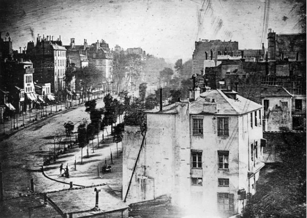

# Введение

Трудно написать простую книгу о художественной фотографии для любителей, так, чтобы сложные и емкие понятия воспринимались без труда. Создавать книгу мы будем особым образом. Разберем работы известных авторов, получившись признание. Узнаем, как достижения фотографов оценили критики и теоретики, увидим, как по-разному может быть истолкованы одни и те же  ситуации и фотографии. 

Соединив практику с теорией, обозначим несколько путей, которые ведут к интересным фотографиям. 

Дальше дело техники. Используя изобразительные средства фотографии, покажем индивидуальные признаки выбранных понятий в кадре. Здесь понадобятся правила и приемы — правило третей, равновесия, колорит, светотень, диагонали, линии, динамика и статика. Подробно разберем основные приемы обработки изображений, изменяющие светотеневой рисунок, создающие колорит, фотоэффекты. Создадим простую последовательную схему творческой обработки снимков.

Вот такой план книги. Приступим к его исполнению!

# Изменение содержимого фотографии

На заре развития фотографии публику очаровали дагерротипы, которые с легкостью передавали с поразительной правдой мелочи и детали. Это были постановочные студийные кадры или фиксация статичных объектов. Это было ново, неожиданно, сулило в будущем необычайные возможности. Способ позволял получать документально точные изображения объектов съемки, повторявшие их во всех деталях и подробностях. Именно за эти свойства фотографию поначалу и ценили более всего. В печати публиковались восторженные отзывы современников, которых приводили в восхищение изображения пейзажей, где чаще всего были отчетливо видны каждый листик на дереве, каждая складка его коры, каждый камешек на дороге. 

Главной сферой коммерческого применения дагеротипии стало получение парадных портретов. 

С усовершенствованием фотографического процесса и появлением стеклянных пластинок со светочувствительным слоем, фотография попыталась не копировать природу и достигла на этом пути успехов. Основы создания живописного эффекта на фотографии еще в 1869 году доходчиво изложил англичанин Генри Пич Робинсон.

Фотография, на рубеже XIX и XX веков, вслед за живописью, пережила увлечение импрессионизмом. На этом пути немецкий фотограф Генрих Кюн – Heinrich Kuhn применил фотоимпрессионизм, который находит многочисленных поклонников.

Сьюзен Зонтаг — американская писательница, философ и критик отметила, что когда в 1915 году Эдвард Стейхен сфотографировал молочную бутылку на пожарной лестнице жилого дома, зародилось новое представление о том, что такое фотография — это «прямая фотография». С этого момента, фотография вышла из под влияния живописи, и начала искать собственные формы осмысления действительности, у фотографии появился художественный язык усилиями таких мастеров как Альфред Стиглиц, который обратился к обыденному реализму, Йозеф Судек, Эдвард Уэстон с его «новым виденим». Признанным классиком пейзажной фотографии стал американец Ансель Адамс.

Документальная фотография начала развиваться с изобретением в 30-х года прошлого века компактного фотоаппарата, использующего 35 миллиметровую пленку. Образцы репортажной, уличной фотографии созданы советскими фотографами — Евгением Халдеем, Эммануилом Евзерихиным, Георгием Зельма, Борисом Игнатовичем, а также знаменитым французом Анри-Картье Брессоном.

На теоретической и практической основе авангардного искусства, основы которого закладывали Малевич, Кандинский, Петров-Водкин, создавал оригинальные фотографии Александр Родченко, который на языке абстрактных форм умел “читать” повседневные жизненные ситуации, улавливать смысловую связь между окружающими предметами и личностью человека.

В 1936 году выпущена первая в мире многослойная цветная обращаемая фотоплёнка фирмой Agfa. Годом позже компания Eastman Kodak  создала первую цветную фотоплёнку типа 135. Эти пленки на годы установили эталон «пленочного цвета». Фотография уже с помощью цифровых приемов обработки пытается воспроизводить этот цвет, но современные производители фотопленок не только сохраняют, но и развивают заложенные традиции, поддерживая спрос на своеобразный, слегка неестественный, но исключительно привлекательный колорит, у которого много поклонников и в наше время.

Бурно развивающаяся практика, получила теоретическое осмысление в работах писателей, искусствоведов и философов. Кинооператор и искусствовед Лидия Павловна Дыко к 60-м годам завершила теорию создания реалистической фотографии, обобщив классические представления живописи о композиции и приспособив под возможности фотографии. Зигфрид Кракауэр — немецкий социолог массовой культуры, реабилитировал физическую реальность в качестве содержания фотографии. Новый философский ключ Съюзан Лангер позволил ясно увидеть символический характер фотографического изображения. Французский философ Жан Бодрийяр подробно и эмоционально разобрал негативное влияние массовой культуры и созданных ею симулякров на фотографию и предложил примеры «буквальной фотографии».

**Откровенная действительность** - прямая фотография, буквальное на фотографиях Бодрийяра, ломография, реалистическое направление Зигфрида Кракауэра, _pinctum_ Ролана Барта. Протест против мейнстрима. Действительность имеет содержание, которое нужно только показать.

**Мейнстрим** - социалистический реализм, инстаграм, гламур, глянец, селфи. Неприкрашенная действительность есть дискредитация действительности.

**Бескомпромиссная идеализация** - Родченко, Петров-Водкин, импрессионизм, пикториализм. Воспитание чувств, необходимых для строительства нового мира. Голые беспредметные ракурсы и композиционные схемы, по канонам супрематизма, вызывают особенные чувства. Изменение направления угла взгляда меняет отношение к миру.  Бескомпромиссная идеализация.

# Выбор объективов и фотоаппарата

Оптимальным выбором для фотографа любителя будет линейка объективов, рассчитанная на применение с полукадровой матрицей формата APS-C или Micro Four Thirds — Micro 4/3. Объективы с переменным фокусным расстоянием или зум-объективы более универсальны в применении к различным условиям съемки, но по сравнению с объективами с фиксированным фокусным расстоянием обладают, как правило несколько меньшей светосилой, что снижает возможности по созданию художественных эффектов при съемке.

Фотоаппараты с меньшей матрицей и с несменными объективами, включая камеры мобильных телефонов, нельзя рекомендовать для использования в художественной фотографии по причине их ограниченных оптических возможностей, которые не позволяют создавать размытие заднего фона на длинном фокусе и разделять глубиной резкости одни части объектов от других близко расположенных.

Линейка объективов, рассчитанная на применение с полнокадровыми матрицами — full-frame, обладает большими творческими возможностями в силу физического размера матрицы, которые позволяют получать меньшую глубину резкости со светосильными средне- и длиннофокусными объективами, что невозможно на матрицах размера меньше чем полукадровый в силу физических ограничений. Только на полнокадровой матрице некоторые творческие объективы, собранные например по схеме Петцваля из четырех линз, полностью раскрывают свои возможности.

Учитывая, что художественные фотографии, как правило, обрабатываются в графических редакторах, набор функций фотоаппарата может быть минимальным. Профессиональные фотоаппараты с максимальным набором функций находят применение, в основном, при репортажной съемке, когда полученный снимок необходимо оперативно опубликовать без дополнительной обработки, опираясь только на богатые возможности управления съемкой,заложенные в профессиональную камеру.

Размер матрицы фотоаппарата в 24 мегапикселя достаточен для печати фотоснимков любого размера, за исключение особо крупноформатных, размеров, например 2 на 3 метра. Фотографии большого формата рассматриваются с более значительного расстояния, чем фотографии малого и среднего размера, поэтому глаз на таком расстоянии не замечает увеличенный размер пикселя и воспринимает изображение как четкое.